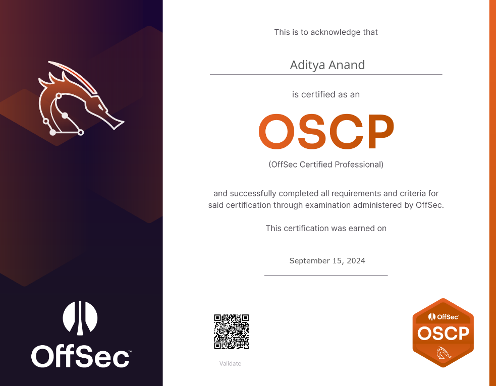

---
layout:
  title:
    visible: true
  description:
    visible: true
  tableOfContents:
    visible: true
  outline:
    visible: true
  pagination:
    visible: true
---

# Welcome!

This will be my cybersecurity blog where I will be documenting my methodology and various techniques I've learnt based on my experience on Hack The Box, TryHackMe, Proving Grounds, Vulnlab and the PWK labs.

<figure><figcaption></figcaption></figure>

## whoami

I am Aditya AKA Warranty\_v01d as my "hacker name" on my journey to attain the OSCP Certification as a Computer Science student in University. &#x20;

Visit my website [here](https://warranty-v01d.pages.dev/) to read my blogs.

Join me on my journey to where breaking limits (and warranties) is all part of the process

<figure><figcaption>
Pentesting. Get it?
</figcaption></figure>

<figure><figcaption></figcaption></figure>
