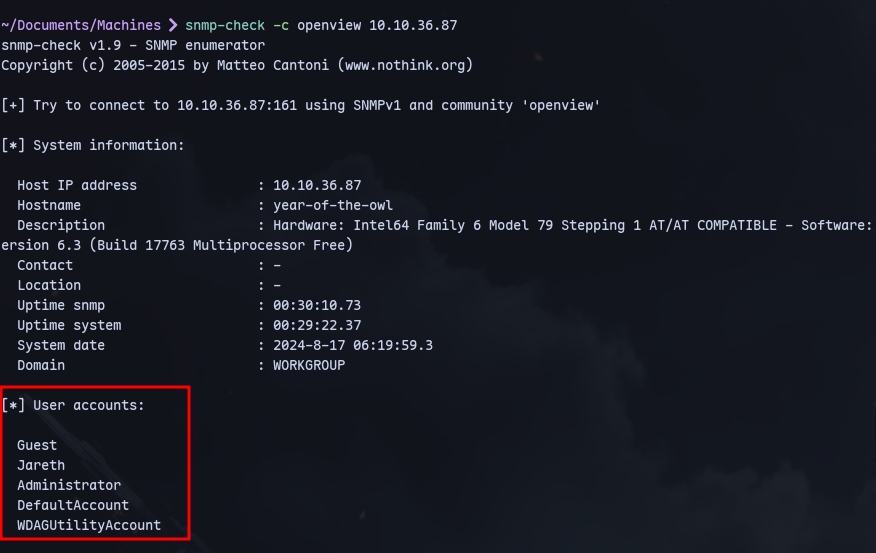

# SNMP Enumeration

* [ ] Use snmpwalk

```bash
snmpwalk -c public -v1 -t 10 192.168.50.151
```

Add one of these at the end in snmpwalk

| 1.3.6.1.2.1.25.1.6.0   | System Processes |
| ---------------------- | ---------------- |
| 1.3.6.1.2.1.25.4.2.1.2 | Running Programs |
| 1.3.6.1.2.1.25.4.2.1.4 | Processes Path   |
| 1.3.6.1.2.1.25.2.3.1.4 | Storage Units    |
| 1.3.6.1.2.1.25.6.3.1.2 | Software Name    |
| 1.3.6.1.4.1.77.1.2.25  | User Accounts    |
| 1.3.6.1.2.1.6.13.1.3   | TCP Local Ports  |

#### **Using extended queries to enumerate further:**

```
snmpwalk -v2c -c public $IP NET-SNMP-EXTEND-MIB::nsExtendOutputFull
```

Try versions with `-v` : 1, 2c, 3. Try with all 3.

<figure><figcaption></figcaption></figure>

#### snmp-check:

```
snmp-check <ip>
```

#### **To bruteforce community strings:**


```
hydra -P /usr/share/seclists/Discovery/SNMP/common-snmp-community-strings-onesixtyone.txt <ip> snmp
```


snmp-check to get more info using the discovered community string:

```
snmp-check -c 'community-string-here' <ip>
```

<figure><figcaption></figcaption></figure>

**For brute-forcing ip:**

```
echo public > community
echo private >> community
echo manager >> community
for ip in $(seq 1 254); do echo 192.168.215.$ip; done > ips
onesixtyone -c community -i ips
```
