## Finding Vulnerabilities
1. we used `sudo netdiscover -r 192.168.161.0/24` with our ip to find the vmware ip
2. we use `nmap -T4 -p- -A 192.168.161.130` to find all info about the system
3. 80/443 default webpage found with apache server running
4. use `nikto` for vulnerable scanning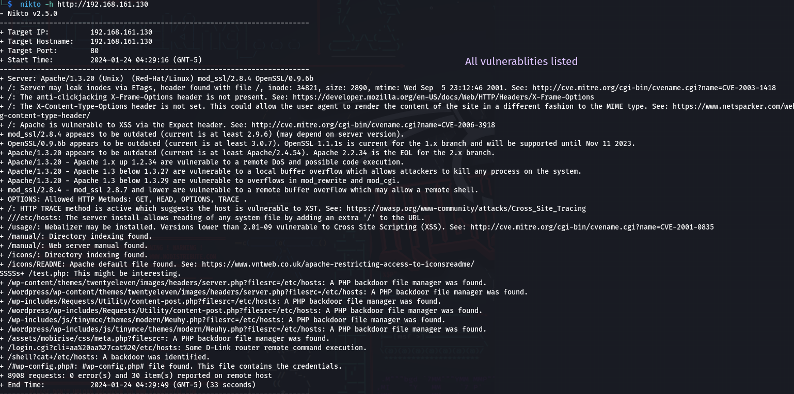
5. Found that 
	`mod_ssl/2.8.4 - mod_ssl 2.8.7 and lower are vulnerable to a remote buffer overflow which may allow a remote shell.`
1. Information disclosure- Server version
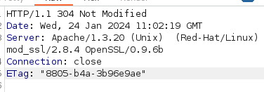
8. We can use three tools for directory busting: 
	- **gobuster**
	- **dirb**
	 - **dirbuster**

9.  Found usage subdirectory which disclosed following info:
		*Generated by Webalizer Version 2.01*
10. Using masscan to find ports:
	`sudo masscan -p1-65535 192.168.161.130 --rate 1000`
 	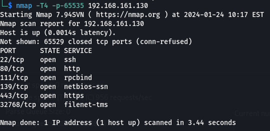
	then we can do 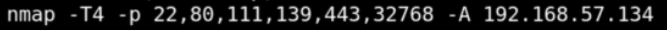 This method is faster
### SMB Enumeration
1.  SMB version found using metasploit- *Unix (Samba 2.2.1a)*
2. Then use **smbclient** to gain access to smb (can potentially contain valuable data) which led to find:
	- `smbclient \\\\192.168.161.130\\IPC$`
		- Access Denied
	- `smbclient \\\\192.168.161.130\\ADMIN$`
		- Requires password
		**THIS PATH IS A DEADEND**
**POTENTIALLY OPEN TO trans2open exploit https://www.infosecmatter.com/metasploit-module-library/?mm=exploit/linux/samba/trans2open**
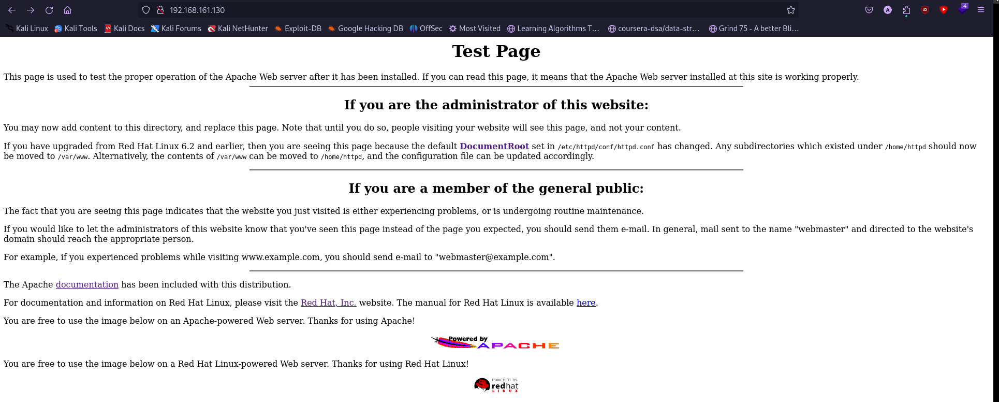
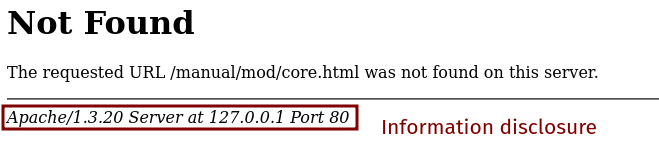
### SSH Enumeration
1. We try to make a connection using: 
```ssh 192.168.161.130 -oKexAlgorithms=+diffie-hellman-group1-sha1 -oHostKeyAlgorithms=+ssh-dss -c aes128-cbc```
The output:
```The authenticity of host '192.168.161.130 (192.168.161.130)' can't be established.
DSA key fingerprint is SHA256:lEaf2l45SOoTn6qFh/EObfveZjbgCPuTHIXBFtD9mY8.
This key is not known by any other names.
Are you sure you want to continue connecting (yes/no/[fingerprint])? yes
Warning: Permanently added '192.168.161.130' (DSA) to the list of known hosts.
kali@192.168.161.130's password
```
We do this to check for exposed banners(which could have ssh version or created by which companies etc).

### SSL remote shell
1.  `mod_ssl/2.8.4 - mod_ssl 2.8.7 and lower are vulnerable to a remote buffer overflow which may allow a remote shell.` is the one we targeting 
2.  80/443 -> Found exploit  - https://github.com/heltonWernik/OpenLuck
## Exploitation
1. We chose smb to exploit (trans2open using metasploit)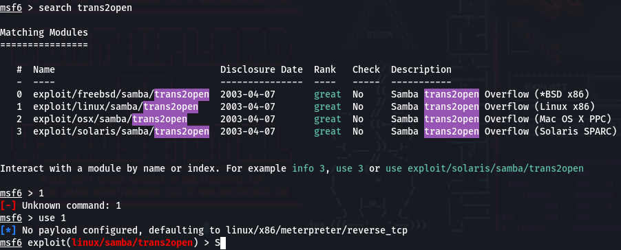
	1. Didn't work first time because of some payload issue. We were using staged [[Exploitation#Staged vs Non- Staged]]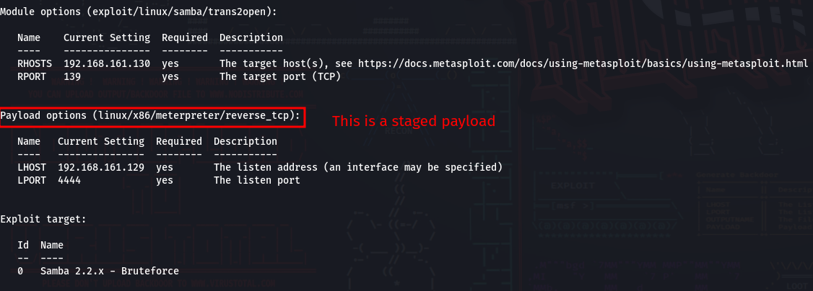
	2. We switch to non staged payload ( :( no meterpreter)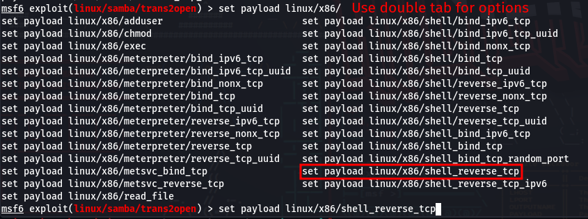
		We gain root after running `exploit`
2.   Using OpenFuck to manually exploit:
3. We got shell access with root privileges. 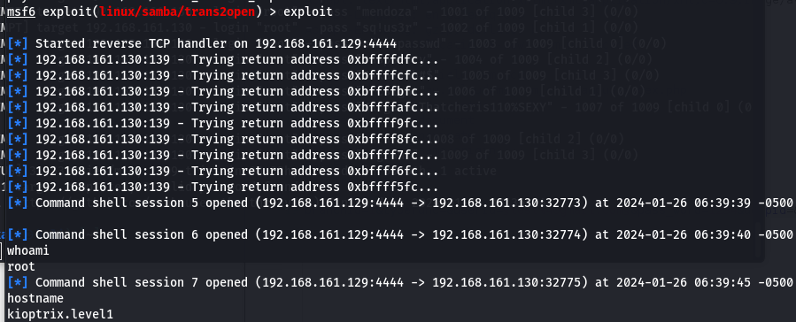
4. Undetected malicious activity
### Passwords
We got root access and can access the passwd file: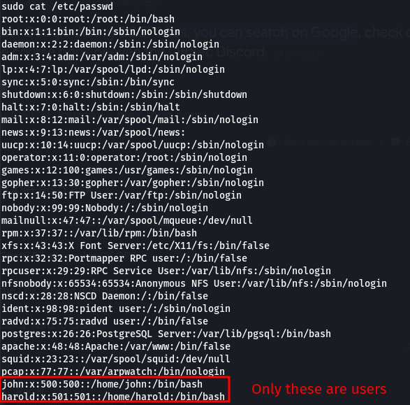
**Note**: The passwd file no longer directly has the passwords
Instead we see the shadow file in `/etc/shadow`: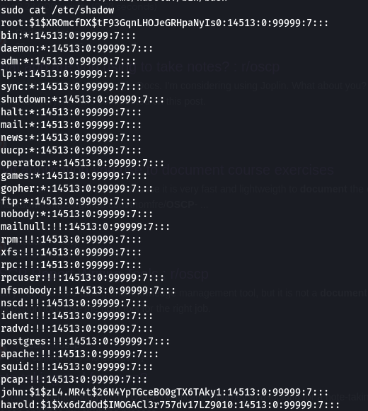
### SSH brute forcing
1. Using hydra
	`hydra -l root -P /usr/share/wordlists/metasploit/unix_passwords.txt ssh://192.168.161.130 -t 4 -V`
2. Using metasploit
	- use `SSH_Login` after search
	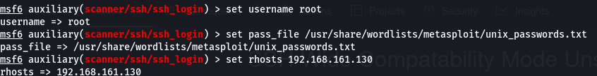
		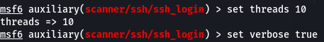
