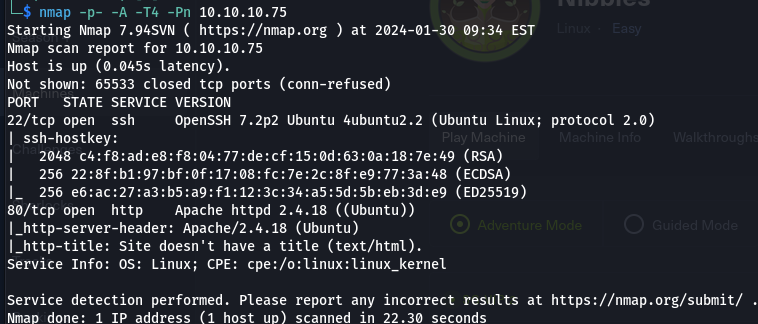
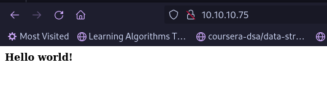
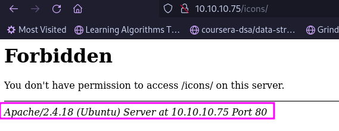
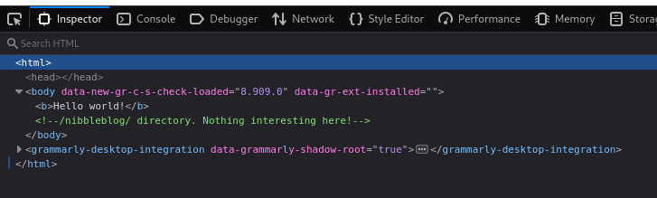
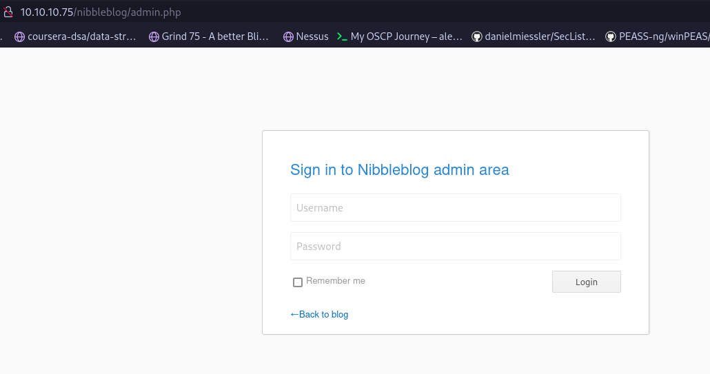
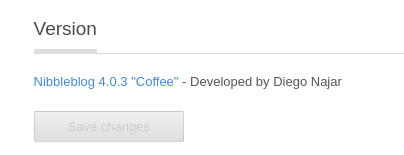
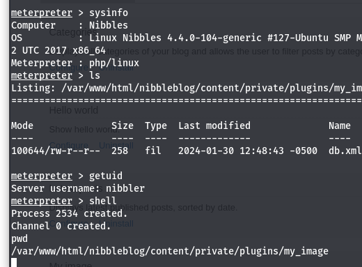
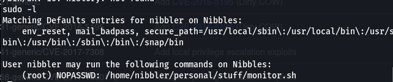
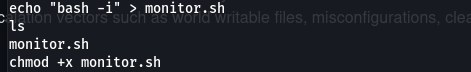
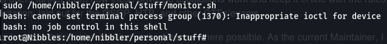

# Enumeration
- We use nmap to scan using `nmap -p- -A -T4 -Pn 10.10.10.75`
- We found an Apache server running:
- Using dirbuster found this:indicates poor hygiene
- Upon inspect element found we found a hidden comment: 
- Leads to a nibbleblog website where we find the following using dirbuster:
- Just attempting *username*:admin *password*:nibbles gets us logged in
- We find that the version used is 4.0.3: 
	Which can be exploited to get remote code execution.
- using metasploit we can use the exploit `exploit(multi/http/nibbleblog_file_upload)` to get access to the machine:
- **Note**: The `history` command lets us view the previous commands executed by the user.
- `sudo -l` lets us know the allowed commands for a user:
We notice that monitor.sh can be run as sudo so we create a monitor.sh as following:
This creates a bash interactive shell with root privileges like so:

- We have successfully pwned the machine!