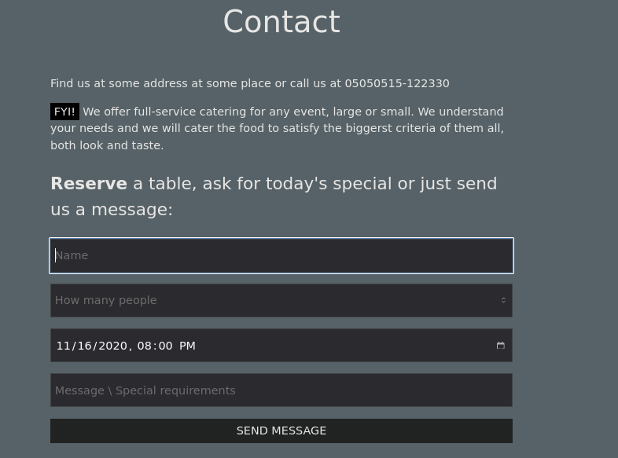
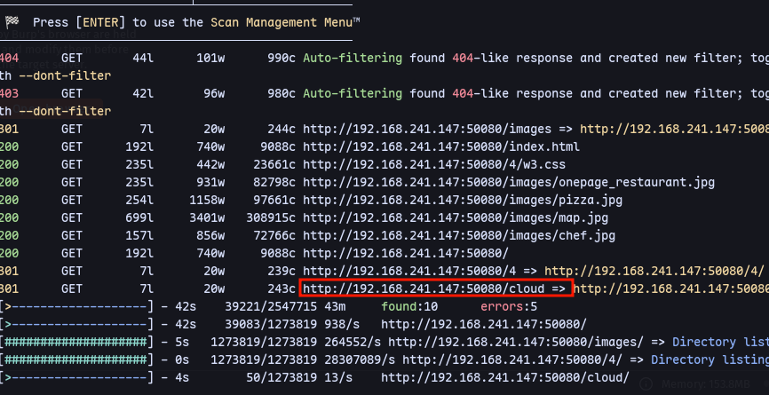
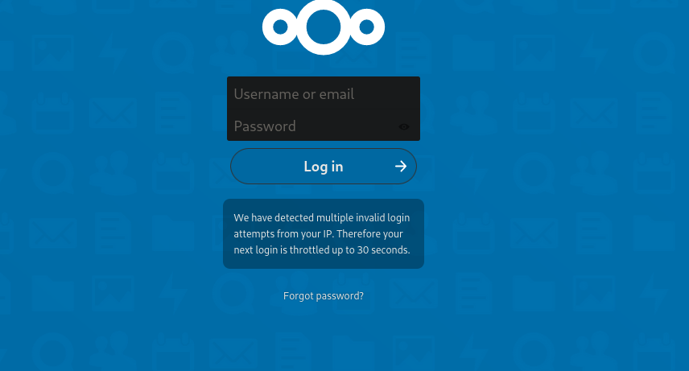
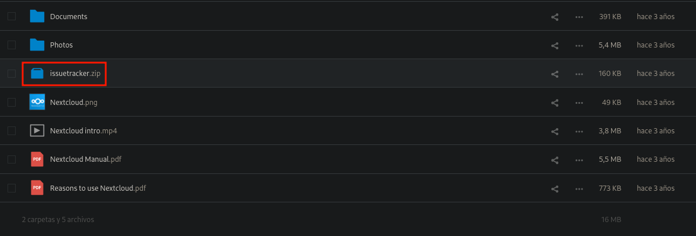
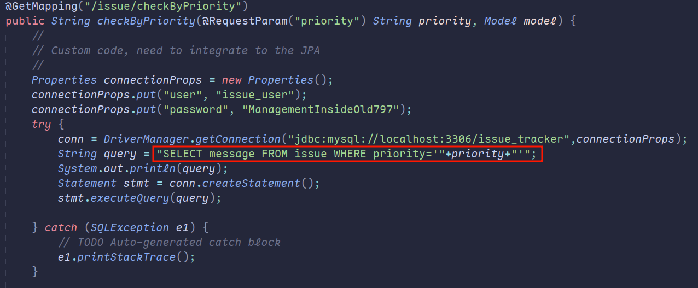

Running feroxbuster:
```
feroxbuster -u http://192.168.241.147:50080/ -C 404,400 -A --wordlist '/usr/share/seclists/Discovery/Web-Content/directory-list-2.3-big.txt' -B --auto-tune
```

We have nextcloud
Using `admin:admin`

We have issuetracker.zip:


We have creds.


We might have SQL injection:


So registering and logging in at [[17445]]