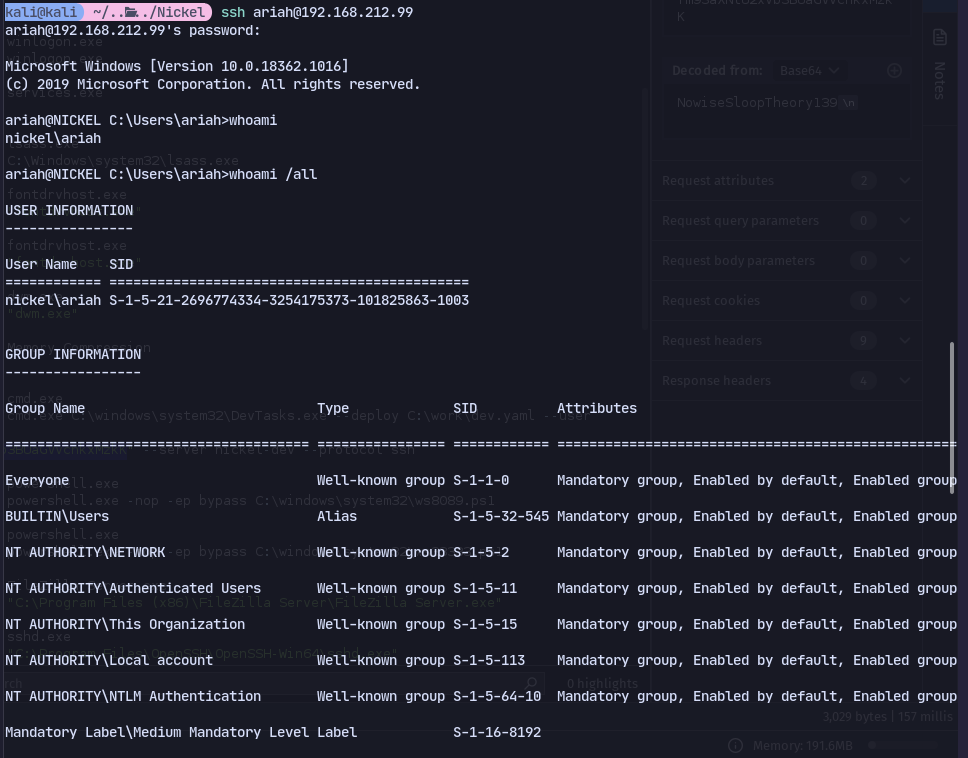
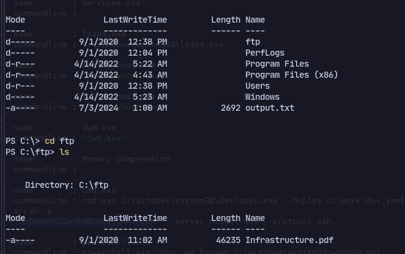
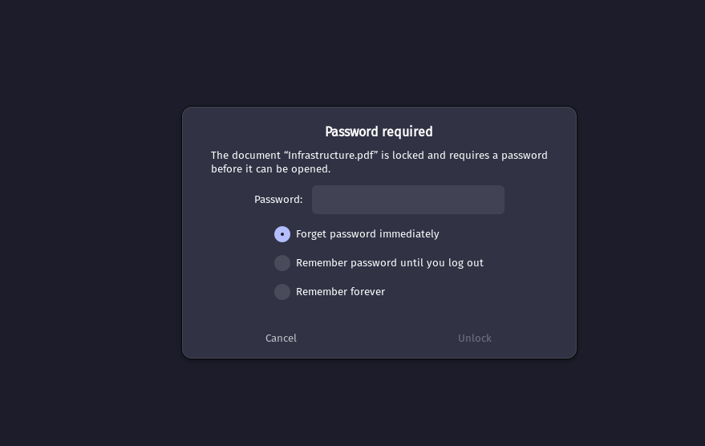
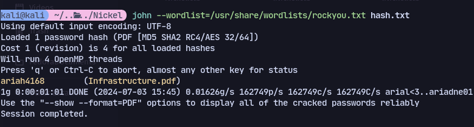
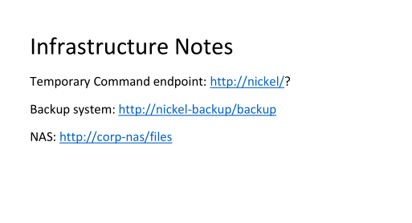
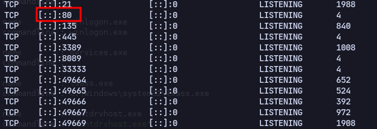

With the creds we can login now:


We found a pdf in the ftp folder on C:\

Now transferring it:
```
scp ariah@192.168.212.99:C:/ftp/Infrastructure.pdf .
```
It is password protected:

Using pdf2john:
```
pdf2john Infrastructure.pdf > hash.txt
```
```
john --wordlist=/usr/share/wordlists/rockyou.txt hash.txt
```

We cracked it
]
We have this in the pdf.

We can check the ports on the machine:

Found port 80
Now we can port forward:
```
ssh -f -N -L 127.0.0.1:8080:127.0.0.1:80 ariah@192.168.179.99
```
